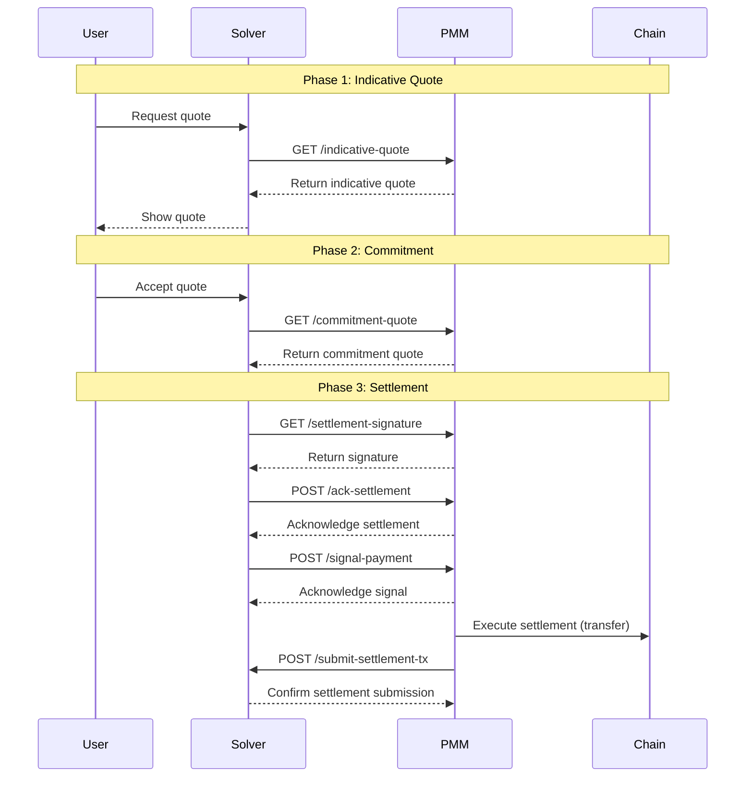

# PMM SDK Integration Documentation

A comprehensive toolkit for implementing Private Market Makers (PMMs) in the cross-chain trading network. This guide covers the required integration points between PMMs and our solver backend, enabling cross-chain liquidity provision and settlement.

## Table of Contents

- [PMM SDK Integration Documentation](#pmm-sdk-integration-documentation)
  - [Table of Contents](#table-of-contents)
  - [1. Overview](#1-overview)
    - [1.1. Repository Structure](#11-repository-structure)
    - [1.2. Example Implementation](#12-example-implementation)
  - [2. Quick Start](#2-quick-start)
    - [2.1. Installation](#21-installation)
    - [2.2. Environment Setup](#22-environment-setup)
  - [3. PMM Backend APIs](#3-pmm-backend-apis)
    - [3.1. Endpoint: `/indicative-quote`](#31-endpoint-indicative-quote)
      - [Description](#description)
      - [Request Parameters](#request-parameters)
      - [Example Request](#example-request)
      - [Expected Response](#expected-response)
      - [Example Implementation](#example-implementation)
    - [3.2. Endpoint: `/commitment-quote`](#32-endpoint-commitment-quote)
      - [Description](#description-1)
      - [Request Parameters](#request-parameters-1)
      - [Example Request](#example-request-1)
      - [Expected Response](#expected-response-1)
      - [Example Implementation](#example-implementation-1)
    - [3.3. Endpoint: `/settlement-signature`](#33-endpoint-settlement-signature)
      - [Description](#description-2)
      - [Request Parameters](#request-parameters-2)
      - [Example Request](#example-request-2)
      - [Expected Response](#expected-response-2)
      - [Example Implementation](#example-implementation-2)
    - [3.4. Endpoint: `/ack-settlement`](#34-endpoint-ack-settlement)
      - [Description](#description-3)
      - [Request Parameters](#request-parameters-3)
      - [Example Request](#example-request-3)
      - [Expected Response](#expected-response-3)
      - [Example Implementation](#example-implementation-3)
    - [3.5. Endpoint: `/signal-payment`](#35-endpoint-signal-payment)
      - [Description](#description-4)
      - [Request Parameters](#request-parameters-4)
      - [Example Request](#example-request-4)
      - [Expected Response](#expected-response-4)
      - [Example Implementation](#example-implementation-4)
  - [4. SDK Functions for PMMs](#4-sdk-functions-for-pmms)
    - [4.1. Function: getTokens](#41-function-gettokens)
      - [Description](#description-5)
      - [Example Code](#example-code)
    - [4.2. Function: submitSettlementTx](#42-function-submitsettlementtx)
      - [Description](#description-6)
      - [Example Implementation](#example-implementation-5)
      - [Notes](#notes)
  - [5. PMM Making Payment](#5-pmm-making-payment)
    - [5.1. EVM](#51-evm)
    - [5.2. Bitcoin](#52-bitcoin)

## 1. Overview

This repository contains everything needed to integrate your PMM with 's solver network:



### 1.1. Repository Structure
The repository consists of:
- `abi/`: Smart contract ABIs and interfaces
- `example/`: A complete mock PMM implementation showing how to integrate the SDK
- `src/`: Source code for the market maker SDK

### 1.2. Example Implementation
The [Example](example/) directory contains a fully functional mock PMM. Use this implementation as a reference while integrating the `@optimex-xyz/market-maker-sdk` into your own PMM service.

## 2. Quick Start

### 2.1. Installation

```bash
npm install @optimex-xyz/market-maker-sdk
# or
yarn add @optimex-xyz/market-maker-sdk
```

### 2.2. Environment Setup

| Variable | Development | Production |
| -------- | ----------- | ---------- |
| SDK_ENV  | dev         | production |

## 3. PMM Backend APIs

These are the APIs that PMMs must implement for Solver integration. These endpoints allow Solvers to communicate with your PMM service.

### 3.1. Endpoint: `/indicative-quote`

#### Description

Provides an indicative quote for the given token pair and trade amount. The quote is used for informational purposes before a commitment is made.

#### Request Parameters

- **HTTP Method**: `GET`
- **Query Parameters**:
  - `from_token_id` (string): The ID of the source token.
  - `to_token_id` (string): The ID of the destination token.
  - `amount` (string): The amount of the source token to be traded, represented as a string in base 10 to accommodate large numbers.
  - `session_id` (string, optional): A unique identifier for the session.

#### Example Request

```
GET /indicative-quote?from_token_id=ETH&to_token_id=BTC&amount=1000000000000000000&session_id=12345
```

#### Expected Response

- **HTTP Status**: `200 OK`
- **Response Body** (JSON):

```json
{
  "session_id": "12345",
  "pmm_receiving_address": "0xReceivingAddress",
  "indicative_quote": "123456789000000000",
  "error": "" // Empty if no error
}
```

- `session_id` (string): The session ID associated with the request.
- `pmm_receiving_address` (string): The receiving address where the user will send the `from_token`.
- `indicative_quote` (string): The indicative quote value, represented as a string.
- `error` (string): Error message, if any (empty if no error).

#### Example Implementation

```js
import { Token, tokenService } from '@optimex-xyz/market-maker-sdk'

export const IndicativeQuoteResponseSchema = z.object({
  sessionId: z.string(),
  pmmReceivingAddress: z.string(),
  indicativeQuote: z.string(),
  error: z.string().optional(),
});

export type IndicativeQuoteResponse = z.infer<
  typeof IndicativeQuoteResponseSchema
>;

async getIndicativeQuote(dto: GetIndicativeQuoteDto): Promise<IndicativeQuoteResponse> {
  const sessionId = dto.sessionId || this.generateSessionId()

  const [fromToken, toToken] = Promise.all([
    this.tokenService.getTokenByTokenId(dto.fromTokenId),
    this.tokenService.getTokenByTokenId(dto.toTokenId),
  ])

  const quote = this.calculateBestQuote()

  return {
    sessionId,
    pmmReceivingAddress,
    indicativeQuote: quote,
    error: '',
  }
}
```

### 3.2. Endpoint: `/commitment-quote`

#### Description

Provides a commitment quote for a specific trade, representing a firm commitment to proceed under the quoted conditions.

#### Request Parameters

- **HTTP Method**: `GET`
- **Query Parameters**:
  - `session_id` (string): A unique identifier for the session.
  - `trade_id` (string): The unique identifier for the trade.
  - `from_token_id` (string): The ID of the source token.
  - `to_token_id` (string): The ID of the destination token.
  - `amount` (string): The amount of the source token to be traded, in base 10.
  - `from_user_address` (string): The address of the user initiating the trade.
  - `to_user_address` (string): The address where the user will receive the `to_token`.
  - `user_deposit_tx` (string): The transaction hash where the user deposited their funds.
  - `user_deposit_vault` (string): The vault where the user's deposit is kept.
  - `trade_deadline` (string): The UNIX timestamp (in seconds) by which the user expects to receive payment.
  - `script_deadline` (string): The UNIX timestamp (in seconds) after which the user can withdraw their deposit if not paid.

#### Example Request

```
GET /commitment-quote?session_id=12345&trade_id=abcd1234&from_token_id=ETH&to_token_id=BTC&amount=1000000000000000000&from_user_address=0xUserAddress&to_user_address=0xReceivingAddress&user_deposit_tx=0xDepositTxHash&user_deposit_vault=VaultData&trade_deadline=1696012800&script_deadline=1696016400
```

#### Expected Response

- **HTTP Status**: `200 OK`
- **Response Body** (JSON):

```json
{
  "trade_id": "abcd1234",
  "commitment_quote": "987654321000000000",
  "error": "" // Empty if no error
}
```

- `trade_id` (string): The trade ID associated with the request.
- `commitment_quote` (string): The committed quote value, represented as a string.
- `error` (string): Error message, if any (empty if no error).

#### Example Implementation

```js
import { Token, tokenService } from '@optimex-xyz/market-maker-sdk'

export const GetCommitmentQuoteSchema = z.object({
  sessionId: z.string(),
  tradeId: z.string(),
  fromTokenId: z.string(),
  toTokenId: z.string(),
  amount: z.string(),
  fromUserAddress: z.string(),
  toUserAddress: z.string(),
  userDepositTx: z.string(),
  userDepositVault: z.string(),
  tradeDeadline: z.string(),
  scriptDeadline: z.string(),
});

export class GetCommitmentQuoteDto extends createZodDto(
  GetCommitmentQuoteSchema
) {}

async getCommitmentQuote(dto: GetCommitmentQuoteDto): Promise<CommitmentQuoteResponse> {
  const session = await this.sessionRepo.findById(dto.sessionId)

  const [fromToken, toToken] = await Promise.all([
    tokenService.getTokenByTokenId(dto.fromTokenId),
    tokenService.getTokenByTokenId(dto.toTokenId),
  ])

  const quote = this.calculateBestQuote(...)

  await this.tradeService.createTrade({ tradeId: dto.tradeId })

  await this.tradeService.updateTradeQuote(dto.tradeId, { commitmentQuote: quote })

  return {
    tradeId: dto.tradeId,
    commitmentQuote: quote,
    error: '',
  }
}
```

### 3.3. Endpoint: `/settlement-signature`

#### Description

Returns a signature from the PMM to confirm the settlement quote, required to finalize the trade.

#### Request Parameters

- **HTTP Method**: `GET`
- **Query Parameters**:
  - `trade_id` (string): The unique identifier for the trade.
  - `committed_quote` (string): The committed quote value in base 10.
  - `trade_deadline` (string): The UNIX timestamp (in seconds) by which the user expects to receive payment.
  - `script_deadline` (string): The UNIX timestamp (in seconds) after which the user can withdraw their deposit if not paid.

#### Example Request

```
GET /settlement-signature?trade_id=abcd1234&committed_quote=987654321000000000&trade_deadline=1696012800&script_deadline=1696016400
```

#### Expected Response

- **HTTP Status**: `200 OK`
- **Response Body** (JSON):

```json
{
  "trade_id": "abcd1234",
  "signature": "0xSignatureData",
  "deadline": 1696012800,
  "error": "" // Empty if no error
}
```

- `trade_id` (string): The trade ID associated with the request.
- `signature` (string): The signature provided by the PMM.
- `deadline` (integer): The UNIX timestamp (in seconds) indicating the PMM's expected payment deadline.
- `error` (string): Error message, if any (empty if no error).

#### Example Implementation

```ts
import {
  getCommitInfoHash,
  getSignature,
  routerService,
  SignatureType,
  signerService,
} from '@optimex-xyz/market-maker-sdk'

export const GetSettlementSignatureSchema = z.object({
  tradeId: z.string(),
  committedQuote: z.string(),
  tradeDeadline: z.string(),
  scriptDeadline: z.string(),
})

export class GetSettlementSignatureDto extends createZodDto(GetSettlementSignatureSchema) {}

async getSettlementSignature(dto: GetSettlementSignatureDto, trade: Trade): Promise<SettlementSignatureResponseDto> {
  try {
    const { tradeId } = trade

    // Get data directly from l2 contract or using routerService ( wrapper of l2 contract )
    const [presigns, tradeData] = await Promise.all([
      routerService.getPresigns(tradeId),
      routerService.getTradeData(tradeId),
    ])

    const { toChain } = tradeData.tradeInfo
    const deadline = BigInt(Math.floor(Date.now() / 1000) + 1800)

    const pmmId = ... // hexString
    const pmmPresign = presigns.find((t) => t.pmmId === pmmId)
    if (!pmmPresign) {
      throw new BadRequestException('pmmPresign not found')
    }

    // get amountOut from the committed quote
    const amountOut = BigInt(dto.committedQuote)

    const commitInfoHash = getCommitInfoHash(
      pmmPresign.pmmId,
      pmmPresign.pmmRecvAddress,
      toChain[1],
      toChain[2],
      amountOut,
      deadline
    )

    const signerAddress = await this.routerService.getSigner()

    const domain = await signerService.getDomain()

    const signature = await getSignature(
      this.pmmWallet,
      this.provider,
      signerAddress,
      tradeId,
      commitInfoHash,
      SignatureType.VerifyingContract,
      domain
    )

    return {
      tradeId: tradeId,
      signature,
      deadline: Number(deadline),
      error: '',
    }
  } catch (error: any) {
    // Handle error
  }
}
```

### 3.4. Endpoint: `/ack-settlement`

#### Description

Used by the solver to acknowledge to the PMM about a successful settlement, indicating whether the PMM is selected.

#### Request Parameters

- **HTTP Method**: `POST`
- **Form Parameters**:
  - `trade_id` (string): The unique identifier for the trade.
  - `trade_deadline` (string): The UNIX timestamp (in seconds) by which the user expects to receive payment.
  - `script_deadline` (string): The UNIX timestamp (in seconds) after which the user can withdraw their deposit if not paid.
  - `chosen` (string): `"true"` if the PMM is selected, `"false"` otherwise.

#### Example Request

```
POST /ack-settlement
Content-Type: application/x-www-form-urlencoded

trade_id=abcd1234&trade_deadline=1696012800&script_deadline=1696016400&chosen=true
```

#### Expected Response

- **HTTP Status**: `200 OK`
- **Response Body** (JSON):

```json
{
  "trade_id": "abcd1234",
  "status": "acknowledged",
  "error": "" // Empty if no error
}
```

- `trade_id` (string): The trade ID associated with the request.
- `status` (string): Status of the acknowledgment (always `"acknowledged"`).
- `error` (string): Error message, if any (empty if no error).

#### Example Implementation

```ts
export const AckSettlementSchema = z.object({
  tradeId: z.string(),
  tradeDeadline: z.string(),
  scriptDeadline: z.string(),
  chosen: z.string().refine((val) => val === 'true' || val === 'false', {
    message: "chosen must be 'true' or 'false'",
  }),
})

export class AckSettlementDto extends createZodDto(AckSettlementSchema) {}

async ackSettlement(dto: AckSettlementDto, trade: Trade): Promise<AckSettlementResponseDto> {
  try {
    return {
      tradeId: dto.tradeId,
      status: 'acknowledged',
      error: '',
    }
  } catch (error: any) {
    if (error instanceof HttpException) {
      throw error
    }
    throw new BadRequestException(error.message)
  }
}
```

### 3.5. Endpoint: `/signal-payment`

#### Description

Used by the solver to signal the chosen PMM to start submitting their payment.

#### Request Parameters

- **HTTP Method**: `POST`
- **Form Parameters**:
  - `trade_id` (string): The unique identifier for the trade.
  - `protocol_fee_amount` (string): The amount of protocol fee the PMM has to submit, in base 10.
  - `trade_deadline` (string): The UNIX timestamp (in seconds) by which the user expects to receive payment.
  - `script_deadline` (string): The UNIX timestamp (in seconds) after which the user can withdraw their deposit if not paid.

#### Example Request

```
POST /signal-payment
Content-Type: application/x-www-form-urlencoded

trade_id=abcd1234&protocol_fee_amount=1000000000000000&trade_deadline=1696012800&script_deadline=1696016400
```

#### Expected Response

- **HTTP Status**: `200 OK`
- **Response Body** (JSON):

```json
{
  "trade_id": "abcd1234",
  "status": "acknowledged",
  "error": "" // Empty if no error
}
```

- `trade_id` (string): The trade ID associated with the request.
- `status` (string): Status of the acknowledgment (always `"acknowledged"`).
- `error` (string): Error message, if any (empty if no error).

#### Example Implementation

```ts
export const SignalPaymentSchema = z.object({
  tradeId: z.string(),
  protocolFeeAmount: z.string(),
  tradeDeadline: z.string(),
  scriptDeadline: z.string(),
})

export class SignalPaymentDto extends createZodDto(SignalPaymentSchema) {}

async signalPayment(dto: SignalPaymentDto, trade: Trade): Promise<SignalPaymentResponseDto> {
  try {
    // enqueue transfer with dto and trade

    return {
      tradeId: dto.tradeId,
      status: 'acknowledged',
      error: '',
    }
  } catch (error: any) {
    if (error instanceof HttpException) {
      throw error
    }
    throw new BadRequestException(error.message)
  }
}
```

## 4. SDK Functions for PMMs

These SDK functions facilitate PMM-Solver communication and are essential for implementing the required backend APIs.

### 4.1. Function: getTokens

#### Description

Returns a list of all supported tokens across different networks.

#### Example Code

```ts
import { tokenService } from '@optimex-xyz/market-maker-sdk'

tokenService.getTokens()
```

### 4.2. Function: submitSettlementTx

#### Description

Allows the PMM to submit the settlement transaction hash for one or more trades. This step is necessary to complete the trade settlement process.

Parameters:
- `trade_ids` (array of strings): An array of trade IDs associated with the settlement transaction.
- `pmm_id` (string): The PMM's ID, which must match the one committed for the trade(s).
- `settlement_tx` (string): The raw transaction data (in hex) representing the settlement.
- `signature` (string): The PMM's signature on the settlement transaction.
- `start_index` (integer): The index indicating the starting point for settlement processing (used for batch settlements).
- `signed_at` (integer): The UNIX timestamp (in seconds) when the PMM signed the settlement transaction.

#### Example Implementation

```ts
import {
  getMakePaymentHash,
  getSignature,
  routerService,
  SignatureType,
  signerService,
  solverService,
} from '@optimex-xyz/market-maker-sdk'

async submit(job: Job<string>) {
  const { tradeId, paymentTxId } = toObject(job.data) as SubmitSettlementEvent

  try {
    const tradeIds: BytesLike[] = [tradeId]
    const startIdx = BigInt(tradeIds.indexOf(tradeId))

    const signerAddress = await this.routerService.getSigner()

    const signedAt = Math.floor(Date.now() / 1000)

    const makePaymentInfoHash = getMakePaymentHash(tradeIds, BigInt(signedAt), startIdx, ensureHexPrefix(paymentTxId))

    const domain = await signerService.getDomain()

    const signature = await getSignature(
      this.pmmWallet,
      this.provider,
      signerAddress,
      tradeId,
      makePaymentInfoHash,
      SignatureType.MakePayment,
      domain
    )

    const pmmId = ... // string
    const requestPayload = {
      tradeIds: [tradeId],
      pmmId: pmmId,
      settlementTx: ensureHexPrefix(paymentTxId),
      signature: signature,
      startIndex: 0,
      signedAt: signedAt,
    }

    const response = await this.solverSerivce.submitSettlementTx(requestPayload)

    return response
  } catch (error: any) {
    this.logger.error('submit settlement error', error.stack)

    throw error // Re-throw the error for the queue to handle
  }
}
```

#### Notes

- **Trade IDs**: Provide all trade IDs included in the settlement transaction.
- **Start Index**: Used when submitting a batch of settlements to indicate the position within the batch.
- **Signature**: Must be valid and verifiable by the solver backend.

## 5. PMM Making Payment

```ts
import { Token } from '@optimex-xyz/market-maker-sdk'

export interface TransferParams {
  toAddress: string
  amount: bigint
  token: Token
  tradeId: string
}

export interface ITransferStrategy {
  transfer(params: TransferParams): Promise<string>
}
```

### 5.1. EVM

In case the target chain is EVM-based, the transaction should emit the event from the `l1 payment contract` with the correct values for pmmAmountOut and protocolFee.

Example implementation:

```ts
import { config, ensureHexPrefix, ERC20__factory, Payment__factory, routerService } from '@optimex-xyz/market-maker-sdk'

import { ITransferStrategy, TransferParams } from '../interfaces/transfer-strategy.interface'

@Injectable()
export class EVMTransferStrategy implements ITransferStrategy {
  private pmmPrivateKey: string

  private routerService = routerService
  private readonly rpcMap = new Map<string, string>([['ethereum_sepolia', 'https://eth-sepolia.public.blastapi.io']])

  constructor(private configService: ConfigService) {
    this.pmmPrivateKey = this.configService.getOrThrow<string>('PMM_EVM_PRIVATE_KEY')
  }

  async transfer(params: TransferParams): Promise<string> {
    const { toAddress, amount, token, tradeId } = params
    const { tokenAddress, networkId } = token

    const signer = this.getSigner(networkId)

    const paymentAddress = this.getPaymentAddress(networkId)

    if (tokenAddress !== 'native') {
      // allowance with ERC20
    }

    const paymentContract = Payment__factory.connect(paymentAddress, signer)

    const feeDetail = await this.routerService.getFeeDetails(tradeId)

    const deadline = BigInt(Math.floor(Date.now() / 1000) + 30 * 60)

    const decoder = errorDecoder()

    const tx = await paymentContract.payment(
      tradeId,
      tokenAddress === 'native' ? ZeroAddress : tokenAddress,
      toAddress,
      amount,
      feeDetail.totalAmount,
      deadline,
      {
        value: tokenAddress === 'native' ? amount : 0n,
      }
    )

    this.logger.log(`Transfer transaction sent: ${tx.hash}`)

    return ensureHexPrefix(tx.hash)
  }

  private getSigner(networkId: string) {
    const rpcUrl = this.rpcMap.get(networkId)

    if (!rpcUrl) {
      throw new Error(`Unsupported networkId: ${networkId}`)
    }

    const provider = new ethers.JsonRpcProvider(rpcUrl)
    return new ethers.Wallet(this.pmmPrivateKey, provider)
  }

  private getPaymentAddress(networkId: string) {
    const paymentAddress = config.getPaymentAddress(networkId)
    if (!paymentAddress) {
      throw new Error(`Unsupported networkId: ${networkId}`)
    }

    return paymentAddress
  }
}
```

### 5.2. Bitcoin

In case the target chain is Bitcoin, the transaction should have at least N + 1 outputs, with the first N outputs being the settlement UTXOs for trades, and one of them being the change UTXO for the user with the correct amount. The output N + 1 is the OP_RETURN output with the hash of tradeIds.

Example implementation:

```ts
import * as bitcoin from 'bitcoinjs-lib'
import { ECPairFactory } from 'ecpair'
import * as ecc from 'tiny-secp256k1'

import { getTradeIdsHash, Token } from '@optimex-xyz/market-maker-sdk'

import { ITransferStrategy, TransferParams } from '../interfaces/transfer-strategy.interface'

interface UTXO {
  txid: string
  vout: number
  value: number
  status: {
    confirmed: boolean
    block_height: number
    block_hash: string
    block_time: number
  }
}

@Injectable()
export class BTCTransferStrategy implements ITransferStrategy {
  private readonly privateKey: string
  private readonly ECPair = ECPairFactory(ecc)

  private readonly networkMap = new Map<string, bitcoin.Network>([
    ['bitcoin_testnet', bitcoin.networks.testnet],
    ['bitcoin', bitcoin.networks.bitcoin],
  ])

  private readonly rpcMap = new Map<string, string>([
    ['bitcoin_testnet', 'https://blockstream.info/testnet'],
    ['bitcoin', 'https://blockstream.info'],
  ])

  constructor(private configService: ConfigService) {
    this.privateKey = this.configService.getOrThrow<string>('PMM_BTC_PRIVATE_KEY')
    bitcoin.initEccLib(ecc)
  }

  async transfer(params: TransferParams): Promise<string> {
    const { toAddress, amount, token, tradeId } = params

    const network = this.getNetwork(token.networkId)
    const rpcUrl = this.getRpcUrl(token.networkId)

    const txId = await this.sendBTC(this.privateKey, toAddress, amount, network, rpcUrl, token, [tradeId])

    return ensureHexPrefix(txId)
  }

  private createPayment(publicKey: Uint8Array, network: bitcoin.Network) {
    const p2tr = bitcoin.payments.p2tr({
      internalPubkey: Buffer.from(publicKey.slice(1, 33)),
      network,
    })

    return {
      payment: p2tr,
      keypair: this.ECPair.fromWIF(this.privateKey, network),
    }
  }

  private async sendBTC(
    privateKey: string,
    toAddress: string,
    amountInSatoshis: bigint,
    network: bitcoin.Network,
    rpcUrl: string,
    token: Token,
    tradeIds: string[]
  ): Promise<string> {
    const keyPair = this.ECPair.fromWIF(privateKey, network)
    const { payment, keypair } = this.createPayment(keyPair.publicKey, network)

    if (!payment.address) {
      throw new Error('Could not generate address')
    }

    const utxos = await this.getUTXOs(payment.address, rpcUrl)
    if (utxos.length === 0) {
      throw new Error(`No UTXOs found in ${token.networkSymbol} wallet`)
    }

    const psbt = new bitcoin.Psbt({ network })
    let totalInput = 0n

    for (const utxo of utxos) {
      if (!payment.output) {
        throw new Error('Could not generate output script')
      }

      const internalKey = Buffer.from(keypair.publicKey.slice(1, 33))

      psbt.addInput({
        hash: utxo.txid,
        index: utxo.vout,
        witnessUtxo: {
          script: payment.output,
          value: BigInt(utxo.value),
        },
        tapInternalKey: internalKey,
      })

      totalInput += BigInt(utxo.value)
    }

    this.logger.log(`Total input: ${totalInput.toString()} ${token.tokenSymbol}`)

    if (totalInput < amountInSatoshis) {
      throw new Error(
        `Insufficient balance in ${token.networkSymbol} wallet. ` +
          `Need ${amountInSatoshis} satoshis, but only have ${totalInput} satoshis`
      )
    }

    const feeRate = await this.getFeeRate(rpcUrl)
    const fee = BigInt(Math.ceil(200 * feeRate))
    const changeAmount = totalInput - amountInSatoshis - fee

    psbt.addOutput({
      address: toAddress,
      value: amountInSatoshis,
    })

    if (changeAmount > 546n) {
      psbt.addOutput({
        address: payment.address,
        value: changeAmount,
      })
    }

    const tradeIdsHash = getTradeIdsHash(tradeIds)

    // Add OP_RETURN output with tradeIds hash
    psbt.addOutput({
      script: bitcoin.script.compile([bitcoin.opcodes['OP_RETURN'], Buffer.from(tradeIdsHash.slice(2), 'hex')]),
      value: 0n,
    })

    const toXOnly = (pubKey: Uint8Array) => (pubKey.length === 32 ? pubKey : pubKey.slice(1, 33))
    const tweakedSigner = keyPair.tweak(bitcoin.crypto.taggedHash('TapTweak', toXOnly(keyPair.publicKey)))

    for (let i = 0; i < psbt.data.inputs.length; i++) {
      psbt.signInput(i, tweakedSigner, [bitcoin.Transaction.SIGHASH_DEFAULT])
      this.logger.log(`Input ${i} signed successfully`)
    }

    psbt.finalizeAllInputs()

    const tx = psbt.extractTransaction()
    const rawTx = tx.toHex()

    const response = await axios.post(`${rpcUrl}/api/tx`, rawTx, {
      headers: {
        'Content-Type': 'text/plain',
      },
    })

    return response.data
  }

  private async getUTXOs(address: string, rpcUrl: string): Promise<UTXO[]> {
    const response = await axios.get<UTXO[]>(`${rpcUrl}/api/address/${address}/utxo`)
    return response.data
  }

  private async getFeeRate(rpcUrl: string): Promise<number> {
    try {
      const response = await axios.get<{ [key: string]: number }>(`${rpcUrl}/api/fee-estimates`)
      return response.data[0]
    } catch (error) {
      console.error(`Error fetching
