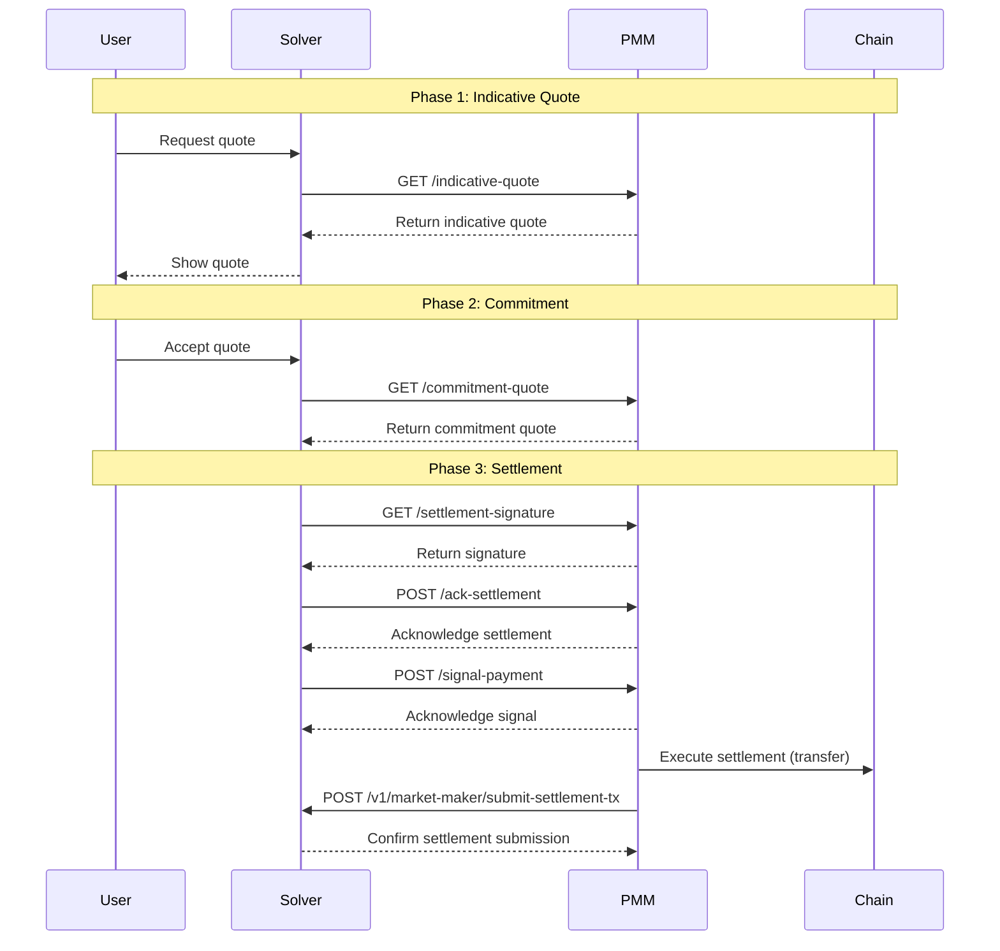

# PMM API Integration Documentation

> **CHANGELOG (v0.7.1)**: 
> - **Breaking Changes:**
>   - Environment key `dev` has been renamed to `staging` - please update your environment configuration accordingly
>   - Several functions from `routerService` moved to `protocolService`
> - **Upgrade Notes:**
>   - For PMMs using version 6.2, you can update to v0.7.1 without needing to change anything
>   - If you need to use the Router, please use the values provided in the environment configuration section

> **Note**: If you prefer using the SDK instead of direct API integration, please refer to the [PMM SDK Integration Guide](sdk-integration.md).

A comprehensive guide for implementing Private Market Makers (PMMs) in the cross-chain trading network. This documentation covers the required integration points between PMMs and our solver backend, enabling cross-chain liquidity provision and settlement.

## Table of Contents

- [PMM API Integration Documentation](#pmm-api-integration-documentation)  
  - [1. Overview](#1-overview)    
  - [2. Quick Start](#2-quick-start)    
  - [3. PMM Backend APIs](#3-pmm-backend-apis)
    - [3.1. Endpoint: `/indicative-quote`](#31-endpoint-indicative-quote)      
    - [3.2. Endpoint: `/commitment-quote`](#32-endpoint-commitment-quote)      
    - [3.3. Endpoint: `/settlement-signature`](#33-endpoint-settlement-signature)      
    - [3.4. Endpoint: `/ack-settlement`](#34-endpoint-ack-settlement)      
    - [3.5. Endpoint: `/signal-payment`](#35-endpoint-signal-payment)      
  - [4. Solver API Endpoints for PMMs](#4-solver-api-endpoints-for-pmms)
    - [4.1. Endpoint: `/v1/market-maker/tokens`](#41-endpoint-v1market-makertokens)
    - [4.2. Endpoint: `/v1/market-maker/submit-settlement-tx`](#42-endpoint-v1market-makersubmit-settlement-tx)
    - [4.3. Endpoint: `/v1/market-maker/trades/:tradeId`](#43-endpoint-v1market-makertradestradeid)
  - [5. PMM Making Payment](#5-pmm-making-payment)
    - [5.1. EVM](#51-evm)
    - [5.2. Bitcoin](#52-bitcoin)


## 1. Overview

The PMM integration with Optimex involves bidirectional API communication:

1. **PMM-Provided APIs**: Endpoints that PMMs must implement to receive requests from the Solver
2. **Solver-Provided APIs**: Endpoints that the Solver provides for PMMs to call

### 1.1. Integration Flow




## 2. Quick Start

### 2.1. API Environments

| Environment      | Description                                                          |
| ---------------- | -------------------------------------------------------------------- |
| `dev`            | internal environment with test networks and development services     |
| `staging`        | Staging environment with test networks and staging services      |
| `prelive` | Pre production environment with mainnet networks for testing before release |
| `production`     | Production environment with mainnet networks and production services |

<details>
<summary><strong>Staging Contracts</strong></summary>

**Optimex L2 Testnet**
- **Signer**: [0xA89F5060B810F3b6027D7663880c43ee77A865C7](https://scan-testnet.optimex.xyz/address/0xA89F5060B810F3b6027D7663880c43ee77A865C7)
- **Router**: [0xa6E13A3c6c63C64d45bB453E0402B7D2eE53E564](https://scan-testnet.optimex.xyz/address/0xa6E13A3c6c63C64d45bB453E0402B7D2eE53E564)
- **ProtocolFetcherProxy**: [0x7c07151ca4DFd93F352Ab9B132A95866697c38c2](https://scan-testnet.optimex.xyz/address/0x7c07151ca4DFd93F352Ab9B132A95866697c38c2)

**Ethereum Sepolia**
- **Payment**: [0x7387DcCfE2f1D5F80b4ECDF91eF58541517e90D2](https://sepolia.etherscan.io/address/0x7387DcCfE2f1D5F80b4ECDF91eF58541517e90D2)
- **ETHVault**: [0x17aD543010fc8E8065b85E203839C0CBEcdfC851](https://sepolia.etherscan.io/address/0x17aD543010fc8E8065b85E203839C0CBEcdfC851)
- **WETHVault**: [0x673Ac1489457F43F04403940cE425ae19a9D639B](https://sepolia.etherscan.io/address/0x673Ac1489457F43F04403940cE425ae19a9D639B)
- **USDCVault**: [0x1c7D4B196Cb0C7B01d743Fbc6116a902379C7238](https://sepolia.etherscan.io/address/0x1c7D4B196Cb0C7B01d743Fbc6116a902379C7238)
- **USDTVault**: [0x62179B12Ce75B81Fcb4a2B634aD92DDaeF728e9C](https://sepolia.etherscan.io/address/0x62179B12Ce75B81Fcb4a2B634aD92DDaeF728e9C)
- **WBTCVault**: [0x04D0C9a5bb122958D8A64049068FD8570dDfA3Dc](https://sepolia.etherscan.io/address/0x04D0C9a5bb122958D8A64049068FD8570dDfA3Dc)
</details>

<details>
<summary><strong>Production/Prelive Contracts</strong></summary>


**Optimex L2 Mainnet**
- **Signer**: [0xCF9786F123F1071023dB8049808C223e94c384be](https://scan.optimex.xyz/address/0xCF9786F123F1071023dB8049808C223e94c384be)
- **Router**: [0xF7fedF4A250157010807E6eA60258E3B768149Ff](https://scan.optimex.xyz/address/0xF7fedF4A250157010807E6eA60258E3B768149Ff)
- **ProtocolFetcherProxy**: [0xFDEd4CEf9aE1E03D0BeF161262a266c1c157a32b](https://scan.optimex.xyz/address/0xFDEd4CEf9aE1E03D0BeF161262a266c1c157a32b)

**Ethereum Mainnet**
- **Payment**: [0x0A497AC4261E37FA4062762C23Cf3cB642C839b8](https://etherscan.io/address/0x0A497AC4261E37FA4062762C23Cf3cB642C839b8)
- **ETHVault**: [0xF7fedF4A250157010807E6eA60258E3B768149Ff](https://etherscan.io/address/0xF7fedF4A250157010807E6eA60258E3B768149Ff)
- **WETHVault**: [0xaD3f379AaED8Eca895209Af446F2e34f07145dbC](https://etherscan.io/address/0xaD3f379AaED8Eca895209Af446F2e34f07145dbC)
- **USDCVault**: [0x4463084C01ed22E8320D345b357721aE525Db93F](https://etherscan.io/address/0x4463084C01ed22E8320D345b357721aE525Db93F)
- **USDTVault**: [0x0712CAB9e52a37aFC6fA768b20cc9b07325314fB](https://etherscan.io/address/0x0712CAB9e52a37aFC6fA768b20cc9b07325314fB)
- **WBTCVault**: [0xCd6B5F600559104Ee19320B9F9C3b2c7672cb895](https://etherscan.io/address/0xCd6B5F600559104Ee19320B9F9C3b2c7672cb895)
</details>

> **Note**: The prelive and production environments use the same contract addresses. The difference is in the backend services and configuration that interact with these contracts.

## 3. PMM Backend APIs

These are the APIs that PMMs must implement for Solver integration. These endpoints allow Solvers to communicate with your PMM service.

### 3.1. Endpoint: `/indicative-quote`

#### Description

Provides an indicative quote for the given token pair and trade amount. The quote is used for informational purposes before a commitment is made.

#### Request Parameters

- **HTTP Method**: `GET`
- **Query Parameters**:
  - `from_token_id` (string): The ID of the source token.
  - `to_token_id` (string): The ID of the destination token.
  - `amount` (string): The amount of the source token to be traded, represented as a string in base 10 to accommodate large numbers.
  - `session_id` (string, optional): A unique identifier for the session.
  - `deposited` (boolean, optional): Whether the deposit has been confirmed. This allows the PMM to decide the returned quote.
  - `trade_timeout` (string, optional): The deadline when user is expected to receive tokens from PMM in UNIX timestamp. We expect the trade to be completed before this timeout. But if not, some actions can still be taken.
  - `script_timeout` (string, optional): The hard timeout for the trade, UNIX timestamp. After this timeout, the trade will not be processed further.
  - `from_user_address` (string, optional): The user's address from which the input token will be sent from.
  - `user_receiving_address` (string, optional): The user's address to which the output token will be sent to.
  - `user_refund_pubkey` (string, optional): The user's public key to which the refund will be sent.

#### Example Request

```
GET /indicative-quote?from_token_id=ETH&to_token_id=BTC&amount=1000000000000000000
```

#### Expected Response

- **HTTP Status**: `200 OK`
- **Response Body** (JSON):

```json
{
  "session_id": "12345",
  "pmm_receiving_address": "0xReceivingAddress",
  "indicative_quote": "123456789000000000",
  "error": "" // Empty if no error
}
```

- `session_id` (string): The session ID associated with the request.
- `pmm_receiving_address` (string): The receiving address where the user will send the `from_token`.
- `indicative_quote` (string): The indicative quote value, represented as a string. Should be treated as a BigInt in your implementation.
- `error` (string): Error message, if any (empty if no error).

<details>
<summary><strong>Example Implementation</strong></summary>

```js
async function getIndicativeQuote(req, res) {
  try {
    const { from_token_id, to_token_id, amount, session_id } = req.query;

    // Generate a session ID if not provided
    const sessionId = session_id || generateSessionId();

    // Fetch token information from Solver API
    const tokensResponse = await fetch('https://api.solver.example/v1/market-maker/tokens');
    const tokensData = await tokensResponse.json();

    // Find the from token and to token
    const fromToken = tokensData.data.tokens.find(token => token.token_id === from_token_id);
    const toToken = tokensData.data.tokens.find(token => token.token_id === to_token_id);

    if (!fromToken || !toToken) {
      return res.status(400).json({
        session_id: sessionId,
        pmm_receiving_address: '',
        indicative_quote: '0',
        error: 'Token not found'
      });
    }

    // Calculate the quote (implementation specific to your PMM)
    // Note: Treat amount as BigInt
    const amountBigInt = BigInt(amount);
    const quote = calculateQuote(fromToken, toToken, amountBigInt);

    // Get the receiving address for this token pair
    const pmmReceivingAddress = getPMMReceivingAddress(fromToken.network_id);

    return res.status(200).json({
      session_id: sessionId,
      pmm_receiving_address: pmmReceivingAddress,
      indicative_quote: quote.toString(),
      error: ''
    });
  } catch (error) {
    return res.status(500).json({
      session_id: req.query.session_id || '',
      pmm_receiving_address: '',
      indicative_quote: '0',
      error: error.message
    });
  }
}
```
</details>

### 3.2. Endpoint: `/commitment-quote`

#### Description

Provides a commitment quote for a specific trade, representing a firm commitment to proceed under the quoted conditions.

#### Request Parameters

- **HTTP Method**: `GET`
- **Query Parameters**:
  - `session_id` (string): A unique identifier for the session.
  - `trade_id` (string): The unique identifier for the trade. Example format: `0x3bfe2fc4889a98a39b31b348e7b212ea3f2bea63fd1ea2e0c8ba326433677328`.
  - `from_token_id` (string): The ID of the source token.
  - `to_token_id` (string): The ID of the destination token.
  - `amount` (string): The amount of the source token to be traded, in base 10. This should be treated as a BigInt in your implementation.
  - `from_user_address` (string): The address of the user initiating the trade.
  - `to_user_address` (string): The address where the user will receive the `to_token`.
  - `user_deposit_tx` (string): The transaction hash where the user deposited their funds.
  - `user_deposit_vault` (string): The vault where the user's deposit is kept.
  - `trade_deadline` (string): The UNIX timestamp (in seconds) by which the user expects to receive payment. Should be treated as a BigInt in your implementation.
  - `script_deadline` (string): The UNIX timestamp (in seconds) after which the user can withdraw their deposit if not paid. Should be treated as a BigInt in your implementation.

#### Example Request

```
GET /commitment-quote?session_id=12345&trade_id=0x3bfe2fc4889a98a39b31b348e7b212ea3f2bea63fd1ea2e0c8ba326433677328&from_token_id=ETH&to_token_id=BTC&amount=1000000000000000000&from_user_address=0xUserAddress&to_user_address=0xReceivingAddress&user_deposit_tx=0xDepositTxHash&user_deposit_vault=VaultData&trade_deadline=1696012800&script_deadline=1696016400
```

#### Expected Response

- **HTTP Status**: `200 OK`
- **Response Body** (JSON):

```json
{
  "trade_id": "0x3bfe2fc4889a98a39b31b348e7b212ea3f2bea63fd1ea2e0c8ba326433677328",
  "commitment_quote": "987654321000000000",
  "error": "" // Empty if no error
}
```

- `trade_id` (string): The trade ID associated with the request.
- `commitment_quote` (string): The committed quote value, represented as a string. Should be treated as a BigInt in your implementation.
- `error` (string): Error message, if any (empty if no error).

<details>
<summary><strong>Example Implementation</strong></summary>

```js
async function getCommitmentQuote(req, res) {
  try {
    const {
      session_id,
      trade_id,
      from_token_id,
      to_token_id,
      amount,
      from_user_address,
      to_user_address,
      user_deposit_tx,
      user_deposit_vault,
      trade_deadline,
      script_deadline
    } = req.query;

    // Validate the session exists
    const session = await sessionRepository.findById(session_id);
    if (!session) {
      return res.status(400).json({
        trade_id,
        commitment_quote: '0',
        error: 'Session not found'
      });
    }

    // Fetch token information from Solver API
    const tokensResponse = await fetch('https://api.solver.example/v1/market-maker/tokens');
    const tokensData = await tokensResponse.json();

    // Find the from token and to token
    const fromToken = tokensData.data.tokens.find(token => token.token_id === from_token_id);
    const toToken = tokensData.data.tokens.find(token => token.token_id === to_token_id);

    if (!fromToken || !toToken) {
      return res.status(400).json({
        trade_id,
        commitment_quote: '0',
        error: 'Token not found'
      });
    }

    // Calculate the final quote (implementation specific to your PMM)
    // Note: Treat numeric values as BigInt
    const amountBigInt = BigInt(amount);
    const quote = calculateFinalQuote(fromToken, toToken, amountBigInt, trade_deadline);

    // Store the trade in the database
    await tradeRepository.create({
      tradeId: trade_id,
      sessionId: session_id,
      fromTokenId: from_token_id,
      toTokenId: to_token_id,
      amount: amountBigInt.toString(),
      fromUserAddress: from_user_address,
      toUserAddress: to_user_address,
      userDepositTx: user_deposit_tx,
      userDepositVault: user_deposit_vault,
      tradeDeadline: trade_deadline,
      scriptDeadline: script_deadline,
      commitmentQuote: quote.toString()
    });

    return res.status(200).json({
      trade_id,
      commitment_quote: quote.toString(),
      error: ''
    });
  } catch (error) {
    return res.status(500).json({
      trade_id: req.query.trade_id || '',
      commitment_quote: '0',
      error: error.message
    });
  }
}
```
</details>

### 3.3. Endpoint: `/settlement-signature`

#### Description

Returns a signature from the PMM to confirm the settlement quote, required to finalize the trade.

#### Request Parameters

- **HTTP Method**: `GET`
- **Query Parameters**:
  - `trade_id` (string): The unique identifier for the trade. Example format: `0x3d09b8eb94466bffa126aeda68c8c0f330633a7d0058f57269d795530415498a`.
  - `committed_quote` (string): The committed quote value in base 10. This should be treated as a BigInt in your implementation.
  - `trade_deadline` (string): The UNIX timestamp (in seconds) by which the user expects to receive payment.
  - `script_deadline` (string): The UNIX timestamp (in seconds) after which the user can withdraw their deposit if not paid.

#### Example Request

```
GET /settlement-signature?trade_id=0x3d09b8eb94466bffa126aeda68c8c0f330633a7d0058f57269d795530415498a&committed_quote=987654321000000000&trade_deadline=1696012800&script_deadline=1696016400
```

#### Expected Response

- **HTTP Status**: `200 OK`
- **Response Body** (JSON):

```json
{
  "trade_id": "0x3d09b8eb94466bffa126aeda68c8c0f330633a7d0058f57269d795530415498a",
  "signature": "0xSignatureData",
  "deadline": 1696012800,
  "error": "" // Empty if no error
}
```

- `trade_id` (string): The trade ID associated with the request.
- `signature` (string): The signature provided by the PMM.
- `deadline` (integer): The UNIX timestamp (in seconds) indicating the PMM's expected payment deadline.
- `error` (string): Error message, if any (empty if no error).

<details>
<summary><strong>Example Implementation</strong></summary>

```js
async function getSettlementSignature(req, res) {
  try {
    const { trade_id, committed_quote, trade_deadline, script_deadline } = req.query;

    // Fetch the trade from the database
    const trade = await tradeRepository.findById(trade_id);
    if (!trade) {
      return res.status(400).json({
        trade_id,
        signature: '',
        deadline: 0,
        error: 'Trade not found'
      });
    }

    // Fetch trade details from Solver API
    const tradeDetailsResponse = await fetch(`https://api.solver.example/v1/market-maker/trades/${trade_id}`);
    const tradeDetails = await tradeDetailsResponse.json();

    // Calculate a deadline (30 minutes from now)
    const deadline = Math.floor(Date.now() / 1000) + 1800;

    // Get PMM data
    const pmmId = process.env.PMM_ID; // Your PMM ID

    // Get the presigns and trade data from tradeDetails
    const { from_token, to_token } = tradeDetails.data;

    // Create a commitment info hash
    // Note: Treat numeric values as BigInt
    const committedQuoteBigInt = BigInt(committed_quote);
    const commitInfoHash = createCommitInfoHash(
      pmmId,
      trade.pmmReceivingAddress,
      to_token.chain,
      to_token.address,
      committedQuoteBigInt,
      deadline
    );

    // Sign the commitment with your private key
    const privateKey = process.env.PMM_PRIVATE_KEY;
    const signature = signMessage(privateKey, trade_id, commitInfoHash);

    return res.status(200).json({
      trade_id,
      signature,
      deadline,
      error: ''
    });
  } catch (error) {
    return res.status(500).json({
      trade_id: req.query.trade_id || '',
      signature: '',
      deadline: 0,
      error: error.message
    });
  }
}
```
</details>

### 3.4. Endpoint: `/ack-settlement`

#### Description

Used by the solver to acknowledge to the PMM about a successful settlement, indicating whether the PMM is selected.

#### Request Parameters

- **HTTP Method**: `POST`
- **Form Parameters**:
  - `trade_id` (string): The unique identifier for the trade. Example format: `0x024be4dae899989e0c3d9b4459e5811613bcd04016dc56529f16a19d2a7724c0`.
  - `trade_deadline` (string): The UNIX timestamp (in seconds) by which the user expects to receive payment.
  - `script_deadline` (string): The UNIX timestamp (in seconds) after which the user can withdraw their deposit if not paid.
  - `chosen` (string): `"true"` if the PMM is selected, `"false"` otherwise.

#### Example Request

```
POST /ack-settlement
Content-Type: application/x-www-form-urlencoded

trade_id=0x024be4dae899989e0c3d9b4459e5811613bcd04016dc56529f16a19d2a7724c0&trade_deadline=1696012800&script_deadline=1696016400&chosen=true
```

#### Expected Response

- **HTTP Status**: `200 OK`
- **Response Body** (JSON):

```json
{
  "trade_id": "0x024be4dae899989e0c3d9b4459e5811613bcd04016dc56529f16a19d2a7724c0",
  "status": "acknowledged",
  "error": "" // Empty if no error
}
```

- `trade_id` (string): The trade ID associated with the request.
- `status` (string): Status of the acknowledgment (always `"acknowledged"`).
- `error` (string): Error message, if any (empty if no error).

<details>
<summary><strong>Example Implementation</strong></summary>

```js
async function ackSettlement(req, res) {
  try {
    const { trade_id, trade_deadline, script_deadline, chosen } = req.body;

    // Fetch the trade from the database
    const trade = await tradeRepository.findById(trade_id);
    if (!trade) {
      return res.status(400).json({
        trade_id,
        status: 'error',
        error: 'Trade not found'
      });
    }

    // Update trade status based on whether it was chosen
    await tradeRepository.update(trade_id, {
      chosen: chosen === 'true',
      tradeDeadline: trade_deadline,
      scriptDeadline: script_deadline
    });

    return res.status(200).json({
      trade_id,
      status: 'acknowledged',
      error: ''
    });
  } catch (error) {
    return res.status(500).json({
      trade_id: req.body.trade_id || '',
      status: 'error',
      error: error.message
    });
  }
}
```
</details>

### 3.5. Endpoint: `/signal-payment`

#### Description

Used by the solver to signal the chosen PMM to start submitting their payment.

#### Request Parameters

- **HTTP Method**: `POST`
- **Form Parameters**:
  - `trade_id` (string): The unique identifier for the trade. Example format: `0x3bfe2fc4889a98a39b31b348e7b212ea3f2bea63fd1ea2e0c8ba326433677328`.
  - `trade_deadline` (string): The UNIX timestamp (in seconds) by which the user expects to receive payment.
  - `script_deadline` (string): The UNIX timestamp (in seconds) after which the user can withdraw their deposit if not paid.
  - `total_fee_amount` (string): The amount of total fee the PMM has to submit, in base 10. This should be treated as a BigInt in your implementation.

#### Example Request

```
POST /signal-payment
Content-Type: application/x-www-form-urlencoded

trade_id=0x3bfe2fc4889a98a39b31b348e7b212ea3f2bea63fd1ea2e0c8ba326433677328&total_fee_amount=1000000000000000&trade_deadline=1696012800&script_deadline=1696016400
```

#### Expected Response

- **HTTP Status**: `200 OK`
- **Response Body** (JSON):

```json
{
  "trade_id": "0x3bfe2fc4889a98a39b31b348e7b212ea3f2bea63fd1ea2e0c8ba326433677328",
  "status": "acknowledged",
  "error": "" // Empty if no error
}
```

- `trade_id` (string): The trade ID associated with the request.
- `status` (string): Status of the acknowledgment (always `"acknowledged"`).
- `error` (string): Error message, if any (empty if no error).

<details>
<summary><strong>Example Implementation</strong></summary>

```js
async function signalPayment(req, res) {
  try {
    const { trade_id, total_fee_amount, trade_deadline, script_deadline } = req.body;

    // Fetch the trade from the database
    const trade = await tradeRepository.findById(trade_id);
    if (!trade) {
      return res.status(400).json({
        trade_id,
        status: 'error',
        error: 'Trade not found'
      });
    }

    // Update trade with fee amount
    await tradeRepository.update(trade_id, {
      totalFeeAmount: total_fee_amount,
      tradeDeadline: trade_deadline,
      scriptDeadline: script_deadline
    });

    // Queue the payment task
    await paymentQueue.add({
      tradeId: trade_id,
      totalFeeAmount: total_fee_amount
    });

    return res.status(200).json({
      trade_id,
      status: 'acknowledged',
      error: ''
    });
  } catch (error) {
    return res.status(500).json({
      trade_id: req.body.trade_id || '',
      status: 'error',
      error: error.message
    });
  }
}
```
</details>

## 4. Solver API Endpoints for PMMs

These API endpoints are provided by the Solver backend for PMMs to retrieve token information and submit settlement data.

> **Note**: The base URL for the Solver API endpoints will be provided separately. All endpoint paths in this documentation should be appended to that base URL.

### 4.1. Endpoint: `/v1/market-maker/tokens`

#### Description

Returns a list of tokens supported by the Solver Backend.

#### Request Parameters

- **HTTP Method**: `GET`

#### Example Request

```
GET /v1/market-maker/tokens
```

#### Expected Response

- **HTTP Status**: `200 OK`
- **Response Body**: JSON containing supported networks, tokens, and trading pairs

<details>
<summary><strong>View Example Response</strong></summary>

```json
{
    "data": {
        "supported_networks": [
            {
                "network_id": "bitcoin_testnet",
                "name": "Bitcoin Testnet",
                "symbol": "tBTC",
                "type": "BTC",
                "logo_uri": "https://storage.googleapis.com/Optimex-static-35291d79/images/tokens/btc_network.svg"
            },
            {
                "network_id": "ethereum_sepolia",
                "name": "Ethereum Sepolia",
                "symbol": "ETH",
                "type": "EVM",
                "logo_uri": "https://storage.googleapis.com/Optimex-static-35291d79/images/tokens/eth_network.svg"
            }
        ],
        "tokens": [
            {
                "id": 2,
                "network_id": "bitcoin_testnet",
                "token_id": "tBTC",
                "network_name": "Bitcoin Testnet",
                "network_symbol": "tBTC",
                "network_type": "BTC",
                "token_name": "Bitcoin Testnet",
                "token_symbol": "tBTC",
                "token_address": "native",
                "token_decimals": 8,
                "token_logo_uri": "https://storage.googleapis.com/Optimex-static-35291d79/images/tokens/tbtc.svg",
                "network_logo_uri": "https://storage.googleapis.com/Optimex-static-35291d79/images/tokens/btc_network.svg",
                "active": true,
                "created_at": "2024-10-28T07:24:33.179Z",
                "updated_at": "2024-11-07T04:40:46.454Z"
            },
            {
                "id": 11,
                "network_id": "ethereum_sepolia",
                "token_id": "ETH",
                "network_name": "Ethereum Sepolia",
                "network_symbol": "ETH",
                "network_type": "EVM",
                "token_name": "Ethereum Sepolia",
                "token_symbol": "ETH",
                "token_address": "native",
                "token_decimals": 18,
                "token_logo_uri": "https://storage.googleapis.com/Optimex-static-35291d79/images/tokens/eth.svg",
                "network_logo_uri": "https://storage.googleapis.com/Optimex-static-35291d79/images/tokens/eth_network.svg",
                "active": true,
                "created_at": "2024-11-22T08:36:59.175Z",
                "updated_at": "2024-11-22T08:36:59.175Z"
            }
        ],
        "pairs": [
            {
                "from_token_id": "ETH",
                "to_token_id": "tBTC",
                "is_active": true
            },
            {
                "from_token_id": "tBTC",
                "to_token_id": "ETH",
                "is_active": true
            }
        ]
    }
}
```
</details>

### 4.2. Endpoint: `/v1/market-maker/submit-settlement-tx`

#### Description
Allows the PMM to submit settlement transaction hashes for trades. This endpoint is essential for completing the trade settlement process and must be called after making payments.

#### Request Parameters

- **HTTP Method**: `POST`
- **Request Body** (JSON):

```json
{
  "trade_ids": ["0xTradeID1", "0xTradeID2", "..."],
  "pmm_id": "pmm001",
  "settlement_tx": "SettlementTransactionData",
  "signature": "0xSignatureData",
  "start_index": 0,
  "signed_at": 1719158400
}
```

- `trade_ids` (array of strings): Array of trade IDs included in this settlement transaction.
- `pmm_id` (string): Your PMM identifier, which must match what was used in the commitment phase.
- `signature` (string): Your cryptographic signature for this submission.
- `start_index` (integer): Starting position within batch settlements (typically 0 for single trades).
- `signed_at` (integer): UNIX timestamp (seconds) when you signed this submission.
- `settlement_tx` (string): Should be hex format with a `0x` prefix

	- **For EVM Chains:**
		- Use the transaction hash directly without additional encoding
		- Example: `settlement_tx`: [0x7a87d2c423e13533b5ae0ecc5af900a7b697048103f4f6e32d19edde5e707355](https://etherscan.io/tx/0x7a87d2c423e13533b5ae0ecc5af900a7b697048103f4f6e32d19edde5e707355)

	- **For Bitcoin or Solana:**
		- Must encode raw_tx string using the `l2Encode` function
		- Example raw_tx string: `3d83c7846d6e5b04279175a9592705a15373f3029b866d5224cc0744489fe403`
		- After encoding
		  ```
		  "settlement_tx": "0x33643833633738343664366535623034323739313735613935393237303561313533373366333032396238363664353232346363303734343438396665343033"
		  ```

<details>
<summary><strong>Bitcoin l2Encode</strong></summary>

```javascript
import { ethers, toUtf8Bytes, toUtf8String } from 'ethers'

export const l2Encode = (info: string) => {
  // Helper function to ensure hex prefix
  const ensureHexPrefix = (value: string) => {
    return value.startsWith('0x') ? value : `0x${value}`
  }

  if (/^0x[0-9a-fA-F]*$/.test(info)) {
    return info
  }
  return ensureHexPrefix(ethers.hexlify(toUtf8Bytes(info)))
}
```
</details>

#### Example Request

```
POST /v1/market-maker/submit-settlement-tx
Content-Type: application/json

{
  "trade_ids": ["0xabcdef123456...", "0x123456abcdef..."],
  "pmm_id": "pmm001",
  "settlement_tx": "0x33643833633738343664366535623034323739313735613935393237303561313533373366333032396238363664353232346363303734343438396665343033",
  "signature": "0xSignatureData",
  "start_index": 0,
  "signed_at": 1719158400
}
```

#### Expected Response

- **HTTP Status**: `200 OK`
- **Response Body** (JSON):

```json
{
  "message": "Settlement transaction submitted successfully"
}
```

#### Notes

- **Trade IDs**: Provide all trade IDs included in the settlement transaction.
- **Start Index**: Used when submitting a batch of settlements to indicate the position within the batch.
- **Signature**: Must be valid and verifiable by the solver backend.

### 4.3. Endpoint: `/v1/market-maker/trades/:tradeId`

#### Description

Returns detailed information about a specific trade by its trade ID. This endpoint allows PMMs to fetch comprehensive data about a trade, including token information, user addresses, quotes, settlement details, and current state.

#### Request Parameters

- **HTTP Method**: `GET`
- **Path Parameters**:
  - `tradeId` (string): The unique identifier for the trade to retrieve.

#### Example Request

```
GET /v1/market-maker/trades/0xfc24b9bc1299b50896027cb4c85d041c911e062147ffaf7ae9c7e51b670086c2
```

#### Expected Response

- **HTTP Status**: `200 OK`
- **Response Body**: JSON containing detailed trade information.

<details>
<summary><strong>View Example Response</strong></summary>

```json
{
  "code": 0,
  "message": "",
  "data": {
    "trade_id": "0xfc24b9bc1299b50896027cb4c85d041c911e062147ffaf7ae9c7e51b670086c2",
    "session_id": "0xa5c2aa8dbff701e1a05707212ce3fb824a6ddd970e5dff5e340d7422ce6bcd97",
    "solver_address": "0xe291307c85f8f0c710180fea7cca25108782dee1",
    "from_token": {
      "token_id": "ETH",
      "chain": "ethereum",
      "address": "native",
      "fee_in": true,
      "fee_out": true
    },
    "to_token": {
      "token_id": "BTC",
      "chain": "bitcoin",
      "address": "native",
      "fee_in": false,
      "fee_out": false
    },
    "amount_before_fees": "3250849775444909",
    "amount_after_fees": "3244348075894020",
    "from_user_address": "0x2997cb0850a0c92db99e6e8745ac83bfb93c10ac",
    "user_receiving_address": "bc1p68q6hew27ljf4ghvlnwqz0fq32qg7tsgc7jr5levfy8r74p5k52qqphk07",
    "script_timeout": 1745544704,
    "protocol_fee_in_bps": "20",
    "affiliate_fee_in_bps": "0",
    "total_fee": "6501699550889",
    "protocol_fee": "6501699550889",
    "affiliate_fee": "0",
    "mpc_asset_chain_pubkey": "0x03c36bcf548094cfc74ec1ea89fc5fe0304461653813cdaa98bc26e2d5221eba9b",
    "best_indicative_quote": "4404",
    "display_indicative_quote": "4404",
    "pmm_finalists": [
      {
        "pmm_id": "pmm_test",
        "pmm_receiving_address": "0xtestaddress"
      }
    ],
    "settlement_quote": "5014",
    "receiving_amount": "5014",
    "selected_pmm": "kypseli",
    "selected_pmm_receiving_address": "0xbee0225697a311af58096ce2f03a2b65f1702f00",
    "selected_pmm_operator": "0x01c4f660ccdc4e5bdc5ee477ab0016dc424c473a",
    "selected_pmm_sig_deadline": 1745472704,
    "commitment_retries": 1,
    "pmm_failure_stats": {},
    "commited_signature": "0x842f32d384e6627755bdaa9285727c09731ed44e92555555c7d211fb3333a4c970b8a717ac79560be35fb2f22dc3fb2d80443e88234605fd353c12011fb8d8851c",
    "min_amount_out": null,
    "trade_timeout": 1745472704,
    "user_deposit_tx": "0x202186375a3b8d55de4d8d1afb7f6a5bec8978cef3b705e6cb379729d03b16c7",
    "deposit_vault": "0xf7fedf4a250157010807e6ea60258e3b768149ff",
    "payment_bundle": {
      "trade_ids": [
        "0xfc24b9bc1299b50896027cb4c85d041c911e062147ffaf7ae9c7e51b670086c2"
      ],
      "settlement_tx": "3d83c7846d6e5b04279175a9592705a15373f3029b866d5224cc0744489fe403",
      "signature": "0x479a5a89e7a871026b60307351ea650fc667890b25d3d02df7ed2e93f94db90d7c3f8dbd823220896b8ad49b13a90851199236e82a644ffbe99e53503929fe151b",
      "start_index": 0,
      "pmm_id": "kypseli",
      "signed_at": 1745459448
    },
    "user_signature": "0xfe4d3288db2b7d6ebc273dad1e1c55ecf9af2991fb89cc3e52fc0956c13746a043195cc22ed3c38bfa67c81e7819b53095b4282c5ee1d0c23a955baa38d754821b",
    "trade_submission_tx": "0x38dfc953a9d08d95d7218e993302f81180c4d1a9c85f84836f005770167b0133",
    "trade_select_pmm_tx": "0xc68dbf08e5774edd87ae78076ae498ebc4e489ae905f34b13682198f6dbcc6c0",
    "trade_make_payment_tx": "0x962a1d6cced99b1fa53450c50cf4f95cbf600dd25dcd145a98311d275ef22a38",
    "state": "Done",
    "last_update_msg": "Done. Changed at version 10",
    "version": 10
  }
}
```
</details>

## 5. PMM Making Payment

### 5.1. EVM

In case the target chain is EVM-based, the transaction should emit the event from the `l1 payment contract` with the correct values for pmmAmountOut and protocolFee.

```js
const { ethers } = require('ethers');

async function makeEVMPayment(tradeId, toAddress, amount, token, protocolFeeAmount) {
  try {
    // Get the private key from your secure storage
    const privateKey = process.env.PMM_EVM_PRIVATE_KEY;

    // Set up the provider and signer
    const rpcUrl = getRpcUrlForNetwork(token.networkId);
    const provider = new ethers.JsonRpcProvider(rpcUrl);
    const signer = new ethers.Wallet(privateKey, provider);

    // Get the payment contract address
    const paymentAddress = getPaymentAddressForNetwork(token.networkId);

    // Create the contract instance
    const paymentAbi = [
      // ABI for the payment contract
      "function payment(bytes32 tradeId, address token, address recipient, uint256 amount, uint256 feeAmount, uint256 deadline) payable returns (bool)"
    ];
    const paymentContract = new ethers.Contract(paymentAddress, paymentAbi, signer);

    // Calculate the deadline (30 minutes from now)
    const deadline = Math.floor(Date.now() / 1000) + 30 * 60;

    // If the token is native, we need to set the value
    const value = token.tokenAddress === 'native' ? amount : 0;
    const tokenAddress = token.tokenAddress === 'native' ? ethers.ZeroAddress : token.tokenAddress;

    // Submit the transaction
    const tx = await paymentContract.payment(
      tradeId,
      tokenAddress,
      toAddress,
      amount,
      protocolFeeAmount,
      deadline,
      { value }
    );

    console.log(`Transfer transaction sent: ${tx.hash}`);

    // Return the transaction hash with the 0x prefix
    return `0x${tx.hash.replace(/^0x/, '')}`;
  } catch (error) {
    console.error('EVM payment error:', error);
    throw error;
  }
}
```

### 5.2. Bitcoin

In case the target chain is Bitcoin, the transaction should have at least N + 1 outputs, with the first N outputs being the settlement UTXOs for trades, and one of them being the change UTXO for the user with the correct amount. The output N + 1 is the OP_RETURN output with the hash of tradeIds.

```js
import * as bitcoin from 'bitcoinjs-lib'
import { ECPairFactory } from 'ecpair'
import * as ecc from 'tiny-secp256k1'
import axios from 'axios'
import { getTradeIdsHash } from '@optimex-xyz/market-maker-sdk'

async function makeBitcoinPayment(params) {
  const { toAddress, amount, token, tradeId } = params
  const ECPair = ECPairFactory(ecc)

  // Set up Bitcoin library
  bitcoin.initEccLib(ecc)

  // Get network configuration
  const network = getNetwork(token.networkId)
  const rpcUrl = getRpcUrl(token.networkId)

  // Create keypair from private key
  const keyPair = ECPair.fromWIF(process.env.PMM_BTC_PRIVATE_KEY, network)
  const payment = bitcoin.payments.p2tr({
    internalPubkey: Buffer.from(keyPair.publicKey.slice(1, 33)),
    network,
  })

  if (!payment.address) {
    throw new Error('Could not generate address')
  }

  // Get UTXOs for the address
  const utxos = await getUTXOs(payment.address, rpcUrl)
  if (utxos.length === 0) {
    throw new Error(`No UTXOs found in ${token.networkSymbol} wallet`)
  }

  // Create and sign transaction
  const psbt = new bitcoin.Psbt({ network })
  let totalInput = 0n

  // Add inputs
  for (const utxo of utxos) {
    if (!payment.output) {
      throw new Error('Could not generate output script')
    }

    const internalKey = Buffer.from(keyPair.publicKey.slice(1, 33))

    psbt.addInput({
      hash: utxo.txid,
      index: utxo.vout,
      witnessUtxo: {
        script: payment.output,
        value: BigInt(utxo.value),
      },
      tapInternalKey: internalKey,
    })

    totalInput += BigInt(utxo.value)
  }

  // Check if we have enough balance
  if (totalInput < amount) {
    throw new Error(
      `Insufficient balance. Need ${amount} satoshis, but only have ${totalInput} satoshis`
    )
  }

  // Get fee rate
  const feeRate = await getFeeRate(rpcUrl)
  const fee = BigInt(Math.ceil(200 * feeRate))
  const changeAmount = totalInput - amount - fee

  // Add recipient output
  psbt.addOutput({
    address: toAddress,
    value: amount,
  })

  // Add change output if needed
  if (changeAmount > 546n) {
    psbt.addOutput({
      address: payment.address,
      value: changeAmount,
    })
  }

  // Add OP_RETURN output with trade ID hash
  const tradeIdsHash = getTradeIdsHash([tradeId])
  psbt.addOutput({
    script: bitcoin.script.compile([
      bitcoin.opcodes.OP_RETURN,
      Buffer.from(tradeIdsHash.slice(2), 'hex')
    ]),
    value: 0n,
  })

  // Sign inputs
  const toXOnly = (pubKey) => (pubKey.length === 32 ? pubKey : pubKey.slice(1, 33))
  const tweakedSigner = keyPair.tweak(bitcoin.crypto.taggedHash('TapTweak', toXOnly(keyPair.publicKey)))

  for (let i = 0; i < psbt.data.inputs.length; i++) {
    psbt.signInput(i, tweakedSigner, [bitcoin.Transaction.SIGHASH_DEFAULT])
  }

  psbt.finalizeAllInputs()

  // Extract transaction
  const tx = psbt.extractTransaction()
  const rawTx = tx.toHex()

  // Broadcast transaction
  const response = await axios.post(`${rpcUrl}/api/tx`, rawTx, {
    headers: {
      'Content-Type': 'text/plain',
    },
  })

  return response.data // Transaction ID
}

```
