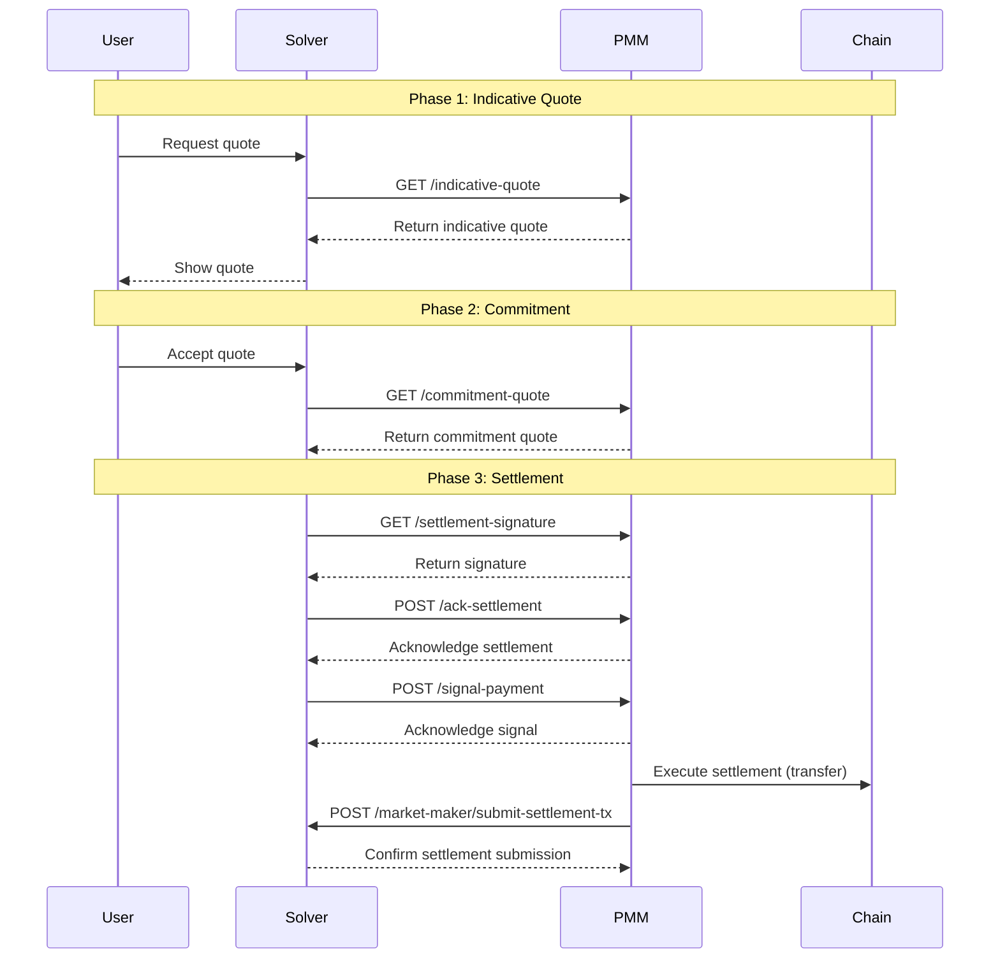

# PMM API Integration Documentation

> **Note**: If you prefer using the SDK instead of direct API integration, please refer to the [PMM SDK Integration Guide](sdk-integration.md).

A comprehensive guide for implementing Private Market Makers (PMMs) in the cross-chain trading network. This documentation covers the required integration points between PMMs and our solver backend, enabling cross-chain liquidity provision and settlement.

## Table of Contents

- [PMM API Integration Documentation](#pmm-api-integration-documentation)
  - [Table of Contents](#table-of-contents)
  - [1. Overview](#1-overview)
    - [1.1. Integration Flow](#11-integration-flow)
  - [2. Quick Start](#2-quick-start)
    - [2.1. API Environments](#21-api-environments)
  - [3. PMM Backend APIs](#3-pmm-backend-apis)
    - [3.1. Endpoint: `/indicative-quote`](#31-endpoint-indicative-quote)
      - [Description](#description)
      - [Request Parameters](#request-parameters)
      - [Example Request](#example-request)
      - [Expected Response](#expected-response)
      - [Example Implementation](#example-implementation)
    - [3.2. Endpoint: `/commitment-quote`](#32-endpoint-commitment-quote)
      - [Description](#description-1)
      - [Request Parameters](#request-parameters-1)
      - [Example Request](#example-request-1)
      - [Expected Response](#expected-response-1)
      - [Example Implementation](#example-implementation-1)
    - [3.3. Endpoint: `/settlement-signature`](#33-endpoint-settlement-signature)
      - [Description](#description-2)
      - [Request Parameters](#request-parameters-2)
      - [Example Request](#example-request-2)
      - [Expected Response](#expected-response-2)
      - [Example Implementation](#example-implementation-2)
    - [3.4. Endpoint: `/ack-settlement`](#34-endpoint-ack-settlement)
      - [Description](#description-3)
      - [Request Parameters](#request-parameters-3)
      - [Example Request](#example-request-3)
      - [Expected Response](#expected-response-3)
      - [Example Implementation](#example-implementation-3)
    - [3.5. Endpoint: `/signal-payment`](#35-endpoint-signal-payment)
      - [Description](#description-4)
      - [Request Parameters](#request-parameters-4)
      - [Example Request](#example-request-4)
      - [Expected Response](#expected-response-4)
      - [Example Implementation](#example-implementation-4)
  - [4. Solver API Endpoints for PMMs](#4-solver-api-endpoints-for-pmms)
    - [4.1. Endpoint: `/market-maker/tokens`](#41-endpoint-market-makertokens)
      - [Description](#description-5)
      - [Request Parameters](#request-parameters-5)
      - [Example Request](#example-request-5)
      - [Expected Response](#expected-response-5)
    - [4.2. Endpoint: `/market-maker/submit-settlement-tx`](#42-endpoint-market-makersubmit-settlement-tx)
      - [Description](#description-6)
      - [Request Parameters](#request-parameters-6)
      - [Example Request](#example-request-6)
      - [Expected Response](#expected-response-6)
      - [Notes](#notes)
    - [4.3. Endpoint: `/market-maker/trades/:tradeId`](#43-endpoint-market-makertradestradeid)
      - [Description](#description-7)
      - [Request Parameters](#request-parameters-7)
      - [Example Request](#example-request-7)
      - [Expected Response](#expected-response-7)
  - [5. PMM Making Payment](#5-pmm-making-payment)
    - [5.1. EVM](#51-evm)
    - [5.2. Bitcoin](#52-bitcoin)
  - [6. General Notes for PMMs](#6-general-notes-for-pmms)

## 1. Overview

This documentation contains everything needed to integrate your PMM with the solver network. The integration requires implementing specific API endpoints in your PMM service and making calls to the solver backend APIs.

### 1.1. Integration Flow



## 2. Quick Start

### 2.1. API Environments

| Environment  | Description                                                          |
| ------------ | -------------------------------------------------------------------- |
| `dev`        | Development environment with test networks and staging services      |
| `production` | Production environment with mainnet networks and production services |

Each environment includes specific configuration for backend URLs, RPC endpoints, router addresses, and payment addresses.

## 3. PMM Backend APIs

These are the APIs that PMMs must implement for Solver integration. These endpoints allow Solvers to communicate with your PMM service.

### 3.1. Endpoint: `/indicative-quote`

#### Description

Provides an indicative quote for the given token pair and trade amount. The quote is used for informational purposes before a commitment is made.

#### Request Parameters

- **HTTP Method**: `GET`
- **Query Parameters**:
  - `from_token_id` (string): The ID of the source token.
  - `to_token_id` (string): The ID of the destination token.
  - `amount` (string): The amount of the source token to be traded, represented as a string in base 10 to accommodate large numbers.
  - `session_id` (string, optional): A unique identifier for the session.

#### Example Request

```
GET /indicative-quote?from_token_id=ETH&to_token_id=BTC&amount=1000000000000000000&session_id=12345
```

#### Expected Response

- **HTTP Status**: `200 OK`
- **Response Body** (JSON):

```json
{
  "session_id": "12345",
  "pmm_receiving_address": "0xReceivingAddress",
  "indicative_quote": "123456789000000000",
  "error": "" // Empty if no error
}
```

- `session_id` (string): The session ID associated with the request.
- `pmm_receiving_address` (string): The receiving address where the user will send the `from_token`.
- `indicative_quote` (string): The indicative quote value, represented as a string.
- `error` (string): Error message, if any (empty if no error).

#### Example Implementation

```js
async function getIndicativeQuote(req, res) {
  try {
    const { from_token_id, to_token_id, amount, session_id } = req.query;
    
    // Generate a session ID if not provided
    const sessionId = session_id || generateSessionId();
    
    // Fetch token information from Solver API
    const tokensResponse = await fetch('https://api.solver.example/market-maker/tokens');
    const tokensData = await tokensResponse.json();
    
    // Find the from token and to token
    const fromToken = tokensData.data.tokens.find(token => token.token_id === from_token_id);
    const toToken = tokensData.data.tokens.find(token => token.token_id === to_token_id);
    
    if (!fromToken || !toToken) {
      return res.status(400).json({
        session_id: sessionId,
        pmm_receiving_address: '',
        indicative_quote: '0',
        error: 'Token not found'
      });
    }
    
    // Calculate the quote (implementation specific to your PMM)
    const quote = calculateQuote(fromToken, toToken, amount);
    
    // Get the receiving address for this token pair
    const pmmReceivingAddress = getPMMReceivingAddress(fromToken.network_id);
    
    return res.status(200).json({
      session_id: sessionId,
      pmm_receiving_address: pmmReceivingAddress,
      indicative_quote: quote,
      error: ''
    });
  } catch (error) {
    return res.status(500).json({
      session_id: req.query.session_id || '',
      pmm_receiving_address: '',
      indicative_quote: '0',
      error: error.message
    });
  }
}
```

### 3.2. Endpoint: `/commitment-quote`

#### Description

Provides a commitment quote for a specific trade, representing a firm commitment to proceed under the quoted conditions.

#### Request Parameters

- **HTTP Method**: `GET`
- **Query Parameters**:
  - `session_id` (string): A unique identifier for the session.
  - `trade_id` (string): The unique identifier for the trade.
  - `from_token_id` (string): The ID of the source token.
  - `to_token_id` (string): The ID of the destination token.
  - `amount` (string): The amount of the source token to be traded, in base 10.
  - `from_user_address` (string): The address of the user initiating the trade.
  - `to_user_address` (string): The address where the user will receive the `to_token`.
  - `user_deposit_tx` (string): The transaction hash where the user deposited their funds.
  - `user_deposit_vault` (string): The vault where the user's deposit is kept.
  - `trade_deadline` (string): The UNIX timestamp (in seconds) by which the user expects to receive payment.
  - `script_deadline` (string): The UNIX timestamp (in seconds) after which the user can withdraw their deposit if not paid.

#### Example Request

```
GET /commitment-quote?session_id=12345&trade_id=abcd1234&from_token_id=ETH&to_token_id=BTC&amount=1000000000000000000&from_user_address=0xUserAddress&to_user_address=0xReceivingAddress&user_deposit_tx=0xDepositTxHash&user_deposit_vault=VaultData&trade_deadline=1696012800&script_deadline=1696016400
```

#### Expected Response

- **HTTP Status**: `200 OK`
- **Response Body** (JSON):

```json
{
  "trade_id": "abcd1234",
  "commitment_quote": "987654321000000000",
  "error": "" // Empty if no error
}
```

- `trade_id` (string): The trade ID associated with the request.
- `commitment_quote` (string): The committed quote value, represented as a string.
- `error` (string): Error message, if any (empty if no error).

#### Example Implementation

```js
async function getCommitmentQuote(req, res) {
  try {
    const {
      session_id,
      trade_id,
      from_token_id,
      to_token_id,
      amount,
      from_user_address,
      to_user_address,
      user_deposit_tx,
      user_deposit_vault,
      trade_deadline,
      script_deadline
    } = req.query;
    
    // Validate the session exists
    const session = await sessionRepository.findById(session_id);
    if (!session) {
      return res.status(400).json({
        trade_id,
        commitment_quote: '0',
        error: 'Session not found'
      });
    }
    
    // Fetch token information from Solver API
    const tokensResponse = await fetch('https://api.solver.example/market-maker/tokens');
    const tokensData = await tokensResponse.json();
    
    // Find the from token and to token
    const fromToken = tokensData.data.tokens.find(token => token.token_id === from_token_id);
    const toToken = tokensData.data.tokens.find(token => token.token_id === to_token_id);
    
    if (!fromToken || !toToken) {
      return res.status(400).json({
        trade_id,
        commitment_quote: '0',
        error: 'Token not found'
      });
    }
    
    // Calculate the final quote (implementation specific to your PMM)
    const quote = calculateFinalQuote(fromToken, toToken, amount, trade_deadline);
    
    // Store the trade in the database
    await tradeRepository.create({
      tradeId: trade_id,
      sessionId: session_id,
      fromTokenId: from_token_id,
      toTokenId: to_token_id,
      amount,
      fromUserAddress: from_user_address,
      toUserAddress: to_user_address,
      userDepositTx: user_deposit_tx,
      userDepositVault: user_deposit_vault,
      tradeDeadline: trade_deadline,
      scriptDeadline: script_deadline,
      commitmentQuote: quote
    });
    
    return res.status(200).json({
      trade_id,
      commitment_quote: quote,
      error: ''
    });
  } catch (error) {
    return res.status(500).json({
      trade_id: req.query.trade_id || '',
      commitment_quote: '0',
      error: error.message
    });
  }
}
```

### 3.3. Endpoint: `/settlement-signature`

#### Description

Returns a signature from the PMM to confirm the settlement quote, required to finalize the trade.

#### Request Parameters

- **HTTP Method**: `GET`
- **Query Parameters**:
  - `trade_id` (string): The unique identifier for the trade.
  - `committed_quote` (string): The committed quote value in base 10.
  - `trade_deadline` (string): The UNIX timestamp (in seconds) by which the user expects to receive payment.
  - `script_deadline` (string): The UNIX timestamp (in seconds) after which the user can withdraw their deposit if not paid.

#### Example Request

```
GET /settlement-signature?trade_id=abcd1234&committed_quote=987654321000000000&trade_deadline=1696012800&script_deadline=1696016400
```

#### Expected Response

- **HTTP Status**: `200 OK`
- **Response Body** (JSON):

```json
{
  "trade_id": "abcd1234",
  "signature": "0xSignatureData",
  "deadline": 1696012800,
  "error": "" // Empty if no error
}
```

- `trade_id` (string): The trade ID associated with the request.
- `signature` (string): The signature provided by the PMM.
- `deadline` (integer): The UNIX timestamp (in seconds) indicating the PMM's expected payment deadline.
- `error` (string): Error message, if any (empty if no error).

#### Example Implementation

```js
async function getSettlementSignature(req, res) {
  try {
    const { trade_id, committed_quote, trade_deadline, script_deadline } = req.query;
    
    // Fetch the trade from the database
    const trade = await tradeRepository.findById(trade_id);
    if (!trade) {
      return res.status(400).json({
        trade_id,
        signature: '',
        deadline: 0,
        error: 'Trade not found'
      });
    }
    
    // Fetch trade details from Solver API
    const tradeDetailsResponse = await fetch(`https://api.solver.example/market-maker/trades/${trade_id}`);
    const tradeDetails = await tradeDetailsResponse.json();
    
    // Calculate a deadline (30 minutes from now)
    const deadline = Math.floor(Date.now() / 1000) + 1800;
    
    // Get PMM data
    const pmmId = process.env.PMM_ID; // Your PMM ID
    
    // Get the presigns and trade data from tradeDetails
    const { from_token, to_token } = tradeDetails.data;
    
    // Create a commitment info hash
    const commitInfoHash = createCommitInfoHash(
      pmmId,
      trade.pmmReceivingAddress,
      to_token.chain,
      to_token.address,
      committed_quote,
      deadline
    );
    
    // Sign the commitment with your private key
    const privateKey = process.env.PMM_PRIVATE_KEY;
    const signature = signMessage(privateKey, trade_id, commitInfoHash);
    
    return res.status(200).json({
      trade_id,
      signature,
      deadline,
      error: ''
    });
  } catch (error) {
    return res.status(500).json({
      trade_id: req.query.trade_id || '',
      signature: '',
      deadline: 0,
      error: error.message
    });
  }
}
```

### 3.4. Endpoint: `/ack-settlement`

#### Description

Used by the solver to acknowledge to the PMM about a successful settlement, indicating whether the PMM is selected.

#### Request Parameters

- **HTTP Method**: `POST`
- **Form Parameters**:
  - `trade_id` (string): The unique identifier for the trade.
  - `trade_deadline` (string): The UNIX timestamp (in seconds) by which the user expects to receive payment.
  - `script_deadline` (string): The UNIX timestamp (in seconds) after which the user can withdraw their deposit if not paid.
  - `chosen` (string): `"true"` if the PMM is selected, `"false"` otherwise.

#### Example Request

```
POST /ack-settlement
Content-Type: application/x-www-form-urlencoded

trade_id=abcd1234&trade_deadline=1696012800&script_deadline=1696016400&chosen=true
```

#### Expected Response

- **HTTP Status**: `200 OK`
- **Response Body** (JSON):

```json
{
  "trade_id": "abcd1234",
  "status": "acknowledged",
  "error": "" // Empty if no error
}
```

- `trade_id` (string): The trade ID associated with the request.
- `status` (string): Status of the acknowledgment (always `"acknowledged"`).
- `error` (string): Error message, if any (empty if no error).

#### Example Implementation

```js
async function ackSettlement(req, res) {
  try {
    const { trade_id, trade_deadline, script_deadline, chosen } = req.body;
    
    // Fetch the trade from the database
    const trade = await tradeRepository.findById(trade_id);
    if (!trade) {
      return res.status(400).json({
        trade_id,
        status: 'error',
        error: 'Trade not found'
      });
    }
    
    // Update trade status based on whether it was chosen
    await tradeRepository.update(trade_id, {
      chosen: chosen === 'true',
      tradeDeadline: trade_deadline,
      scriptDeadline: script_deadline
    });
    
    return res.status(200).json({
      trade_id,
      status: 'acknowledged',
      error: ''
    });
  } catch (error) {
    return res.status(500).json({
      trade_id: req.body.trade_id || '',
      status: 'error',
      error: error.message
    });
  }
}
```

### 3.5. Endpoint: `/signal-payment`

#### Description

Used by the solver to signal the chosen PMM to start submitting their payment.

#### Request Parameters

- **HTTP Method**: `POST`
- **Form Parameters**:
  - `trade_id` (string): The unique identifier for the trade.
  - `total_fee_amount` (string): The amount of total fee the PMM has to submit, in base 10.
  - `trade_deadline` (string): The UNIX timestamp (in seconds) by which the user expects to receive payment.
  - `script_deadline` (string): The UNIX timestamp (in seconds) after which the user can withdraw their deposit if not paid.

#### Example Request

```
POST /signal-payment
Content-Type: application/x-www-form-urlencoded

trade_id=abcd1234&total_fee_amount=1000000000000000&trade_deadline=1696012800&script_deadline=1696016400
```

#### Expected Response

- **HTTP Status**: `200 OK`
- **Response Body** (JSON):

```json
{
  "trade_id": "abcd1234",
  "status": "acknowledged",
  "error": "" // Empty if no error
}
```

- `trade_id` (string): The trade ID associated with the request.
- `status` (string): Status of the acknowledgment (always `"acknowledged"`).
- `error` (string): Error message, if any (empty if no error).

#### Example Implementation

```js
async function signalPayment(req, res) {
  try {
    const { trade_id, total_fee_amount, trade_deadline, script_deadline } = req.body;
    
    // Fetch the trade from the database
    const trade = await tradeRepository.findById(trade_id);
    if (!trade) {
      return res.status(400).json({
        trade_id,
        status: 'error',
        error: 'Trade not found'
      });
    }
    
    // Update trade with fee amount
    await tradeRepository.update(trade_id, {
      totalFeeAmount: total_fee_amount,
      tradeDeadline: trade_deadline,
      scriptDeadline: script_deadline
    });
    
    // Queue the payment task
    await paymentQueue.add({
      tradeId: trade_id,
      totalFeeAmount: total_fee_amount
    });
    
    return res.status(200).json({
      trade_id,
      status: 'acknowledged',
      error: ''
    });
  } catch (error) {
    return res.status(500).json({
      trade_id: req.body.trade_id || '',
      status: 'error',
      error: error.message
    });
  }
}
```

## 4. Solver API Endpoints for PMMs

These API endpoints are provided by the Solver backend for PMMs to retrieve token information and submit settlement data.

### 4.1. Endpoint: `/market-maker/tokens`

#### Description

Returns a list of tokens supported by the Solver Backend.

#### Request Parameters

- **HTTP Method**: `GET`

#### Example Request

```
GET /market-maker/tokens
```

#### Expected Response

- **HTTP Status**: `200 OK`
- **Response Body** (JSON):

```json
{
    "data": {
        "supported_networks": [
            {
                "network_id": "bitcoin_testnet",
                "name": "Bitcoin Testnet",
                "symbol": "tBTC",
                "type": "BTC",
                "logo_uri": "https://storage.googleapis.com/bitfi-static-35291d79/images/tokens/btc_network.svg"
            },
            {
                "network_id": "ethereum_sepolia",
                "name": "Ethereum Sepolia",
                "symbol": "ETH",
                "type": "EVM",
                "logo_uri": "https://storage.googleapis.com/bitfi-static-35291d79/images/tokens/eth_network.svg"
            }
        ],
        "tokens": [
            {
                "id": 2,
                "network_id": "bitcoin_testnet",
                "token_id": "tBTC",
                "network_name": "Bitcoin Testnet",
                "network_symbol": "tBTC",
                "network_type": "BTC",
                "token_name": "Bitcoin Testnet",
                "token_symbol": "tBTC",
                "token_address": "native",
                "token_decimals": 8,
                "token_logo_uri": "https://storage.googleapis.com/bitfi-static-35291d79/images/tokens/tbtc.svg",
                "network_logo_uri": "https://storage.googleapis.com/bitfi-static-35291d79/images/tokens/btc_network.svg",
                "active": true,
                "created_at": "2024-10-28T07:24:33.179Z",
                "updated_at": "2024-11-07T04:40:46.454Z"
            },
            {
                "id": 11,
                "network_id": "ethereum_sepolia",
                "token_id": "ETH",
                "network_name": "Ethereum Sepolia",
                "network_symbol": "ETH",
                "network_type": "EVM",
                "token_name": "Ethereum Sepolia",
                "token_symbol": "ETH",
                "token_address": "native",
                "token_decimals": 18,
                "token_logo_uri": "https://storage.googleapis.com/bitfi-static-35291d79/images/tokens/eth.svg",
                "network_logo_uri": "https://storage.googleapis.com/bitfi-static-35291d79/images/tokens/eth_network.svg",
                "active": true,
                "created_at": "2024-11-22T08:36:59.175Z",
                "updated_at": "2024-11-22T08:36:59.175Z"
            }
        ],
        "pairs": [
            {
                "from_token_id": "ETH",
                "to_token_id": "tBTC",
                "is_active": true
            },
            {
                "from_token_id": "tBTC",
                "to_token_id": "ETH",
                "is_active": true
            }
        ]
    }
}
```

### 4.2. Endpoint: `/market-maker/submit-settlement-tx`

#### Description

Allows the PMM to submit the settlement transaction hash for one or more trades. This step is necessary to complete the trade settlement process.

#### Request Parameters

- **HTTP Method**: `POST`
- **Request Body** (JSON):

```json
{
  "trade_ids": ["0xTradeID1", "0xTradeID2", "..."],
  "pmm_id": "pmm001",
  "settlement_tx": "SettlementTransactionData",
  "signature": "0xSignatureData",
  "start_index": 0,
  "signed_at": 1719158400
}
```

- `trade_ids` (array of strings): An array of trade IDs associated with the settlement transaction.
- `pmm_id` (string): The PMM's ID, which must match the one committed for the trade(s).
- `settlement_tx` (string): The raw transaction data representing the settlement.
- `signature` (string): The PMM's signature on the settlement transaction.
- `start_index` (integer): The index indicating the starting point for settlement processing (used for batch settlements).
- `signed_at` (integer): The UNIX timestamp (in seconds) when the PMM signed the settlement transaction.

#### Example Request

```
POST /market-maker/submit-settlement-tx
Content-Type: application/json

{
  "trade_ids": ["0xabcdef123456...", "0x123456abcdef..."],
  "pmm_id": "pmm001",
  "settlement_tx": "0xRawTransactionData",
  "signature": "0xSignatureData",
  "start_index": 0,
  "signed_at": 1719158400
}
```

#### Expected Response

- **HTTP Status**: `200 OK`
- **Response Body** (JSON):

```json
{
  "message": "Settlement transaction submitted successfully"
}
```

#### Notes

- **Trade IDs**: Provide all trade IDs included in the settlement transaction.
- **Start Index**: Used when submitting a batch of settlements to indicate the position within the batch.
- **Signature**: Must be valid and verifiable by the solver backend.

### 4.3. Endpoint: `/market-maker/trades/:tradeId`

#### Description

Returns detailed information about a specific trade by its trade ID. This endpoint allows PMMs to fetch comprehensive data about a trade, including token information, user addresses, quotes, settlement details, and current state.

#### Request Parameters

- **HTTP Method**: `GET`
- **Path Parameters**:
  - `tradeId` (string): The unique identifier for the trade to retrieve.

#### Example Request

```
GET /market-maker/trades/0x650e2c921a85eb0b8831ff838d4d98c0a5cd2ede5c0cb6bb4a15969f51c75424
```

#### Expected Response

- **HTTP Status**: `200 OK`
- **Response Body** (JSON): See the detailed response format in the updated PMM Integration API Documentation.

## 5. PMM Making Payment

### 5.1. EVM

In case the target chain is EVM-based, the transaction should emit the event from the `l1 payment contract` with the correct values for pmmAmountOut and protocolFee.

Example implementation:

```js
const { ethers } = require('ethers');

async function makeEVMPayment(tradeId, toAddress, amount, token, protocolFeeAmount) {
  try {
    // Get the private key from your secure storage
    const privateKey = process.env.PMM_EVM_PRIVATE_KEY;
    
    // Set up the provider and signer
    const rpcUrl = getRpcUrlForNetwork(token.networkId);
    const provider = new ethers.JsonRpcProvider(rpcUrl);
    const signer = new ethers.Wallet(privateKey, provider);
    
    // Get the payment contract address
    const paymentAddress = getPaymentAddressForNetwork(token.networkId);
    
    // Create the contract instance
    const paymentAbi = [
      // ABI for the payment contract
      "function payment(bytes32 tradeId, address token, address recipient, uint256 amount, uint256 feeAmount, uint256 deadline) payable returns (bool)"
    ];
    const paymentContract = new ethers.Contract(paymentAddress, paymentAbi, signer);
    
    // Calculate the deadline (30 minutes from now)
    const deadline = Math.floor(Date.now() / 1000) + 30 * 60;
    
    // If the token is native, we need to set the value
    const value = token.tokenAddress === 'native' ? amount : 0;
    const tokenAddress = token.tokenAddress === 'native' ? ethers.ZeroAddress : token.tokenAddress;
    
    // Submit the transaction
    const tx = await paymentContract.payment(
      tradeId,
      tokenAddress,
      toAddress,
      amount,
      protocolFeeAmount,
      deadline,
      { value }
    );
    
    console.log(`Transfer transaction sent: ${tx.hash}`);
    
    // Return the transaction hash with the 0x prefix
    return `0x${tx.hash.replace(/^0x/, '')}`;
  } catch (error) {
    console.error('EVM payment error:', error);
    throw error;
  }
}
```

### 5.2. Bitcoin

In case the target chain is Bitcoin, the transaction should have at least N + 1 outputs, with the first N outputs being the settlement UTXOs for trades, and one of them being the change UTXO for the user with the correct amount. The output N + 1 is the OP_RETURN output with the hash of tradeIds.

Example implementation:

```js
