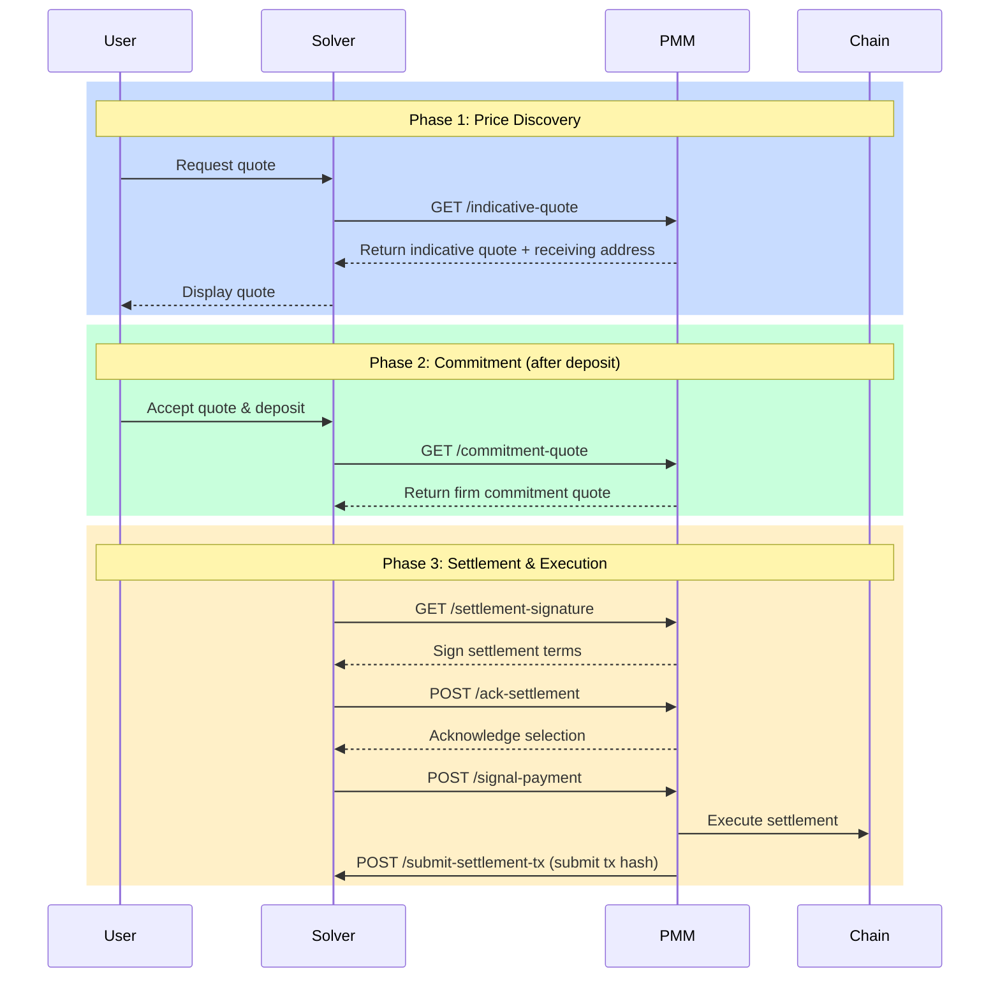

# PMM API Integration Documentation

A comprehensive guide for implementing Private Market Makers (PMMs) in the cross-chain trading network. This documentation covers the required integration points between PMMs and our solver backend, enabling cross-chain liquidity provision and settlement.

> **Latest Release: v0.8.0**
>
> - ✅ Router contract now fetched from protocol fetcher
> - ✅ Consistent `trade_id` across all protocols
> - ✅ Added optional fields: `user_receiving_address`, `user_refund_pubkey`, `from_user_address`
> - ✅ Backward compatible - no breaking changes for existing integrations
> - 📖 For Router usage, see [Environment Configuration](#21-api-environments)

## Table of Contents

- [PMM API Integration Documentation](#pmm-api-integration-documentation)
  - [Table of Contents](#table-of-contents)
  - [Smart Contract Integration](#smart-contract-integration)
    - [Contract Addresses](#contract-addresses)
  - [1. Overview](#1-overview)
    - [1.1. Integration Flow](#11-integration-flow)
  - [2. Quick Start](#2-quick-start)
    - [2.1. API Environments](#21-api-environments)
  - [3. PMM Backend APIs](#3-pmm-backend-apis)
    - [3.1. Endpoint: `/indicative-quote`](#31-endpoint-indicative-quote)
      - [Description](#description)
      - [Request Parameters](#request-parameters)
      - [Example Request](#example-request)
      - [Expected Response](#expected-response)
    - [3.2. Endpoint: `/commitment-quote`](#32-endpoint-commitment-quote)
      - [Request Parameters](#request-parameters-1)
      - [Example Request](#example-request-1)
      - [Expected Response](#expected-response-1)
    - [3.3. Endpoint: `/settlement-signature`](#33-endpoint-settlement-signature)
      - [Request Parameters](#request-parameters-2)
      - [Example Request](#example-request-2)
      - [Expected Response](#expected-response-2)
    - [3.4. Endpoint: `/ack-settlement`](#34-endpoint-ack-settlement)
      - [Request Parameters](#request-parameters-3)
      - [Example Request](#example-request-3)
      - [Expected Response](#expected-response-3)
    - [3.5. Endpoint: `/signal-payment`](#35-endpoint-signal-payment)
      - [Request Parameters](#request-parameters-4)
      - [Example Request](#example-request-4)
      - [Expected Response](#expected-response-5)
  - [4. Solver API Endpoints for PMMs](#4-solver-api-endpoints-for-pmms)
    - [4.1. Endpoint: `/v1/market-maker/tokens`](#41-endpoint-v1market-makertokens)
      - [Description](#description-6)
      - [Request Parameters](#request-parameters-6)
      - [Example Request](#example-request-6)
      - [Expected Response](#expected-response-6)
    - [4.2. Endpoint: `/v1/market-maker/submit-settlement-tx`](#42-endpoint-v1market-makersubmit-settlement-tx)
      - [Description](#description-7)
      - [Request Parameters](#request-parameters-7)
      - [Example Request](#example-request-7)
      - [Expected Response](#expected-response-7)
      - [Notes](#notes)
    - [4.3. Endpoint: `/v1/market-maker/trades/:tradeId`](#43-endpoint-v1market-makertradestradeid)
      - [Description](#description-8)
      - [Request Parameters](#request-parameters-8)
      - [Example Request](#example-request-8)
      - [Expected Response](#expected-response-8)
  - [5. PMM Making Payment](#5-pmm-making-payment)
    - [5.1. EVM](#51-evm)
    - [5.2. Bitcoin](#52-bitcoin)

## Smart Contract Integration

### Contract Addresses

**Testnet**

| Contract | Address                                      |
| -------- | -------------------------------------------- |
| Signer   | `0xA89F5060B810F3b6027D7663880c43ee77A865C7` |
| Router   | `0x31C88ebd9E430455487b6a5c8971e8eF63e97ED4` |
| Payment  | `0x7387DcCfE2f1D5F80b4ECDF91eF58541517e90D2` |

**Mainnet**

| Contract | Address                                      |
| -------- | -------------------------------------------- |
| Signer   | `0xCF9786F123F1071023dB8049808C223e94c384be` |
| Router   | `0x1e878cCa765a8aAFEBecCa672c767441b4859634` |
| Payment  | `0x0A497AC4261E37FA4062762C23Cf3cB642C839b8` |

## 1. Overview

The PMM integration with Optimex involves **bidirectional API communication**:

- **PMM-Provided APIs**: Endpoints that PMMs must implement to receive requests from the Solver
- **Solver-Provided APIs**: Endpoints that the Solver provides for PMMs to call

### 1.1. Integration Flow

The complete trade lifecycle consists of three phases:


```mermaid
sequenceDiagram
    participant User
    participant Solver
    participant PMM
    participant Chain

    rect rgb(200, 220, 255)
    Note over User,Chain: Phase 1: Price Discovery
    User->>Solver: Request quote
    Solver->>PMM: GET /indicative-quote
    PMM-->>Solver: Return indicative quote + receiving address
    Solver-->>User: Display quote
    end

    rect rgb(200, 255, 220)
    Note over User,Chain: Phase 2: Commitment (after deposit)
    User->>Solver: Accept quote & deposit
    Solver->>PMM: GET /commitment-quote
    PMM-->>Solver: Return firm commitment quote
    end

    rect rgb(255, 240, 200)
    Note over User,Chain: Phase 3: Settlement & Execution
    Solver->>PMM: GET /settlement-signature
    PMM-->>Solver: Sign settlement terms
    Solver->>PMM: POST /ack-settlement
    PMM-->>Solver: Acknowledge selection
    Solver->>PMM: POST /signal-payment
    PMM->>Chain: Execute settlement
    PMM->>Solver: POST /submit-settlement-tx (submit tx hash)
    end
```

## 2. Quick Start

### 2.1. API Environments

| Environment  | Network Type      | Use Case                                           |
| ------------ | ----------------- | -------------------------------------------------- |
| `dev`        | Test Networks     | Internal development and testing                  |
| `staging`    | Test Networks     | Integration testing & QA before staging release    |
| `prelive`    | Mainnet (Testing) | Final validation on mainnet before production     |
| `production` | Mainnet (Live)    | Production - Live trading with real assets        |

<details>
<summary><strong>Staging Contracts</strong></summary>

**Optimex L2 Testnet**

- **Signer**: [0xA89F5060B810F3b6027D7663880c43ee77A865C7](https://scan-testnet.optimex.xyz/address/0xA89F5060B810F3b6027D7663880c43ee77A865C7)
- **Router**: [0x31C88ebd9E430455487b6a5c8971e8eF63e97ED4](https://scan-testnet.optimex.xyz/address/0x31C88ebd9E430455487b6a5c8971e8eF63e97ED4)
- **ProtocolFetcherProxy**: [0x7c07151ca4DFd93F352Ab9B132A95866697c38c2](https://scan-testnet.optimex.xyz/address/0x7c07151ca4DFd93F352Ab9B132A95866697c38c2)

**Ethereum Sepolia**

- **Payment**: [0x7387DcCfE2f1D5F80b4ECDF91eF58541517e90D2](https://sepolia.etherscan.io/address/0x7387DcCfE2f1D5F80b4ECDF91eF58541517e90D2)
- **ETHVault**: [0x17aD543010fc8E8065b85E203839C0CBEcdfC851](https://sepolia.etherscan.io/address/0x17aD543010fc8E8065b85E203839C0CBEcdfC851)
- **WETHVault**: [0x673Ac1489457F43F04403940cE425ae19a9D639B](https://sepolia.etherscan.io/address/0x673Ac1489457F43F04403940cE425ae19a9D639B)
- **USDCVault**: [0x1c7D4B196Cb0C7B01d743Fbc6116a902379C7238](https://sepolia.etherscan.io/address/0x1c7D4B196Cb0C7B01d743Fbc6116a902379C7238)
- **USDTVault**: [0x62179B12Ce75B81Fcb4a2B634aD92DDaeF728e9C](https://sepolia.etherscan.io/address/0x62179B12Ce75B81Fcb4a2B634aD92DDaeF728e9C)
- **WBTCVault**: [0x04D0C9a5bb122958D8A64049068FD8570dDfA3Dc](https://sepolia.etherscan.io/address/0x04D0C9a5bb122958D8A64049068FD8570dDfA3Dc)
</details>

<details>
<summary><strong>Production/Prelive Contracts</strong></summary>

**Optimex L2 Mainnet**

- **Signer**: [0xCF9786F123F1071023dB8049808C223e94c384be](https://scan.optimex.xyz/address/0xCF9786F123F1071023dB8049808C223e94c384be)
- **Router**: [0x1e878cCa765a8aAFEBecCa672c767441b4859634](https://scan.optimex.xyz/address/0x1e878cCa765a8aAFEBecCa672c767441b4859634)
- **ProtocolFetcherProxy**: [0xFDEd4CEf9aE1E03D0BeF161262a266c1c157a32b](https://scan.optimex.xyz/address/0xFDEd4CEf9aE1E03D0BeF161262a266c1c157a32b)

**Ethereum Mainnet**

- **Payment**: [0x0A497AC4261E37FA4062762C23Cf3cB642C839b8](https://etherscan.io/address/0x0A497AC4261E37FA4062762C23Cf3cB642C839b8)
- **ETHVault**: [0xF7fedF4A250157010807E6eA60258E3B768149Ff](https://etherscan.io/address/0xF7fedF4A250157010807E6eA60258E3B768149Ff)
- **WETHVault**: [0xaD3f379AaED8Eca895209Af446F2e34f07145dbC](https://etherscan.io/address/0xaD3f379AaED8Eca895209Af446F2e34f07145dbC)
- **USDCVault**: [0x4463084C01ed22E8320D345b357721aE525Db93F](https://etherscan.io/address/0x4463084C01ed22E8320D345b357721aE525Db93F)
- **USDTVault**: [0x0712CAB9e52a37aFC6fA768b20cc9b07325314fB](https://etherscan.io/address/0x0712CAB9e52a37aFC6fA768b20cc9b07325314fB)
- **WBTCVault**: [0xCd6B5F600559104Ee19320B9F9C3b2c7672cb895](https://etherscan.io/address/0xCd6B5F600559104Ee19320B9F9C3b2c7672cb895)
</details>

> **Note**: The prelive and production environments use the same contract addresses. The difference is in the backend services and configuration that interact with these contracts.

## 3. PMM Backend APIs

These are the APIs that **PMMs must implement** for Solver integration. These endpoints handle the complete trade lifecycle from quote to settlement.

| Endpoint | Method | Phase | Purpose |
|----------|--------|-------|---------|
| `/indicative-quote` | GET | Discovery | Initial price quote before deposit |
| `/commitment-quote` | GET | Commitment | Firm quote after user deposits |
| `/settlement-signature` | GET | Settlement | PMM signs settlement authorization |
| `/ack-settlement` | POST | Settlement | Acknowledge if PMM was selected |
| `/signal-payment` | POST | Settlement | Signal to execute payment |

> **📝 For Liquidation Flows:** See [Liquidation Documentation](./docs/liquidation.md) for the `/liquidation-quote` endpoint which replaces `/commitment-quote` for liquidation trades.

---

### 3.1. Endpoint: `/indicative-quote`

**Purpose:** Provides an indicative quote for the given token pair and trade amount. Used for informational purposes before a commitment is made.

#### Request Parameters

**Query Parameters:**

| Parameter | Type | Required | Description |
|-----------|------|----------|-------------|
| `from_token_id` | string | ✅ | Source token identifier |
| `to_token_id` | string | ✅ | Destination token identifier |
| `amount` | string | ✅ | Amount to trade (base 10, handles large numbers) |
| `session_id` | string | ❌ | Unique session identifier for tracking |
| `deposited` | boolean | ❌ | Whether user deposit is confirmed |
| `trade_timeout` | string | ❌ | Deadline for user to receive tokens (UNIX timestamp) |
| `script_timeout` | string | ❌ | Hard timeout - trade won't process after this (UNIX timestamp) |
| `from_user_address` | string | ❌ | User's source address (where input tokens come from) |
| `user_receiving_address` | string | ❌ | User's receiving address (where output tokens go) |
| `user_refund_pubkey` | string | ❌ | User's public key for refunds |

#### Example Request

```
GET /indicative-quote?from_token_id=ETH&to_token_id=BTC&amount=1000000000000000000
```

#### Expected Response

**HTTP Status:** `200 OK`

**Response Body:**

```json
{
  "session_id": "12345",
  "pmm_receiving_address": "0xReceivingAddress",
  "indicative_quote": "123456789000000000",
  "error": ""
}
```

| Field | Type | Description |
|-------|------|-------------|
| `session_id` | string | Session identifier for tracking this quote |
| `pmm_receiving_address` | string | Where user will send the input tokens |
| `indicative_quote` | string | Estimated output amount (treat as BigInt) |
| `error` | string | Error message if applicable (empty if successful) |

<details>
<summary><strong>Example Implementation</strong></summary>

```js
import crypto from 'crypto'
import { tokenService } from '@optimex-xyz/market-maker-sdk'

// In-memory session storage (use Redis in production)
const sessionStore = new Map()

function generateSessionId() {
  return crypto.randomBytes(16).toString('hex')
}

function getPmmAddressByNetworkType(token) {
  switch (token.networkType.toUpperCase()) {
    case 'EVM':
      return process.env.PMM_EVM_ADDRESS
    case 'BTC':
    case 'TBTC':
      return process.env.PMM_BTC_ADDRESS
    case 'SOLANA':
      return process.env.PMM_SOLANA_ADDRESS
    default:
      throw new Error(`Unsupported network type: ${token.networkType}`)
  }
}

async function getIndicativeQuote(req, res) {
  try {
    const { from_token_id, to_token_id, amount, session_id } = req.query

    // Generate a session ID if not provided
    const sessionId = session_id || generateSessionId()

    // Fetch token information using SDK tokenService
    const [fromToken, toToken] = await Promise.all([
      tokenService.getTokenByTokenId(from_token_id),
      tokenService.getTokenByTokenId(to_token_id),
    ])

    if (!fromToken) {
      return res.status(400).json({
        session_id: sessionId,
        pmm_receiving_address: '',
        indicative_quote: '0',
        error: `From token not found: ${from_token_id}`,
      })
    }
    if (!toToken) {
      return res.status(400).json({
        session_id: sessionId,
        pmm_receiving_address: '',
        indicative_quote: '0',
        error: `To token not found: ${to_token_id}`,
      })
    }

    // Validate amount (implement your own validation logic)
    const amountBigInt = BigInt(amount)
    validateIndicativeAmount(amountBigInt, fromToken)

    // Calculate the quote (implementation specific to your PMM)
    const quote = await calculateBestQuote({
      amountIn: amount,
      fromTokenId: from_token_id,
      toTokenId: to_token_id,
      isCommitment: false,
    })

    // Get the receiving address based on network type
    const pmmReceivingAddress = getPmmAddressByNetworkType(fromToken)

    // Save session data for later use in commitment quote
    sessionStore.set(sessionId, {
      fromToken: from_token_id,
      toToken: to_token_id,
      amount: amount,
      pmmReceivingAddress: pmmReceivingAddress,
      indicativeQuote: quote,
    })

    return res.status(200).json({
      session_id: sessionId,
      pmm_receiving_address: pmmReceivingAddress,
      indicative_quote: quote.toString(),
      error: '',
    })
  } catch (error) {
    return res.status(500).json({
      session_id: req.query.session_id || '',
      pmm_receiving_address: '',
      indicative_quote: '0',
      error: error.message,
    })
  }
}
```

</details>

### 3.2. Endpoint: `/commitment-quote`

**Purpose:** Provides a firm commitment quote for a specific trade after user deposits. This is a binding quote that must be honored.

#### Request Parameters

**Query Parameters:**

| Parameter | Type | Required | Description |
|-----------|------|----------|-------------|
| `session_id` | string | ✅ | Session identifier from indicative quote |
| `trade_id` | string | ✅ | Unique trade identifier (hex format) |
| `from_token_id` | string | ✅ | Source token identifier |
| `to_token_id` | string | ✅ | Destination token identifier |
| `amount` | string | ✅ | Trade amount (base 10, treat as BigInt) |
| `from_user_address` | string | ✅ | User's source address |
| `to_user_address` | string | ✅ | User's receiving address |
| `user_deposit_tx` | string | ✅ | Transaction hash of user's deposit |
| `user_deposit_vault` | string | ✅ | Vault where deposit is held |
| `trade_deadline` | string | ✅ | Expected payment deadline (UNIX timestamp, BigInt) |
| `script_deadline` | string | ✅ | Withdrawal deadline if unpaid (UNIX timestamp, BigInt) |

#### Example Request

```
GET /commitment-quote?session_id=12345&trade_id=0x3bfe2fc4889a98a39b31b348e7b212ea3f2bea63fd1ea2e0c8ba326433677328&from_token_id=ETH&to_token_id=BTC&amount=1000000000000000000&from_user_address=0xUserAddress&to_user_address=0xReceivingAddress&user_deposit_tx=0xDepositTxHash&user_deposit_vault=VaultData&trade_deadline=1696012800&script_deadline=1696016400
```

#### Expected Response

**HTTP Status:** `200 OK`

**Response Body:**

```json
{
  "trade_id": "0x3bfe2fc4889a98a39b31b348e7b212ea3f2bea63fd1ea2e0c8ba326433677328",
  "commitment_quote": "987654321000000000",
  "error": ""
}
```

| Field | Type | Description |
|-------|------|-------------|
| `trade_id` | string | Trade identifier from request |
| `commitment_quote` | string | **Firm committed quote amount** (treat as BigInt) - PMM must honor this |
| `error` | string | Error message if applicable (empty if successful) |

<details>
<summary><strong>Example Implementation</strong></summary>

```js
import { tokenService } from '@optimex-xyz/market-maker-sdk'

// Session store (use Redis in production)
const sessionStore = new Map()

async function getCommitmentQuote(req, res) {
  try {
    const {
      session_id,
      trade_id,
      from_token_id,
      to_token_id,
      amount,
      from_user_address,
      to_user_address,
      user_deposit_tx,
      user_deposit_vault,
      trade_deadline,
      script_deadline,
    } = req.query

    // Validate the session exists
    const session = sessionStore.get(session_id)
    if (!session) {
      return res.status(400).json({
        trade_id,
        commitment_quote: '0',
        error: 'Session expired during processing',
      })
    }

    // Fetch token information using SDK tokenService
    const [fromToken, toToken] = await Promise.all([
      tokenService.getTokenByTokenId(from_token_id),
      tokenService.getTokenByTokenId(to_token_id),
    ])

    if (!fromToken) {
      return res.status(400).json({
        trade_id,
        commitment_quote: '0',
        error: `From token not found: ${from_token_id}`,
      })
    }
    if (!toToken) {
      return res.status(400).json({
        trade_id,
        commitment_quote: '0',
        error: `To token not found: ${to_token_id}`,
      })
    }

    // Validate commitment amount (implement your own validation logic)
    validateCommitmentAmount(BigInt(amount), fromToken)

    // Delete any existing trade with the same ID (handle retries)
    await tradeRepository.delete(trade_id)

    // Calculate the final quote (implementation specific to your PMM)
    const quote = await calculateBestQuote({
      amountIn: amount,
      fromTokenId: from_token_id,
      toTokenId: to_token_id,
      isCommitment: true, // Use commitment pricing
    })

    // Store the trade in the database
    await tradeRepository.create({
      tradeId: trade_id,
      fromTokenId: from_token_id,
      toTokenId: to_token_id,
      fromUser: from_user_address,
      toUser: to_user_address,
      amount: amount,
      fromNetworkId: fromToken.networkId,
      toNetworkId: toToken.networkId,
      userDepositTx: user_deposit_tx,
      userDepositVault: user_deposit_vault,
      tradeDeadline: trade_deadline,
      scriptDeadline: script_deadline,
      tradeType: 'SWAP',
      commitmentQuote: quote.toString(),
    })

    return res.status(200).json({
      trade_id,
      commitment_quote: quote.toString(),
      error: '',
    })
  } catch (error) {
    return res.status(500).json({
      trade_id: req.query.trade_id || '',
      commitment_quote: '0',
      error: error.message,
    })
  }
}
```

</details>

### 3.3. Endpoint: `/settlement-signature`

**Purpose:** Returns a signature from the PMM to confirm the settlement quote, required to finalize the trade.

#### Request Parameters

**Query Parameters:**

| Parameter | Type | Required | Description |
|-----------|------|----------|-------------|
| `trade_id` | string | ✅ | Unique trade identifier (hex format) |
| `committed_quote` | string | ✅ | Committed quote value (base 10, treat as BigInt) |
| `trade_deadline` | string | ✅ | Payment deadline (UNIX timestamp) |
| `script_deadline` | string | ✅ | Withdrawal deadline if unpaid (UNIX timestamp) |

#### Example Request

```
GET /settlement-signature?trade_id=0x3d09b8eb94466bffa126aeda68c8c0f330633a7d0058f57269d795530415498a&committed_quote=987654321000000000&trade_deadline=1696012800&script_deadline=1696016400
```

#### Expected Response

**HTTP Status:** `200 OK`

**Response Body:**

```json
{
  "trade_id": "0x3d09b8eb94466bffa126aeda68c8c0f330633a7d0058f57269d795530415498a",
  "signature": "0xSignatureData",
  "deadline": 1696012800,
  "error": ""
}
```

| Field | Type | Description |
|-------|------|-------------|
| `trade_id` | string | Trade identifier from request |
| `signature` | string | PMM's cryptographic signature authorizing settlement |
| `deadline` | integer | PMM's expected payment deadline (UNIX timestamp) |
| `error` | string | Error message if applicable (empty if successful) |

<details>
<summary><strong>Example Implementation</strong></summary>

```js
import {
  getCommitInfoHash,
  getSignature,
  routerService,
  SignatureType,
  signerService,
  tokenService,
} from '@optimex-xyz/market-maker-sdk'

import { ethers } from 'ethers'

// Helper function to encode string to hex
const l2Encode = (info) => {
  if (/^0x[0-9a-fA-F]*$/.test(info)) {
    return info
  }
  return '0x' + Buffer.from(info, 'utf8').toString('hex')
}

// Helper function to decode hex to string
const l2Decode = (hex) => {
  if (!hex.startsWith('0x')) return hex
  return Buffer.from(hex.slice(2), 'hex').toString('utf8')
}

async function getSettlementSignature(req, res) {
  try {
    const { trade_id, committed_quote, trade_deadline, script_deadline } = req.query

    // Fetch the trade from the database
    const trade = await tradeRepository.findById(trade_id)
    if (!trade) {
      return res.status(400).json({
        trade_id,
        signature: '',
        deadline: 0,
        error: 'Trade not found',
      })
    }

    // Fetch presigns and trade data from router service
    const [presigns, tradeData] = await Promise.all([
      routerService.getSettlementPresigns(trade_id),
      routerService.getTradeData(trade_id),
    ])

    const { toChain, fromChain } = tradeData.tradeInfo

    // Get the from token to determine PMM receiving address
    const fromToken = await tokenService.getToken(l2Decode(fromChain[1]), l2Decode(fromChain[2]))
    const pmmAddress = getPmmAddressByNetworkType(fromToken) // Your PMM address based on network type

    // Calculate a deadline (30 minutes from now)
    const deadline = BigInt(Math.floor(Date.now() / 1000) + 1800)

    // Get PMM ID (should be hex encoded)
    const pmmId = '0x' + Buffer.from(process.env.PMM_ID, 'utf8').toString('hex')

    // Find PMM presign and validate receiving address
    const pmmPresign = presigns.find((t) => t.pmmId === pmmId)
    if (!pmmPresign) {
      return res.status(400).json({
        trade_id,
        signature: '',
        deadline: 0,
        error: 'PMM presign not found',
      })
    }

    // Validate that the presign receiving address matches expected PMM address
    if (l2Decode(pmmPresign.pmmRecvAddress).toLowerCase() !== pmmAddress.toLowerCase()) {
      return res.status(400).json({
        trade_id,
        signature: '',
        deadline: 0,
        error: 'PMM receiving address mismatch',
      })
    }

    const amountOut = BigInt(committed_quote)

    // Create commitment info hash using SDK function
    const commitInfoHash = getCommitInfoHash(
      pmmId,
      l2Encode(pmmAddress),
      toChain[1], // destination chain
      toChain[2], // destination token address
      amountOut,
      deadline
    )

    // Get signer address and domain for EIP-712 signature
    const signerAddress = await routerService.getSigner()
    const domain = await signerService.getDomain()

    // Set up provider and wallet
    const provider = new ethers.JsonRpcProvider(process.env.RPC_URL)
    const pmmWallet = new ethers.Wallet(process.env.PMM_PRIVATE_KEY, provider)

    // Generate signature using SDK function
    const signature = await getSignature(
      pmmWallet,
      provider,
      signerAddress,
      trade_id,
      commitInfoHash,
      SignatureType.VerifyingContract,
      domain
    )

    return res.status(200).json({
      trade_id,
      signature,
      deadline: Number(deadline),
      error: '',
    })
  } catch (error) {
    return res.status(500).json({
      trade_id: req.query.trade_id || '',
      signature: '',
      deadline: 0,
      error: error.message,
    })
  }
}

// Helper function to get PMM address based on network type
function getPmmAddressByNetworkType(token) {
  switch (token.networkType.toUpperCase()) {
    case 'EVM':
      return process.env.PMM_EVM_ADDRESS
    case 'BTC':
    case 'TBTC':
      return process.env.PMM_BTC_ADDRESS
    case 'SOLANA':
      return process.env.PMM_SOLANA_ADDRESS
    default:
      throw new Error(`Unsupported network type: ${token.networkType}`)
  }
}
```

</details>

### 3.4. Endpoint: `/ack-settlement`

**Purpose:** Solver notifies the PMM whether it was selected to execute the settlement. PMM can prepare or release liquidity accordingly.

#### Request Parameters

**Form Parameters:**

| Parameter | Type | Required | Description |
|-----------|------|----------|-------------|
| `trade_id` | string | ✅ | Unique trade identifier (hex format) |
| `trade_deadline` | string | ✅ | Payment deadline (UNIX timestamp) |
| `script_deadline` | string | ✅ | Withdrawal deadline if unpaid (UNIX timestamp) |
| `chosen` | string | ✅ | `"true"` if PMM selected, `"false"` if not |

#### Example Request

```
POST /ack-settlement
Content-Type: application/x-www-form-urlencoded

trade_id=0x024be4dae899989e0c3d9b4459e5811613bcd04016dc56529f16a19d2a7724c0&trade_deadline=1696012800&script_deadline=1696016400&chosen=true
```

#### Expected Response

**HTTP Status:** `200 OK`

**Response Body:**

```json
{
  "trade_id": "0x024be4dae899989e0c3d9b4459e5811613bcd04016dc56529f16a19d2a7724c0",
  "status": "acknowledged",
  "error": ""
}
```

| Field | Type | Description |
|-------|------|-------------|
| `trade_id` | string | Trade identifier from request |
| `status` | string | Always `"acknowledged"` if successful |
| `error` | string | Error message if applicable (empty if successful) |

<details>
<summary><strong>Example Implementation</strong></summary>

```js
// Trade status enum
const TradeStatus = {
  PENDING: 'PENDING',
  QUOTE_PROVIDED: 'QUOTE_PROVIDED',
  COMMITTED: 'COMMITTED',
  SELECTED: 'SELECTED',
  SETTLING: 'SETTLING',
  COMPLETED: 'COMPLETED',
  FAILED: 'FAILED',
}

async function ackSettlement(req, res) {
  try {
    const { trade_id, trade_deadline, script_deadline, chosen } = req.body

    // Fetch the trade from the database
    const trade = await tradeRepository.findById(trade_id)
    if (!trade) {
      return res.status(400).json({
        trade_id,
        status: 'error',
        error: 'Trade not found',
      })
    }

    // Update trade status based on whether PMM was chosen
    const isChosen = chosen === 'true'
    const newStatus = isChosen ? TradeStatus.SELECTED : TradeStatus.FAILED
    const failureReason = isChosen ? undefined : 'PMM not chosen for settlement'

    await tradeRepository.updateStatus(trade_id, newStatus, failureReason)

    return res.status(200).json({
      trade_id,
      status: 'acknowledged',
      error: '',
    })
  } catch (error) {
    return res.status(500).json({
      trade_id: req.body.trade_id || '',
      status: 'error',
      error: error.message,
    })
  }
}
```

</details>

### 3.5. Endpoint: `/signal-payment`

**Purpose:** Solver signals the selected PMM to start submitting payment transactions. After receiving this signal, PMM must execute settlement before the deadline.

#### Request Parameters

**Form Parameters:**

| Parameter | Type | Required | Description |
|-----------|------|----------|-------------|
| `trade_id` | string | ✅ | Unique trade identifier (hex format) |
| `total_fee_amount` | string | ✅ | Total fee amount to submit (base 10, treat as BigInt) |
| `trade_deadline` | string | ✅ | Payment deadline (UNIX timestamp) |
| `script_deadline` | string | ✅ | Withdrawal deadline if unpaid (UNIX timestamp) |

#### Example Request

```
POST /signal-payment
Content-Type: application/x-www-form-urlencoded

trade_id=0x3bfe2fc4889a98a39b31b348e7b212ea3f2bea63fd1ea2e0c8ba326433677328&total_fee_amount=1000000000000000&trade_deadline=1696012800&script_deadline=1696016400
```

#### Expected Response

**HTTP Status:** `200 OK`

**Response Body:**

```json
{
  "trade_id": "0x3bfe2fc4889a98a39b31b348e7b212ea3f2bea63fd1ea2e0c8ba326433677328",
  "status": "acknowledged",
  "error": ""
}
```

| Field | Type | Description |
|-------|------|-------------|
| `trade_id` | string | Trade identifier from request |
| `status` | string | Always `"acknowledged"` if successful |
| `error` | string | Error message if applicable (empty if successful) |

**Next Steps After Signal:**
1. Queue payment execution to appropriate network (EVM/BTC/Solana)
2. Execute settlement transaction before deadline
3. Submit settlement via `/v1/market-maker/submit-settlement-tx`

<details>
<summary><strong>Example Implementation</strong></summary>

```js
import { tokenService } from '@optimex-xyz/market-maker-sdk'

// Trade status enum
const TradeStatus = {
  PENDING: 'PENDING',
  QUOTE_PROVIDED: 'QUOTE_PROVIDED',
  COMMITTED: 'COMMITTED',
  SELECTED: 'SELECTED',
  SETTLING: 'SETTLING',
  COMPLETED: 'COMPLETED',
  FAILED: 'FAILED',
}

// Queue names for different network types
const SETTLEMENT_QUEUES = {
  EVM: 'settlement:evm:transfer',
  BTC: 'settlement:btc:transfer',
  SOLANA: 'settlement:solana:transfer',
}

function getQueueNameByNetworkType(networkType) {
  switch (networkType.toUpperCase()) {
    case 'EVM':
      return SETTLEMENT_QUEUES.EVM
    case 'BTC':
    case 'TBTC':
      return SETTLEMENT_QUEUES.BTC
    case 'SOLANA':
      return SETTLEMENT_QUEUES.SOLANA
    default:
      throw new Error(`Unsupported network type: ${networkType}`)
  }
}

async function signalPayment(req, res) {
  try {
    const { trade_id, total_fee_amount, trade_deadline, script_deadline } = req.body

    // Fetch the trade from the database
    const trade = await tradeRepository.findById(trade_id)
    if (!trade) {
      return res.status(400).json({
        trade_id,
        status: 'error',
        error: 'Trade not found',
      })
    }

    // Validate trade status - must be SELECTED to proceed
    if (trade.status !== TradeStatus.SELECTED) {
      return res.status(400).json({
        trade_id,
        status: 'error',
        error: `Invalid trade status: ${trade.status}`,
      })
    }

    // Get the destination token to determine which queue to use
    const toToken = await tokenService.getTokenByTokenId(trade.toTokenId)
    const queueName = getQueueNameByNetworkType(toToken.networkType)

    // Queue the payment task to the appropriate network queue
    await paymentQueue.add(queueName, {
      tradeId: trade_id,
    })

    // Update trade status to SETTLING
    await tradeRepository.updateStatus(trade_id, TradeStatus.SETTLING)

    return res.status(200).json({
      trade_id,
      status: 'acknowledged',
      error: '',
    })
  } catch (error) {
    return res.status(500).json({
      trade_id: req.body.trade_id || '',
      status: 'error',
      error: error.message,
    })
  }
}
```

</details>

## 4. Solver API Endpoints for PMMs

These API endpoints are provided by the Solver backend for PMMs to retrieve token information and submit settlement data.

> **Note**: The base URL for the Solver API endpoints will be provided separately. All endpoint paths in this documentation should be appended to that base URL.

### 4.1. Endpoint: `/v1/market-maker/tokens`

#### Description

Returns a list of tokens supported by the Solver Backend.

#### Request Parameters

- **HTTP Method**: `GET`

#### Example Request

```
GET /v1/market-maker/tokens
```

#### Expected Response

- **HTTP Status**: `200 OK`
- **Response Body**: JSON containing supported networks, tokens, and trading pairs

<details>
<summary><strong>View Example Response</strong></summary>

```json
{
  "data": {
    "supported_networks": [
      {
        "network_id": "bitcoin_testnet",
        "name": "Bitcoin Testnet",
        "symbol": "tBTC",
        "type": "BTC",
        "logo_uri": "https://storage.googleapis.com/Optimex-static-35291d79/images/tokens/btc_network.svg"
      },
      {
        "network_id": "ethereum_sepolia",
        "name": "Ethereum Sepolia",
        "symbol": "ETH",
        "type": "EVM",
        "logo_uri": "https://storage.googleapis.com/Optimex-static-35291d79/images/tokens/eth_network.svg"
      }
    ],
    "tokens": [
      {
        "id": 2,
        "network_id": "bitcoin_testnet",
        "token_id": "tBTC",
        "network_name": "Bitcoin Testnet",
        "network_symbol": "tBTC",
        "network_type": "BTC",
        "token_name": "Bitcoin Testnet",
        "token_symbol": "tBTC",
        "token_address": "native",
        "token_decimals": 8,
        "token_logo_uri": "https://storage.googleapis.com/Optimex-static-35291d79/images/tokens/tbtc.svg",
        "network_logo_uri": "https://storage.googleapis.com/Optimex-static-35291d79/images/tokens/btc_network.svg",
        "active": true,
        "created_at": "2024-10-28T07:24:33.179Z",
        "updated_at": "2024-11-07T04:40:46.454Z"
      },
      {
        "id": 11,
        "network_id": "ethereum_sepolia",
        "token_id": "ETH",
        "network_name": "Ethereum Sepolia",
        "network_symbol": "ETH",
        "network_type": "EVM",
        "token_name": "Ethereum Sepolia",
        "token_symbol": "ETH",
        "token_address": "native",
        "token_decimals": 18,
        "token_logo_uri": "https://storage.googleapis.com/Optimex-static-35291d79/images/tokens/eth.svg",
        "network_logo_uri": "https://storage.googleapis.com/Optimex-static-35291d79/images/tokens/eth_network.svg",
        "active": true,
        "created_at": "2024-11-22T08:36:59.175Z",
        "updated_at": "2024-11-22T08:36:59.175Z"
      }
    ],
    "pairs": [
      {
        "from_token_id": "ETH",
        "to_token_id": "tBTC",
        "is_active": true
      },
      {
        "from_token_id": "tBTC",
        "to_token_id": "ETH",
        "is_active": true
      }
    ]
  }
}
```

</details>

### 4.2. Endpoint: `/v1/market-maker/submit-settlement-tx`

#### Description

Allows the PMM to submit settlement transaction hashes for trades. This endpoint is essential for completing the trade settlement process and must be called after making payments.

#### Request Parameters

- **HTTP Method**: `POST`
- **Request Body** (JSON):

```json
{
  "trade_ids": ["0xTradeID1", "0xTradeID2", "..."],
  "pmm_id": "pmm001",
  "settlement_tx": "SettlementTransactionData",
  "signature": "0xSignatureData",
  "start_index": 0,
  "signed_at": 1719158400
}
```

- `trade_ids` (array of strings): Array of trade IDs included in this settlement transaction.
- `pmm_id` (string): Your PMM identifier, which must match what was used in the commitment phase.
- `signature` (string): Your cryptographic signature for this submission.
- `start_index` (integer): Starting position within batch settlements (typically 0 for single trades).
- `signed_at` (integer): UNIX timestamp (seconds) when you signed this submission.
- `settlement_tx` (string): Should be hex format with a `0x` prefix

  - **For EVM Chains:**

    - Use the transaction hash directly without additional encoding
    - Example: `settlement_tx`: [0x7a87d2c423e13533b5ae0ecc5af900a7b697048103f4f6e32d19edde5e707355](https://etherscan.io/tx/0x7a87d2c423e13533b5ae0ecc5af900a7b697048103f4f6e32d19edde5e707355)

  - **For Bitcoin or Solana:**
    - Must encode raw_tx string using the `l2Encode` function
    - Example raw_tx string: `3d83c7846d6e5b04279175a9592705a15373f3029b866d5224cc0744489fe403`
    - After encoding
      ```
      "settlement_tx": "0x33643833633738343664366535623034323739313735613935393237303561313533373366333032396238363664353232346363303734343438396665343033"
      ```

<details>
<summary><strong>Bitcoin l2Encode</strong></summary>

```javascript
import { ethers, toUtf8Bytes, toUtf8String } from 'ethers'

export const l2Encode = (info: string) => {
  // Helper function to ensure hex prefix
  const ensureHexPrefix = (value: string) => {
    return value.startsWith('0x') ? value : `0x${value}`
  }

  if (/^0x[0-9a-fA-F]*$/.test(info)) {
    return info
  }
  return ensureHexPrefix(ethers.hexlify(toUtf8Bytes(info)))
}
```

</details>

#### Example Request

```
POST /v1/market-maker/submit-settlement-tx
Content-Type: application/json

{
  "trade_ids": ["0xabcdef123456...", "0x123456abcdef..."],
  "pmm_id": "pmm001",
  "settlement_tx": "0x33643833633738343664366535623034323739313735613935393237303561313533373366333032396238363664353232346363303734343438396665343033",
  "signature": "0xSignatureData",
  "start_index": 0,
  "signed_at": 1719158400
}
```

#### Expected Response

- **HTTP Status**: `200 OK`
- **Response Body** (JSON):

```json
{
  "message": "Settlement transaction submitted successfully"
}
```

#### Notes

- **Trade IDs**: Provide all trade IDs included in the settlement transaction.
- **Start Index**: Used when submitting a batch of settlements to indicate the position within the batch.
- **Signature**: Must be valid and verifiable by the solver backend.

### 4.3. Endpoint: `/v1/market-maker/trades/:tradeId`

#### Description

Returns detailed information about a specific trade by its trade ID. This endpoint allows PMMs to fetch comprehensive data about a trade, including token information, user addresses, quotes, settlement details, and current state.

#### Request Parameters

- **HTTP Method**: `GET`
- **Path Parameters**:
  - `tradeId` (string): The unique identifier for the trade to retrieve.

#### Example Request

```
GET /v1/market-maker/trades/0xfc24b9bc1299b50896027cb4c85d041c911e062147ffaf7ae9c7e51b670086c2
```

#### Expected Response

- **HTTP Status**: `200 OK`
- **Response Body**: JSON containing detailed trade information.

<details>
<summary><strong>View Example Response</strong></summary>

```json
{
  "code": 0,
  "message": "",
  "data": {
    "trade_id": "0xfc24b9bc1299b50896027cb4c85d041c911e062147ffaf7ae9c7e51b670086c2",
    "session_id": "0xa5c2aa8dbff701e1a05707212ce3fb824a6ddd970e5dff5e340d7422ce6bcd97",
    "solver_address": "0xe291307c85f8f0c710180fea7cca25108782dee1",
    "from_token": {
      "token_id": "ETH",
      "chain": "ethereum",
      "address": "native",
      "fee_in": true,
      "fee_out": true
    },
    "to_token": {
      "token_id": "BTC",
      "chain": "bitcoin",
      "address": "native",
      "fee_in": false,
      "fee_out": false
    },
    "amount_before_fees": "3250849775444909",
    "amount_after_fees": "3244348075894020",
    "from_user_address": "0x2997cb0850a0c92db99e6e8745ac83bfb93c10ac",
    "user_receiving_address": "bc1p68q6hew27ljf4ghvlnwqz0fq32qg7tsgc7jr5levfy8r74p5k52qqphk07",
    "script_timeout": 1745544704,
    "protocol_fee_in_bps": "20",
    "affiliate_fee_in_bps": "0",
    "total_fee": "6501699550889",
    "protocol_fee": "6501699550889",
    "affiliate_fee": "0",
    "mpc_asset_chain_pubkey": "0x03c36bcf548094cfc74ec1ea89fc5fe0304461653813cdaa98bc26e2d5221eba9b",
    "best_indicative_quote": "4404",
    "display_indicative_quote": "4404",
    "pmm_finalists": [
      {
        "pmm_id": "pmm_test",
        "pmm_receiving_address": "0xtestaddress"
      }
    ],
    "settlement_quote": "5014",
    "receiving_amount": "5014",
    "selected_pmm": "kypseli",
    "selected_pmm_receiving_address": "0xbee0225697a311af58096ce2f03a2b65f1702f00",
    "selected_pmm_operator": "0x01c4f660ccdc4e5bdc5ee477ab0016dc424c473a",
    "selected_pmm_sig_deadline": 1745472704,
    "commitment_retries": 1,
    "pmm_failure_stats": {},
    "commited_signature": "0x842f32d384e6627755bdaa9285727c09731ed44e92555555c7d211fb3333a4c970b8a717ac79560be35fb2f22dc3fb2d80443e88234605fd353c12011fb8d8851c",
    "min_amount_out": null,
    "trade_timeout": 1745472704,
    "user_deposit_tx": "0x202186375a3b8d55de4d8d1afb7f6a5bec8978cef3b705e6cb379729d03b16c7",
    "deposit_vault": "0xf7fedf4a250157010807e6ea60258e3b768149ff",
    "payment_bundle": {
      "trade_ids": ["0xfc24b9bc1299b50896027cb4c85d041c911e062147ffaf7ae9c7e51b670086c2"],
      "settlement_tx": "3d83c7846d6e5b04279175a9592705a15373f3029b866d5224cc0744489fe403",
      "signature": "0x479a5a89e7a871026b60307351ea650fc667890b25d3d02df7ed2e93f94db90d7c3f8dbd823220896b8ad49b13a90851199236e82a644ffbe99e53503929fe151b",
      "start_index": 0,
      "pmm_id": "kypseli",
      "signed_at": 1745459448
    },
    "user_signature": "0xfe4d3288db2b7d6ebc273dad1e1c55ecf9af2991fb89cc3e52fc0956c13746a043195cc22ed3c38bfa67c81e7819b53095b4282c5ee1d0c23a955baa38d754821b",
    "trade_submission_tx": "0x38dfc953a9d08d95d7218e993302f81180c4d1a9c85f84836f005770167b0133",
    "trade_select_pmm_tx": "0xc68dbf08e5774edd87ae78076ae498ebc4e489ae905f34b13682198f6dbcc6c0",
    "trade_make_payment_tx": "0x962a1d6cced99b1fa53450c50cf4f95cbf600dd25dcd145a98311d275ef22a38",
    "state": "Done",
    "last_update_msg": "Done. Changed at version 10",
    "version": 10
  }
}
```

</details>

## 5. PMM Making Payment

### 5.1. EVM

In case the target chain is EVM-based, the transaction should emit the event from the `l1 payment contract` with the correct values for pmmAmountOut and protocolFee.

```js
const { ethers } = require('ethers')

async function makeEVMPayment(tradeId, toAddress, amount, token, protocolFeeAmount) {
  try {
    // Get the private key from your secure storage
    const privateKey = process.env.PMM_EVM_PRIVATE_KEY

    // Set up the provider and signer
    const rpcUrl = getRpcUrlForNetwork(token.networkId)
    const provider = new ethers.JsonRpcProvider(rpcUrl)
    const signer = new ethers.Wallet(privateKey, provider)

    // Get the payment contract address
    const paymentAddress = getPaymentAddressForNetwork(token.networkId)

    // Create the contract instance
    const paymentAbi = [
      // ABI for the payment contract
      'function payment(bytes32 tradeId, address token, address recipient, uint256 amount, uint256 feeAmount, uint256 deadline) payable returns (bool)',
    ]
    const paymentContract = new ethers.Contract(paymentAddress, paymentAbi, signer)

    // Calculate the deadline (30 minutes from now)
    const deadline = Math.floor(Date.now() / 1000) + 30 * 60

    // If the token is native, we need to set the value
    const value = token.tokenAddress === 'native' ? amount : 0
    const tokenAddress = token.tokenAddress === 'native' ? ethers.ZeroAddress : token.tokenAddress

    // Submit the transaction
    const tx = await paymentContract.payment(tradeId, tokenAddress, toAddress, amount, protocolFeeAmount, deadline, {
      value,
    })

    console.log(`Transfer transaction sent: ${tx.hash}`)

    // Return the transaction hash with the 0x prefix
    return `0x${tx.hash.replace(/^0x/, '')}`
  } catch (error) {
    console.error('EVM payment error:', error)
    throw error
  }
}
```

### 5.2. Bitcoin

In case the target chain is Bitcoin, the transaction should have at least N + 1 outputs, with the first N outputs being the settlement UTXOs for trades, and one of them being the change UTXO for the user with the correct amount. The output N + 1 is the OP_RETURN output with the hash of tradeIds.

```js
import { getTradeIdsHash } from '@optimex-xyz/market-maker-sdk'

import axios from 'axios'
import * as bitcoin from 'bitcoinjs-lib'
import { ECPairFactory } from 'ecpair'
import * as ecc from 'tiny-secp256k1'

async function makeBitcoinPayment(params) {
  const { toAddress, amount, token, tradeId } = params
  const ECPair = ECPairFactory(ecc)

  // Set up Bitcoin library
  bitcoin.initEccLib(ecc)

  // Get network configuration
  const network = getNetwork(token.networkId)
  const rpcUrl = getRpcUrl(token.networkId)

  // Create keypair from private key
  const keyPair = ECPair.fromWIF(process.env.PMM_BTC_PRIVATE_KEY, network)
  const payment = bitcoin.payments.p2tr({
    internalPubkey: Buffer.from(keyPair.publicKey.slice(1, 33)),
    network,
  })

  if (!payment.address) {
    throw new Error('Could not generate address')
  }

  // Get UTXOs for the address
  const utxos = await getUTXOs(payment.address, rpcUrl)
  if (utxos.length === 0) {
    throw new Error(`No UTXOs found in ${token.networkSymbol} wallet`)
  }

  // Create and sign transaction
  const psbt = new bitcoin.Psbt({ network })
  let totalInput = 0n

  // Add inputs
  for (const utxo of utxos) {
    if (!payment.output) {
      throw new Error('Could not generate output script')
    }

    const internalKey = Buffer.from(keyPair.publicKey.slice(1, 33))

    psbt.addInput({
      hash: utxo.txid,
      index: utxo.vout,
      witnessUtxo: {
        script: payment.output,
        value: BigInt(utxo.value),
      },
      tapInternalKey: internalKey,
    })

    totalInput += BigInt(utxo.value)
  }

  // Check if we have enough balance
  if (totalInput < amount) {
    throw new Error(`Insufficient balance. Need ${amount} satoshis, but only have ${totalInput} satoshis`)
  }

  // Get fee rate
  const feeRate = await getFeeRate(rpcUrl)
  const fee = BigInt(Math.ceil(200 * feeRate))
  const changeAmount = totalInput - amount - fee

  // Add recipient output
  psbt.addOutput({
    address: toAddress,
    value: amount,
  })

  // Add change output if needed
  if (changeAmount > 546n) {
    psbt.addOutput({
      address: payment.address,
      value: changeAmount,
    })
  }

  // Add OP_RETURN output with trade ID hash
  const tradeIdsHash = getTradeIdsHash([tradeId])
  psbt.addOutput({
    script: bitcoin.script.compile([bitcoin.opcodes.OP_RETURN, Buffer.from(tradeIdsHash.slice(2), 'hex')]),
    value: 0n,
  })

  // Sign inputs
  const toXOnly = (pubKey) => (pubKey.length === 32 ? pubKey : pubKey.slice(1, 33))
  const tweakedSigner = keyPair.tweak(bitcoin.crypto.taggedHash('TapTweak', toXOnly(keyPair.publicKey)))

  for (let i = 0; i < psbt.data.inputs.length; i++) {
    psbt.signInput(i, tweakedSigner, [bitcoin.Transaction.SIGHASH_DEFAULT])
  }

  psbt.finalizeAllInputs()

  // Extract transaction
  const tx = psbt.extractTransaction()
  const rawTx = tx.toHex()

  // Broadcast transaction
  const response = await axios.post(`${rpcUrl}/api/tx`, rawTx, {
    headers: {
      'Content-Type': 'text/plain',
    },
  })

  return response.data // Transaction ID
}
```
