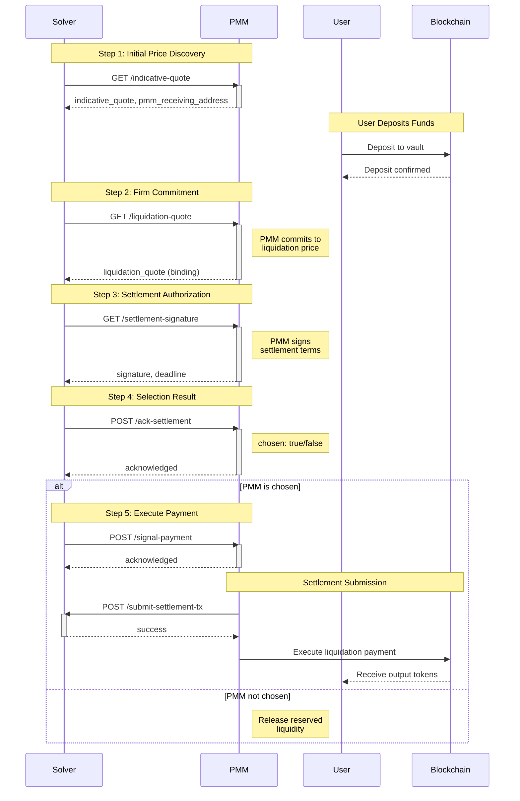

# PMM Liquidation Flow

This document outlines the complete liquidation flow that a PMM needs to implement, covering all endpoints from initial quote to final payment.

---

## Flow Overview

The liquidation process follows these sequential steps:

1. **Indicative Quote** - Initial price discovery
2. **Liquidation Quote** - Firm commitment quote
3. **Settlement Signature** - PMM signs the settlement
4. **Ack Settlement** - Solver notifies if PMM is chosen
5. **Signal Payment** - Solver signals PMM to execute payment



---

## 1. `/indicative-quote` - Initial Quote Request

### Purpose

Solver requests an indicative quote before the user makes a deposit. This helps estimate the trade parameters.

### Request from Solver

- **Method:** `GET`
- **Key Parameters:**
  - `swap_type`: "0" (Optimistic) or "1" (Basic)
  - `from_token_id`: Source token ID
  - `to_token_id`: Destination token ID
  - `amount`: Amount to trade (base 10 string)
  - `trade_timeout`: Deadline for user to receive tokens (UNIX timestamp)
  - `script_timeout`: Hard timeout for the trade (UNIX timestamp)
  - `deposited`: Whether deposit is confirmed (optional)

### Response from PMM

```json
{
  "session_id": "12345",
  "pmm_receiving_address": "0xReceivingAddress",
  "indicative_quote": "123456789000000000",
  "quote_timeout": 1748857281,
  "error": ""
}
```

### Key Fields

- `pmm_receiving_address`: Where user will send the input tokens
- `indicative_quote`: Estimated output amount
- `quote_timeout`: When this quote expires (0 if no timeout)

---

## 2. `/liquidation-quote` - Commitment Quote

### Purpose

After user deposits funds, solver requests a firm commitment quote for the liquidation.

### Request from Solver

- **Method:** `GET`
- **Key Parameters:**
  - `session_id`: Session identifier
  - `trade_id`: Unique trade identifier
  - `from_token_id`, `to_token_id`, `amount`: Trade details
  - `payment_metadata`: Base64 encoded data for smart contract payment method
  - `from_user_address`: User's source address
  - `to_user_address`: User's receiving address
  - `user_deposit_tx`: Transaction hash of user's deposit
  - `user_deposit_vault`: Vault containing user's deposit
  - `trade_deadline`: Expected payment deadline (UNIX timestamp)
  - `script_deadline`: Withdrawal deadline if unpaid (UNIX timestamp)

### Response from PMM

```json
{
  "trade_id": "abcd1234",
  "liquidation_quote": "987654321000000000",
  "error": ""
}
```

### Key Fields

- `liquidation_quote`: **Firm committed quote** - PMM must honor this price
- This is a binding commitment to execute the liquidation at this rate

---

## 3. `/settlement-signature` - Settlement Authorization

### Purpose

PMM provides a cryptographic signature to authorize the settlement at the committed quote.

### Request from Solver

- **Method:** `GET`
- **Parameters:**
  - `trade_id`: Unique trade identifier
  - `committed_quote`: The agreed quote value (base 10 string)
  - `trade_deadline`: Expected payment deadline (UNIX timestamp)
  - `script_deadline`: Withdrawal deadline (UNIX timestamp)

### Response from PMM

```json
{
  "trade_id": "abcd1234",
  "signature": "0xSignatureData",
  "deadline": 1696012800,
  "error": ""
}
```

### Key Fields

- `signature`: PMM's signature authorizing the settlement
- `deadline`: PMM's expected payment deadline
- This signature will be used to finalize the trade on-chain

---

## 4. `/ack-settlement` - Selection Acknowledgment

### Purpose

Solver notifies the PMM whether it was selected to execute the liquidation (solver may query multiple PMMs).

### Request from Solver

- **Method:** `POST`
- **Body:**

```json
{
  "trade_id": "abcd1234",
  "trade_deadline": "1696012800",
  "script_deadline": "1696016400",
  "chosen": "true"
}
```

### Response from PMM

```json
{
  "trade_id": "abcd1234",
  "status": "acknowledged",
  "error": ""
}
```

### Key Fields

- `chosen`: "true" if PMM is selected, "false" if not
- If chosen, PMM should prepare to execute the liquidation
- If not chosen, PMM can release reserved liquidity

---

## 5. `/signal-payment` - Payment Execution Signal

### Purpose

Solver signals the chosen PMM to start submitting the liquidation payment transaction.

### Request from Solver

- **Method:** `POST`
- **Body:**

```json
{
  "trade_id": "abcd1234",
  "total_fee_amount": "1000000000000000",
  "trade_deadline": "1696012800",
  "script_deadline": "1696016400"
}
```

### Response from PMM

```json
{
  "trade_id": "abcd1234",
  "status": "acknowledged",
  "error": ""
}
```

### PMM Actions After Signal

1. **Prepare settlement transaction** using the liquidation contract
2. **Submit to solver** via `/submit-settlement-tx` endpoint:
   - Include `trade_ids`, `pmm_id`, `settlement_tx`
   - Provide signature and timestamp
3. **Execute payment** before the deadline

---

## Settlement Submission

After receiving the payment signal, PMM must submit the settlement transaction to the solver backend.

### Endpoint: `/submit-settlement-tx`

**Request:**

```json
{
  "trade_ids": ["abcd1234"],
  "pmm_id": "pmm001",
  "settlement_tx": "0xRawTransactionData",
  "signature": "0xSignatureData",
  "start_index": 0,
  "signed_at": 1719158400
}
```

### Smart Contracts

**Staging Environment:**

- Liquidation Contract: `0x1CcD45Be1508E70d760b11b32ccd5Ac288756b1a`
- Network: Sepolia

**Production Environment:**

- Liquidation Contract: ``
- Network: Ethereum Mainnet

---

## Important Notes

1. **Timing is Critical:** All deadlines must be strictly observed
2. **Signature Security:** All signatures must be valid and verifiable
3. **Binding Commitment:** The liquidation quote is a firm commitment
4. **Error Reporting:** Always populate the `error` field if issues occur
5. **Logging:** Maintain detailed logs of all interactions for troubleshooting

---
