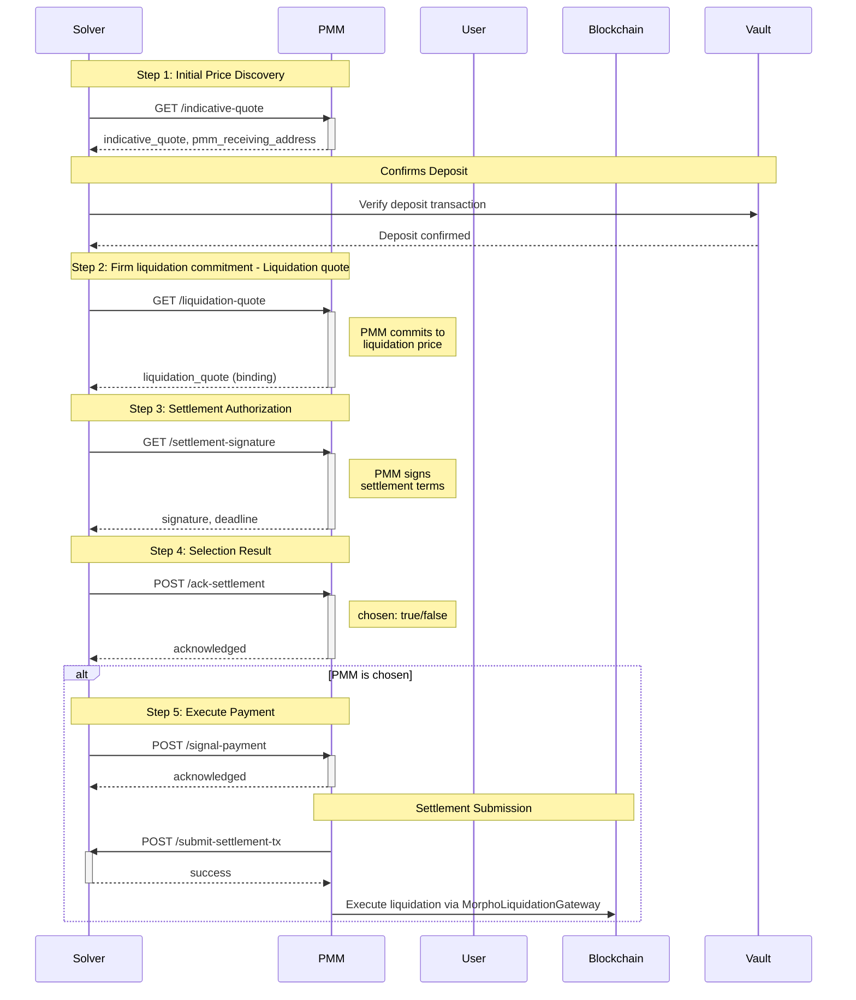

# PMM Liquidation Flow

The liquidation process uses the **Morpho Liquidation Gateway** contract instead of the standard **Payment** contract. However, **the flow when calling the contract is similar to the normal swap payment flow**, following the same sequential steps from initial quote to final settlement.

**IMPORTANT NOTE for PMM Operators:**

- **Liquidation Receiving Address**: The PMM's receiving address for liquidation collateral tokens is configured manually (not part of the API response). Once set, **this address MUST NOT be changed during active liquidation operations** to ensure proper settlement and payment flows.

## Table of Contents

- [PMM Liquidation Flow](#pmm-liquidation-flow)
  - [Table of Contents](#table-of-contents)
  - [Quick Flow Overview](#quick-flow-overview)
  - [API Endpoints](#api-endpoints)
    - [1. `/indicative-quote` - Initial Quote Request](#1-indicative-quote---initial-quote-request)
    - [2. `/liquidation-quote` - Liquidation Commitment Quote (Liquidation-Specific)](#2-liquidation-quote---liquidation-commitment-quote-liquidation-specific)
    - [3. `/settlement-signature` - Settlement Authorization](#3-settlement-signature---settlement-authorization)
    - [4. `/ack-settlement` - Selection Acknowledgment](#4-ack-settlement---selection-acknowledgment)
    - [5. `/signal-payment` - Payment Execution Signal](#5-signal-payment---payment-execution-signal)
  - [Settlement \& Submission](#settlement--submission)
    - [Endpoint: `/submit-settlement-tx`](#endpoint-submit-settlement-tx)
  - [Smart Contract Integration](#smart-contract-integration)
    - [Contract Addresses](#contract-addresses)
    - [Payment Function](#payment-function)
    - [Implementation Example](#implementation-example)
  - [Error Handling](#error-handling)
    - [Dummy Transaction Format](#dummy-transaction-format)
    - [Common Error Codes](#common-error-codes)
    - [Error Handling Flow](#error-handling-flow)

---

## Quick Flow Overview

1. **Indicative Quote** - Initial price discovery
2. **Liquidation Quote** - Firm commitment quote (liquidation-specific)
3. **Settlement Signature** - PMM signs the settlement
4. **Ack Settlement** - Solver notifies if PMM is chosen
5. **Signal Payment** - Solver signals PMM to execute payment
6. **Settlement Submission** - PMM submits settlement transaction
7. **Contract Execution** - Liquidation executed via MorphoLiquidationGateway



---

## API Endpoints

### 1. `/indicative-quote` - Initial Quote Request

<details>
<summary><strong>Click to expand</strong> - Shared with Swap flow</summary>

**Purpose:** Solver requests an indicative quote before the user makes a deposit. This helps estimate the trade parameters.

**Method:** `GET`

**Key Parameters:**

- `swap_type`: "0" (Optimistic) or "1" (Basic)
- `from_token_id`: Source token ID
- `to_token_id`: Destination token ID
- `amount`: Amount to trade (base 10 string)
- `trade_timeout`: Deadline for user to receive tokens (UNIX timestamp)
- `script_timeout`: Hard timeout for the trade (UNIX timestamp)
- `deposited`: Whether deposit is confirmed (optional)

**Response:**

```json
{
  "session_id": "12345",
  "pmm_receiving_address": "0xReceivingAddress",
  "indicative_quote": "123456789000000000",
  "quote_timeout": 1748857281,
  "error": ""
}
```

**Key Fields:**

- `pmm_receiving_address`: Where user will send the input tokens
- `indicative_quote`: Estimated output amount
- `quote_timeout`: When this quote expires (0 if no timeout)

</details>

---

### 2. `/liquidation-quote` - Liquidation Commitment Quote (Liquidation-Specific)

**Purpose:** Solver requests a firm commitment quote for the liquidation after user deposits funds.

**Method:** `GET`

**Key Parameters:**

- `session_id`: Session identifier
- `trade_id`: Unique trade identifier
- `from_token_id`, `to_token_id`, `amount`: Trade details
- `payment_metadata`: Hex string encoded data for smart contract payment method
- `from_user_address`: User's source address
- `to_user_address`: User's receiving address
- `user_deposit_tx`: Transaction hash of user's deposit
- `user_deposit_vault`: Vault containing user's deposit
- `trade_deadline`: Expected payment deadline (UNIX timestamp)
- `script_deadline`: Withdrawal deadline if unpaid (UNIX timestamp)

**Response:**

```json
{
  "trade_id": "abcd1234",
  "liquidation_quote": "987654321000000000",
  "error": ""
}
```

**Key Fields:**

- `liquidation_quote`: **Firm committed quote** - PMM must honor this price
- This is a binding commitment to execute the liquidation at this rate

---

### 3. `/settlement-signature` - Settlement Authorization

<details>
<summary><strong>Click to expand</strong> - Shared with Swap flow</summary>

**Purpose:** PMM provides a cryptographic signature to authorize the settlement at the committed quote.

**Method:** `GET`

**Parameters:**

- `trade_id`: Unique trade identifier
- `committed_quote`: The agreed quote value (base 10 string)
- `trade_deadline`: Expected payment deadline (UNIX timestamp)
- `script_deadline`: Withdrawal deadline (UNIX timestamp)

**Response:**

```json
{
  "trade_id": "abcd1234",
  "signature": "0xSignatureData",
  "deadline": 1696012800,
  "error": ""
}
```

**Key Fields:**

- `signature`: PMM's signature authorizing the settlement
- `deadline`: PMM's expected payment deadline
- This signature will be used to finalize the trade on-chain

</details>

---

### 4. `/ack-settlement` - Selection Acknowledgment

<details>
<summary><strong>Click to expand</strong> - Shared with Swap flow</summary>

**Purpose:** Solver notifies the PMM whether it was selected to execute the liquidation (solver may query multiple PMMs).

**Method:** `POST`

**Request Body:**

```json
{
  "trade_id": "abcd1234",
  "trade_deadline": "1696012800",
  "script_deadline": "1696016400",
  "chosen": "true"
}
```

**Response:**

```json
{
  "trade_id": "abcd1234",
  "status": "acknowledged",
  "error": ""
}
```

**Key Fields:**

- `chosen`: "true" if PMM is selected, "false" if not
- If chosen, PMM should prepare to execute the liquidation
- If not chosen, PMM can release reserved liquidity

</details>

---

### 5. `/signal-payment` - Payment Execution Signal

<details>
<summary><strong>Click to expand</strong> - Shared with Swap flow</summary>

**Purpose:** Solver signals the chosen PMM to start submitting the liquidation payment transaction.

**Method:** `POST`

**Request Body:**

```json
{
  "trade_id": "abcd1234",
  "total_fee_amount": "1000000000000000",
  "trade_deadline": "1696012800",
  "script_deadline": "1696016400"
}
```

**Response:**

```json
{
  "trade_id": "abcd1234",
  "status": "acknowledged",
  "error": ""
}
```

**PMM Actions After Signal:**

1. **Prepare settlement transaction** using the liquidation contract
2. **Submit to solver** via `/submit-settlement-tx` endpoint:
   - Include `trade_ids`, `pmm_id`, `settlement_tx`
   - Provide signature and timestamp
3. **Execute payment** before the deadline

</details>

---

## Settlement & Submission

After receiving the payment signal, PMM must submit the settlement transaction to the solver backend.

### Endpoint: `/submit-settlement-tx`

**Method:** `POST`

**Request Body:**

```json
{
  "trade_ids": ["0x"],
  "pmm_id": "pmm001",
  "settlement_tx": "0xRawTransactionData",
  "signature": "0xSignatureData",
  "start_index": 0,
  "signed_at": 1719158400
}
```

**Field Descriptions:**

- `trade_ids`: Array of trade identifiers being settled
- `pmm_id`: PMM identifier
- `settlement_tx`: Raw transaction data for the settlement
- `signature`: PMM's signature for the settlement
- `start_index`: Starting index for batch processing (typically 0)
- `signed_at`: UNIX timestamp when signature was created

**Expected Response:**

- **HTTP Status:** `200 OK`
- **Response Body:**

```json
{
  "message": "Settlement transaction submitted successfully"
}
```

---

## Smart Contract Integration

### Contract Addresses

**Staging Environment:**

- **Network:** Sepolia Testnet

  - **MorphoLiquidationGateway Contract:** [0x390Bd58173F7C0433f8fa9b0fF08913A261d0Ba7](https://sepolia.etherscan.io/address/0x390Bd58173F7C0433f8fa9b0fF08913A261d0Ba7#code)

- **Network:** Optimex Testnet
  - `Signer`: [0xA89F5060B810F3b6027D7663880c43ee77A865C7](https://scan-testnet.optimex.xyz/address/0xA89F5060B810F3b6027D7663880c43ee77A865C7)
  - `Router`: [0x31C88ebd9E430455487b6a5c8971e8eF63e97ED4](https://scan-testnet.optimex.xyz/address/0x31C88ebd9E430455487b6a5c8971e8eF63e97ED4)

**Production Environment:**

- **Network:** Ethereum Mainnet

  - **MorphoLiquidationGateway Contract:** [0x4be396E85c09972728C114F781Aa0e84A5f908E5](https://etherscan.io/address/0x4be396E85c09972728C114F781Aa0e84A5f908E5)

- **Network:** Optimex Mainnet
  - `Signer`: [0xCF9786F123F1071023dB8049808C223e94c384be](https://scan.optimex.xyz/address/0xCF9786F123F1071023dB8049808C223e94c384be)
  - `Router`: [0x1e878cCa765a8aAFEBecCa672c767441b4859634](https://scan.optimex.xyz/address/0x1e878cCa765a8aAFEBecCa672c767441b4859634)

### Payment Function

When executing the liquidation, PMM calls the payment function from the **MorphoLiquidationGateway**:

```solidity
function payment(
    address token,
    uint256 amount,
    bytes calldata externalCall
)
```

**Parameters:**

- `token`: Address of the token being paid (or "zeroAddress" for native chain tokens)
- `amount`: Amount of tokens to pay
- `externalCall`: Encoded call data for the liquidation execution (provided in `payment_metadata` from `/liquidation-quote`)

### Implementation Example

Here's how PMM executes the liquidation payment:

```typescript
import { MorphoLiquidationGateway__factory } from '@optimex-xyz/market-maker-sdk'

// Step 1: Get trade data and prepare transaction parameters
const trade = await tradeService.findTradeById(tradeId)
const liquidAddress = await protocolService.getAssetChainConfig(
  networkId,
  AssetChainContractRole.MorphoLiquidationGateway
)
const externalCall = trade.metadata.paymentMetadata // From /liquidation-quote request

// Step 2: Handle token approval if needed (not for native tokens)
if (tokenAddress !== 'native') {
  await transactionService.handleTokenApproval(
    networkId,
    tokenAddress,
    liquidAddress,
    amount
  )
}

// Step 3: Execute liquidation payment with automatic gas management
const txResult = await transactionService.executeContractMethod(
  MorphoLiquidationGateway__factory,
  liquidAddress,
  'payment',
  [tokenAddress, amount, externalCall], // Matches solidity function signature
  networkId,
  {
    description: `Liquidation payment for trade ${tradeId}`,
    gasBufferPercentage: 40, // Higher buffer for complex liquidation transactions
  }
)

// Transaction Flow Summary:
// executeContractMethod()
//   ↓
// estimateContractGas() ← Gas estimation with 40% buffer for liquidation
//   ↓
// applyGasBuffer() ← Apply buffer percentage
//   ↓
// getOptimalGasPrice() ← Get current gas prices (EIP-1559 or Legacy)
//   ↓
// applyGasPriceBuffer() ← Apply 30% gas price buffer for network volatility
//   ↓
// executeTransaction() ← Prepare final transaction with all parameters
//   ↓
// wallet.sendTransaction() ← ⭐ BROADCAST TO BLOCKCHAIN

// Step 4: Submit settlement transaction hash to solver
await submitSettlementTx({
  trade_ids: [tradeId],
  pmm_id: 'pmm001',
  settlement_tx: txResult.hash, // Transaction hash returned from broadcast
  signature: settlementSignature,
  start_index: 0,
  signed_at: Math.floor(Date.now() / 1000),
})
```

**Key Points:**

- **Automatic Gas Management**: The transaction service automatically estimates gas with a 40% buffer for liquidation transactions
- **Gas Price Optimization**: Uses EIP-1559 with 30% price buffer or legacy gas pricing based on network support
- **Token Approval**: Automatically handles ERC20 token approvals before payment execution
- **Error Handling**: Returns padded error codes as transaction hashes when execution fails (see Error Handling section)

**Full Implementation Reference:**

- [Complete EVMLiquidationTransferStrategy Implementation](https://gist.github.com/Phathdt/6bcc76e39cefbd9e1c55bc6867fcb100)

---

## Error Handling

When settlement simulation reverts, PMM must create a dummy settlement transaction using the 4-byte error code from the contract revert, padded to match normal Ethereum transaction size.

### Dummy Transaction Format

**Formula:**

```
Dummy Transaction = 0x + [4-byte-error-code] + [56 zeros padding]
Total length = 66 characters (including 0x prefix)
```

**Example:**

- **Error code:** `0xadb068de`
- **Dummy settlement tx:** `0xadb068de00000000000000000000000000000000000000000000000000000000`

### Common Error Codes

| Error Code   | Error Name                           | Description                                                       |
| ------------ | ------------------------------------ | ----------------------------------------------------------------- |
| `0xadb068de` | NotAuthorizedValidator(address)      | Invalid validator signature during forceClose                     |
| `0x5ebb051b` | NotEnoughPaymentAmount()             | PMM payment insufficient for liquidation                          |
| `0xf645eedf` | ECDSAInvalidSignature()              | Validator signature is incorrect                                  |
| `0xfce698f7` | ECDSAInvalidSignatureLength(uint256) | Invalid signature length                                          |
| `0xd78bce0c` | ECDSAInvalidSignatureS(bytes32)      | Wrong signature s value                                           |
| `0x08c379a0` | Error(string)                        | Generic error (e.g., position becomes healthy during liquidation) |

### Error Handling Flow

1. **Simulate settlement transaction** before submission
2. **If simulation reverts:**
   - Extract 4-byte error code from revert data
   - Pad error code with 56 zeros
   - Submit dummy transaction with error code
3. **If simulation succeeds:**
   - Submit actual settlement transaction
