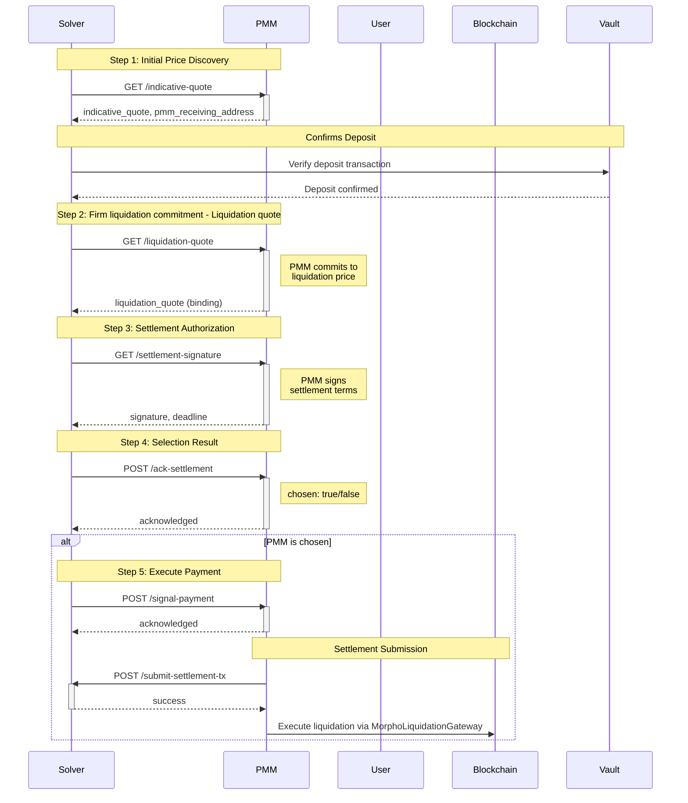

# PMM Liquidation Flow

Liquidation is a specialized trade type where PMMs help liquidate under-collateralized positions. The flow is **similar to standard swaps**, but uses the **Morpho Liquidation Gateway** contract for settlement.

## Key Differences from Standard Swaps

| Aspect | Standard Swap | Liquidation |
|--------|---------------|-------------|
| Endpoint | `/commitment-quote` | **`/liquidation-quote`** |
| Database Type | `SWAP` | `LENDING` |
| Contract | Payment | **MorphoLiquidationGateway** |
| Metadata | Optional | **Required** (`payment_metadata`) |
| Receiving Address | Dynamic (from API) | **Pre-configured** (manual setup) |

> ⚠️ **Critical:** The PMM's liquidation receiving address is configured **manually** and **MUST NOT be changed** during active liquidation operations. This ensures proper settlement and payment flows.

## Table of Contents

- [PMM Liquidation Flow](#pmm-liquidation-flow)
  - [Table of Contents](#table-of-contents)
  - [Quick Flow Overview](#quick-flow-overview)
  - [API Endpoints](#api-endpoints)
    - [1. `/indicative-quote` - Initial Quote Request](#1-indicative-quote---initial-quote-request)
    - [2. `/liquidation-quote` - Liquidation Commitment Quote (Liquidation-Specific)](#2-liquidation-quote---liquidation-commitment-quote-liquidation-specific)
    - [3. `/settlement-signature` - Settlement Authorization](#3-settlement-signature---settlement-authorization)
    - [4. `/ack-settlement` - Selection Acknowledgment](#4-ack-settlement---selection-acknowledgment)
    - [5. `/signal-payment` - Payment Execution Signal](#5-signal-payment---payment-execution-signal)
  - [Settlement \& Submission](#settlement--submission)
    - [Endpoint: `/submit-settlement-tx`](#endpoint-submit-settlement-tx)
  - [Smart Contract Integration](#smart-contract-integration)
    - [Contract Addresses](#contract-addresses)
    - [Payment Function](#payment-function)
    - [Implementation Example](#implementation-example)
  - [Error Handling](#error-handling)
    - [Dummy Transaction Format](#dummy-transaction-format)
    - [Common Error Codes](#common-error-codes)
    - [Error Handling Flow](#error-handling-flow)

---

## Quick Flow Overview

The liquidation flow consists of **5 main phases** (same as swaps, but with `/liquidation-quote` instead of `/commitment-quote`):

| # | Phase | Endpoint | PMM Action |
|---|-------|----------|-----------|
| 1️⃣ | Price Discovery | `GET /indicative-quote` | Return quote + receiving address |
| 2️⃣ | Liquidation Quote | `GET /liquidation-quote` | **Commit firm liquidation price** |
| 3️⃣ | Authorization | `GET /settlement-signature` | Sign settlement terms |
| 4️⃣ | Selection | `POST /ack-settlement` | Receive selection result |
| 5️⃣ | Execution | `POST /signal-payment` → `/submit-settlement-tx` | Execute & submit liquidation |


```mermaid
sequenceDiagram
    participant Solver
    participant PMM
    participant User
    participant Blockchain

    Note over Solver,PMM: Step 1: Initial Price Discovery
    Solver->>PMM: GET /indicative-quote
    activate PMM
    PMM-->>Solver: indicative_quote, pmm_receiving_address
    deactivate PMM

    Note over Solver,Vault: Confirms Deposit
    Solver->>Vault: Verify deposit transaction
    Vault-->>Solver: Deposit confirmed

    Note over Solver,PMM: Step 2: Firm liquidation commitment - Liquidation quote
    Solver->>PMM: GET /liquidation-quote
    activate PMM
    Note right of PMM: PMM commits to<br/>liquidation price
    PMM-->>Solver: liquidation_quote (binding)
    deactivate PMM

    Note over Solver,PMM: Step 3: Settlement Authorization
    Solver->>PMM: GET /settlement-signature
    activate PMM
    Note right of PMM: PMM signs<br/>settlement terms
    PMM-->>Solver: signature, deadline
    deactivate PMM

    Note over Solver,PMM: Step 4: Selection Result
    Solver->>PMM: POST /ack-settlement
    activate PMM
    Note right of PMM: chosen: true/false
    PMM-->>Solver: acknowledged
    deactivate PMM

    alt PMM is chosen
        Note over Solver,PMM: Step 5: Execute Payment
        Solver->>PMM: POST /signal-payment
        activate PMM
        PMM-->>Solver: acknowledged
        deactivate PMM

        Note over PMM,Blockchain: Settlement Submission
        PMM->>Solver: POST /submit-settlement-tx
        activate Solver
        Solver-->>PMM: success
        deactivate Solver

        PMM->>Blockchain: Execute liquidation via MorphoLiquidationGateway
    end
```

---

## API Endpoints

### 1. `/indicative-quote` - Initial Quote Request

<details>
<summary><strong>Shared with Swap flow</strong> - Click to expand for details</summary>

**Purpose:** Solver requests an indicative quote before the user makes a deposit. This helps estimate the trade parameters.

**Method:** `GET`

**Query Parameters:**

| Parameter | Type | Description |
|-----------|------|-------------|
| `swap_type` | string | "0" (Optimistic) or "1" (Basic) |
| `from_token_id` | string | Source token ID |
| `to_token_id` | string | Destination token ID |
| `amount` | string | Amount to trade (base 10 string) |
| `trade_timeout` | string | Deadline for user to receive tokens (UNIX timestamp) |
| `script_timeout` | string | Hard timeout for the trade (UNIX timestamp) |
| `deposited` | boolean | Optional - Whether deposit is confirmed |

**Response:**

```json
{
  "session_id": "12345",
  "pmm_receiving_address": "0xReceivingAddress",
  "indicative_quote": "123456789000000000",
  "quote_timeout": 1748857281,
  "error": ""
}
```

| Field | Type | Description |
|-------|------|-------------|
| `pmm_receiving_address` | string | Where user will send the input tokens |
| `indicative_quote` | string | Estimated output amount |
| `quote_timeout` | integer | When this quote expires (0 if no timeout) |

</details>

---

### 2. `/liquidation-quote` - Liquidation Commitment Quote (Liquidation-Specific)

**Purpose:** Solver requests a firm commitment quote for the liquidation after user deposits funds.

**Method:** `GET`

**Query Parameters:**

| Parameter | Type | Description |
|-----------|------|-------------|
| `session_id` | string | Session identifier |
| `trade_id` | string | Unique trade identifier |
| `from_token_id` | string | Source token identifier |
| `to_token_id` | string | Destination token identifier |
| `amount` | string | Amount to trade (base 10, treat as BigInt) |
| `payment_metadata` | string | Optional - Hex string encoded data for smart contract payment method |
| `from_user_address` | string | User's source address |
| `to_user_address` | string | User's receiving address |
| `user_deposit_tx` | string | Transaction hash of user's deposit |
| `user_deposit_vault` | string | Vault containing user's deposit |
| `trade_deadline` | string | Expected payment deadline (UNIX timestamp) |
| `script_deadline` | string | Withdrawal deadline if unpaid (UNIX timestamp) |

**Response:**

```json
{
  "trade_id": "abcd1234",
  "liquidation_quote": "987654321000000000",
  "error": ""
}
```

| Field | Type | Description |
|-------|------|-------------|
| `liquidation_quote` | string | **Firm committed quote** - PMM must honor this price (treat as BigInt) |
| `error` | string | Error message if applicable (empty if successful) |

---

### 3. `/settlement-signature` - Settlement Authorization

<details>
<summary><strong>Shared with Swap flow</strong> - Click to expand for details</summary>

**Purpose:** PMM provides a cryptographic signature to authorize the settlement at the committed quote.

**Method:** `GET`

**Query Parameters:**

| Parameter | Type | Description |
|-----------|------|-------------|
| `trade_id` | string | Unique trade identifier |
| `committed_quote` | string | The agreed quote value (base 10 string, treat as BigInt) |
| `trade_deadline` | string | Expected payment deadline (UNIX timestamp) |
| `script_deadline` | string | Withdrawal deadline (UNIX timestamp) |

**Response:**

```json
{
  "trade_id": "abcd1234",
  "signature": "0xSignatureData",
  "deadline": 1696012800,
  "error": ""
}
```

| Field | Type | Description |
|-------|------|-------------|
| `signature` | string | PMM's signature authorizing the settlement |
| `deadline` | integer | PMM's expected payment deadline (UNIX timestamp) |

</details>

---

### 4. `/ack-settlement` - Selection Acknowledgment

<details>
<summary><strong>Shared with Swap flow</strong> - Click to expand for details</summary>

**Purpose:** Solver notifies the PMM whether it was selected to execute the liquidation.

**Method:** `POST`

**Form Parameters:**

| Parameter | Type | Description |
|-----------|------|-------------|
| `trade_id` | string | Unique trade identifier |
| `trade_deadline` | string | Expected payment deadline (UNIX timestamp) |
| `script_deadline` | string | Withdrawal deadline if unpaid (UNIX timestamp) |
| `chosen` | string | "true" if PMM selected, "false" if not |

**Request Body:**

```json
{
  "trade_id": "abcd1234",
  "trade_deadline": "1696012800",
  "script_deadline": "1696016400",
  "chosen": "true"
}
```

**Response:**

```json
{
  "trade_id": "abcd1234",
  "status": "acknowledged",
  "error": ""
}
```

| Field | Type | Description |
|-------|------|-------------|
| `status` | string | Always "acknowledged" if successful |

</details>

---

### 5. `/signal-payment` - Payment Execution Signal

<details>
<summary><strong>Shared with Swap flow</strong> - Click to expand for details</summary>

**Purpose:** Solver signals the chosen PMM to start submitting the liquidation payment transaction.

**Method:** `POST`

**Form Parameters:**

| Parameter | Type | Description |
|-----------|------|-------------|
| `trade_id` | string | Unique trade identifier |
| `total_fee_amount` | string | Total fee amount to submit (base 10, treat as BigInt) |
| `trade_deadline` | string | Expected payment deadline (UNIX timestamp) |
| `script_deadline` | string | Withdrawal deadline if unpaid (UNIX timestamp) |

**Request Body:**

```json
{
  "trade_id": "abcd1234",
  "total_fee_amount": "1000000000000000",
  "trade_deadline": "1696012800",
  "script_deadline": "1696016400"
}
```

**Response:**

```json
{
  "trade_id": "abcd1234",
  "status": "acknowledged",
  "error": ""
}
```

**PMM Actions After Signal:**

1. Prepare settlement transaction using the liquidation contract
2. Submit to solver via `/submit-settlement-tx` endpoint
3. Execute payment before the deadline

</details>

---

## Settlement & Submission

After receiving the payment signal, PMM must submit the settlement transaction to the solver backend.

### Endpoint: `/submit-settlement-tx`

**Method:** `POST`

**Request Body Fields:**

| Field | Type | Description |
|-------|------|-------------|
| `trade_ids` | array | Array of trade identifiers being settled |
| `pmm_id` | string | PMM identifier |
| `settlement_tx` | string | Raw transaction data for the settlement |
| `signature` | string | PMM's signature for the settlement |
| `start_index` | integer | Starting index for batch processing (typically 0) |
| `signed_at` | integer | UNIX timestamp when signature was created |

**Request Body:**

```json
{
  "trade_ids": ["0x..."],
  "pmm_id": "pmm001",
  "settlement_tx": "0xRawTransactionData",
  "signature": "0xSignatureData",
  "start_index": 0,
  "signed_at": 1719158400
}
```

**Expected Response:**

**HTTP Status:** `200 OK`

```json
{
  "message": "Settlement transaction submitted successfully"
}
```

---

## Smart Contract Integration

### Contract Addresses

**Staging Environment (Testnet)**

| Network | Contract | Address |
|---------|----------|---------|
| Sepolia | MorphoLiquidationGateway | [0x390Bd58173F7C0433f8fa9b0fF08913A261d0Ba7](https://sepolia.etherscan.io/address/0x390Bd58173F7C0433f8fa9b0fF08913A261d0Ba7#code) |
| Optimex Testnet | Signer | [0xA89F5060B810F3b6027D7663880c43ee77A865C7](https://scan-testnet.optimex.xyz/address/0xA89F5060B810F3b6027D7663880c43ee77A865C7) |
| Optimex Testnet | Router | [0x31C88ebd9E430455487b6a5c8971e8eF63e97ED4](https://scan-testnet.optimex.xyz/address/0x31C88ebd9E430455487b6a5c8971e8eF63e97ED4) |

**Production Environment (Mainnet)**

| Network | Contract | Address |
|---------|----------|---------|
| Ethereum Mainnet | MorphoLiquidationGateway | [0x4be396E85c09972728C114F781Aa0e84A5f908E5](https://etherscan.io/address/0x4be396E85c09972728C114F781Aa0e84A5f908E5) |
| Optimex Mainnet | Signer | [0xCF9786F123F1071023dB8049808C223e94c384be](https://scan.optimex.xyz/address/0xCF9786F123F1071023dB8049808C223e94c384be) |
| Optimex Mainnet | Router | [0x1e878cCa765a8aAFEBecCa672c767441b4859634](https://scan.optimex.xyz/address/0x1e878cCa765a8aAFEBecCa672c767441b4859634) |

### Payment Function

When executing the liquidation, PMM calls the payment function from the **MorphoLiquidationGateway**:

```solidity
function payment(
    address token,
    uint256 amount,
    bytes calldata externalCall
)
```

**Function Parameters:**

| Parameter | Type | Description |
|-----------|------|-------------|
| `token` | address | Token address being paid (or `0x0` for native tokens) |
| `amount` | uint256 | Amount of tokens to pay |
| `externalCall` | bytes | Encoded call data for liquidation execution (from `payment_metadata`) |

### Implementation Example

Here's how PMM executes the liquidation payment:

```typescript
import { MorphoLiquidationGateway__factory } from '@optimex-xyz/market-maker-sdk'

// Step 1: Get trade data and prepare transaction parameters
const trade = await tradeService.findTradeById(tradeId)
const liquidAddress = await protocolService.getAssetChainConfig(
  networkId,
  AssetChainContractRole.MorphoLiquidationGateway
)
const externalCall = trade.metadata.paymentMetadata // From /liquidation-quote request

// Step 2: Handle token approval if needed (not for native tokens)
if (tokenAddress !== 'native') {
  await transactionService.handleTokenApproval(
    networkId,
    tokenAddress,
    liquidAddress,
    amount
  )
}

// Step 3: Execute liquidation payment with automatic gas management
const txResult = await transactionService.executeContractMethod(
  MorphoLiquidationGateway__factory,
  liquidAddress,
  'payment',
  [tokenAddress, amount, externalCall], // Matches solidity function signature
  networkId,
  {
    description: `Liquidation payment for trade ${tradeId}`,
    gasBufferPercentage: 40, // Higher buffer for complex liquidation transactions
  }
)

// Transaction Flow Summary:
// executeContractMethod()
//   ↓
// estimateContractGas() ← Gas estimation with 40% buffer for liquidation
//   ↓
// applyGasBuffer() ← Apply buffer percentage
//   ↓
// getOptimalGasPrice() ← Get current gas prices (EIP-1559 or Legacy)
//   ↓
// applyGasPriceBuffer() ← Apply 30% gas price buffer for network volatility
//   ↓
// executeTransaction() ← Prepare final transaction with all parameters
//   ↓
// wallet.sendTransaction() ← ⭐ BROADCAST TO BLOCKCHAIN

// Step 4: Submit settlement transaction hash to solver
await submitSettlementTx({
  trade_ids: [tradeId],
  pmm_id: 'pmm001',
  settlement_tx: txResult.hash, // Transaction hash returned from broadcast
  signature: settlementSignature,
  start_index: 0,
  signed_at: Math.floor(Date.now() / 1000),
})
```

**Key Points:**

- **Automatic Gas Management**: The transaction service automatically estimates gas with a 40% buffer for liquidation transactions
- **Gas Price Optimization**: Uses EIP-1559 with 30% price buffer or legacy gas pricing based on network support
- **Token Approval**: Automatically handles ERC20 token approvals before payment execution
- **Error Handling**: Returns padded error codes as transaction hashes when execution fails (see Error Handling section)

**Full Implementation Reference:**

- [Complete EVMLiquidationTransferStrategy Implementation](https://gist.github.com/Phathdt/6bcc76e39cefbd9e1c55bc6867fcb100)

---

## Error Handling

When settlement simulation reverts, PMM must create a dummy settlement transaction using the 4-byte error code from the contract revert.

### Dummy Transaction Format

**Pattern:**

```
Dummy Transaction = 0x + [4-byte-error-code] + [56 zeros padding]
Total Length: 66 characters (including 0x prefix)
```

**Example:**

| Component | Value |
|-----------|-------|
| Error code | `0xadb068de` |
| Dummy tx | `0xadb068de00000000000000000000000000000000000000000000000000000000` |

### Common Error Codes

| Error Code   | Error Name                           | Description                                                              |
| ------------ | ------------------------------------ | ------------------------------------------------------------------------ |
| `0x1f2a2005` | ZeroAmount()                         | Payment amount is zero                                                   |
| `0x11d5c560` | InvalidValidator(address)            | The signature is not signed by validator                                 |
| `0x2c5211c6` | InvalidAmount()                      | Payment amount is insufficient to cover the liquidation process          |
| `0xf902523f` | TokenMismatch(address,address)       | The collateral token in the position is not oBTC                         |
| `0x44552f2a` | InvalidPositionId(bytes32)           | Optimex position ID is invalid or does not exist                         |
| `0x438857be` | InvalidBorrowShares()                | Cannot finalize a position that still has outstanding debt               |
| `0x04976396` | IncompleteConsumption()              | Liquidation process did not consume the entire payment amount            |
| `0x37d5916a` | PreLiqDisabled(bytes32)              | Pre-liquidation is not enabled for this market                           |
| `0x62294153` | Liquidatable()                       | Position is eligible for hard liquidation, not pre-liquidation           |
| `0x422a59ca` | NotPreLiquidatable()                 | Position does not meet pre-liquidation criteria                          |
| `0xf645eedf` | ECDSAInvalidSignature()              | Validator signature is invalid or incorrectly formatted                  |
| `0xfce698f7` | ECDSAInvalidSignatureLength(uint256) | Signature length does not match expected format                          |
| `0xd78bce0c` | ECDSAInvalidSignatureS(bytes32)      | Signature 's' parameter value is invalid                                 |
| `0x08c379a0` | Error(string)                        | Generic error (e.g., position became healthy during liquidation attempt) |

### Error Handling Flow

**Step 1:** Simulate settlement transaction before submission

**Step 2:** Check simulation result
- ✅ **Success:** Submit actual settlement transaction hash
- ❌ **Reverts:** Extract 4-byte error code → pad with 56 zeros → submit dummy transaction
