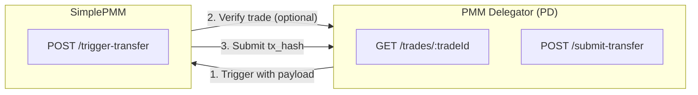
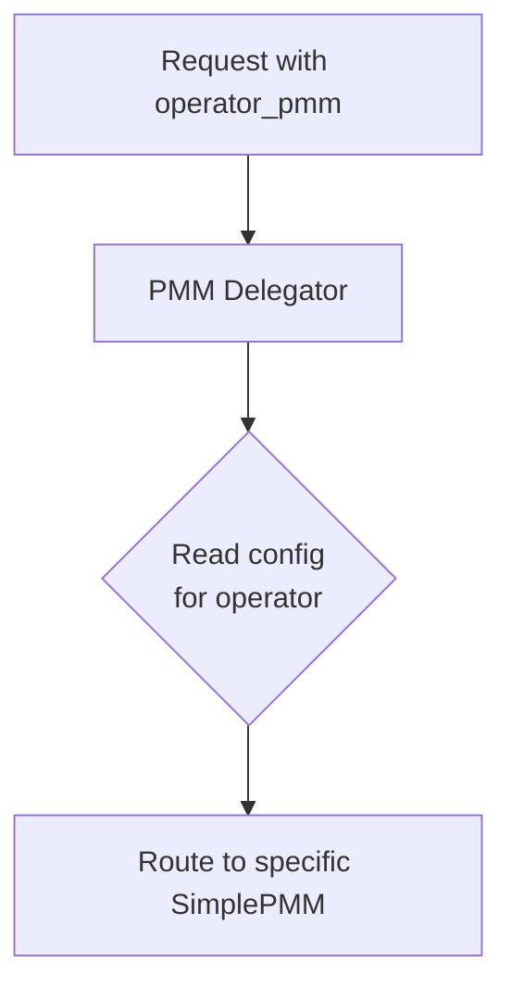
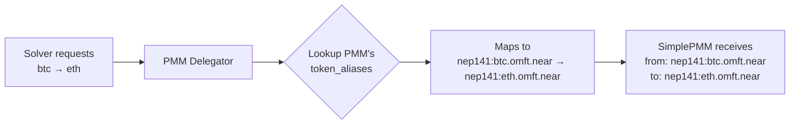
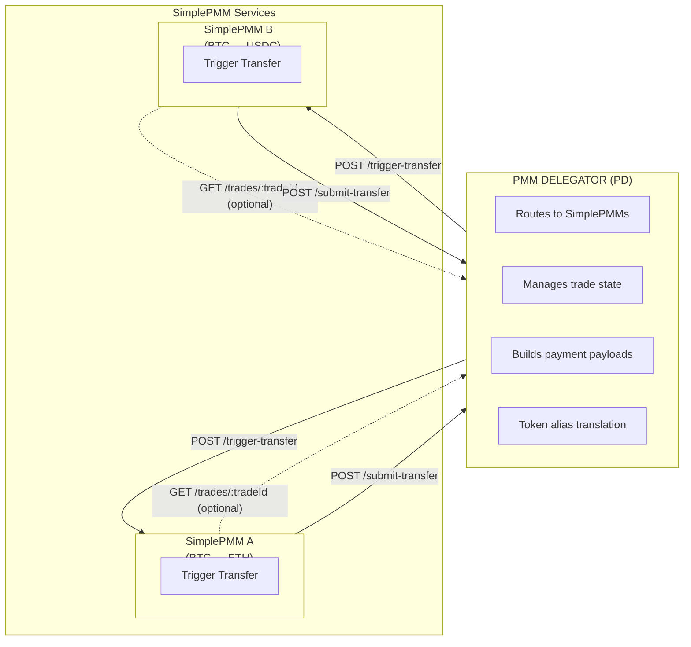
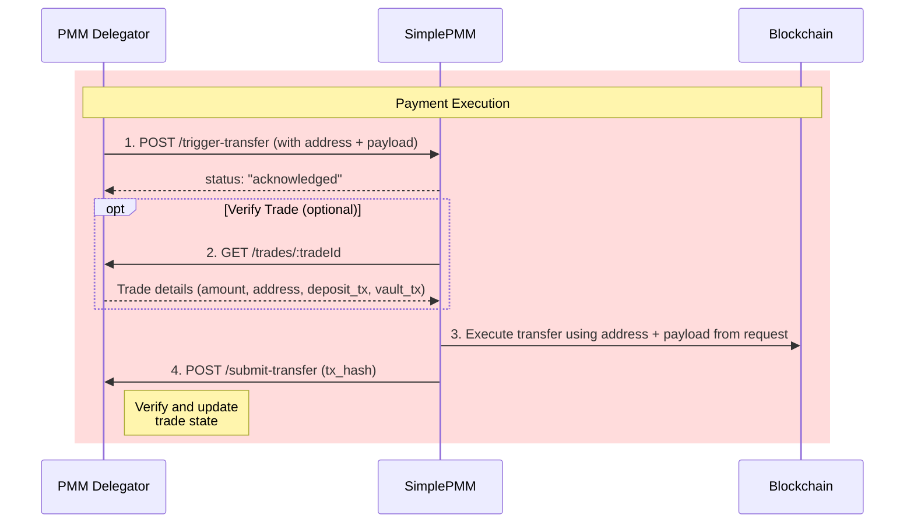

# PMM Delegator Architecture

This document describes the **PMM Delegator (PD)** and **SimplePMM** architecture, enabling a simplified integration pattern for market makers who want to provide liquidity without implementing the full PMM protocol complexity.

## Quick Summary



| Component     | Implements                                                    |
| ------------- | ------------------------------------------------------------- |
| **SimplePMM** | `POST /trigger-transfer` (1 endpoint)                         |
| **PD**        | `GET /trades/:tradeId`, `POST /submit-transfer` (2 endpoints) |

**Key Features:**

- SimplePMM only implements 1 endpoint
- PD provides pre-built `address` + `payload` for execution
- Per-PMM `supported_pairs` and `token_aliases` configuration
- SimplePMM can verify trade details via `GET /trades/:tradeId` before executing

## Table of Contents

- [PMM Delegator Architecture](#pmm-delegator-architecture)
  - [Quick Summary](#quick-summary)
  - [Table of Contents](#table-of-contents)
  - [1. Overview](#1-overview)
    - [1.1. Architecture Components](#11-architecture-components)
    - [1.2. Key Benefits](#12-key-benefits)
    - [1.3. Operator-Based Routing](#13-operator-based-routing)
  - [2. System Architecture](#2-system-architecture)
    - [2.1. Component Diagram](#21-component-diagram)
    - [2.2. Communication Flow](#22-communication-flow)
  - [3. Trade Flow](#3-trade-flow)
    - [3.1. Flow Diagram](#31-flow-diagram)
    - [3.2. Phase Breakdown](#32-phase-breakdown)
  - [4. SimplePMM API Specification](#4-simplepmm-api-specification)
    - [4.1. Endpoint: `POST /trigger-transfer`](#41-endpoint-post-trigger-transfer)
      - [Request Parameters](#request-parameters)
      - [Example Request](#example-request)
      - [Expected Response](#expected-response)
      - [Network-Specific Behavior](#network-specific-behavior)
      - [SimplePMM Actions After Response](#simplepmm-actions-after-response)
  - [5. PMM Delegator API Specification](#5-pmm-delegator-api-specification)
    - [5.1. Endpoint: `GET /trades/:tradeId`](#51-endpoint-get-tradestradeid)
      - [Request Parameters](#request-parameters-1)
      - [Example Request](#example-request-1)
      - [Expected Response](#expected-response-1)
    - [5.2. Endpoint: `POST /submit-transfer`](#52-endpoint-post-submit-transfer)
      - [Request Parameters](#request-parameters-2)
      - [Example Request](#example-request-2)
      - [Expected Response](#expected-response-2)
      - [PMM Delegator Processing](#pmm-delegator-processing)
  - [6. Security Considerations](#6-security-considerations)
  - [7. Error Handling](#7-error-handling)
    - [Common Error Responses](#common-error-responses)
    - [Error Response Format](#error-response-format)
    - [Retry Strategy](#retry-strategy)
  - [8. Design Decisions](#8-design-decisions)
    - [8.1. Transaction Hash Format](#81-transaction-hash-format)
    - [8.2. Callback Failure Recovery](#82-callback-failure-recovery)
    - [8.3. Operator Routing Rules](#83-operator-routing-rules)
    - [8.4. Fee Distribution](#84-fee-distribution)
    - [8.5. Configuration Management](#85-configuration-management)
    - [8.6. Timeout Ordering](#86-timeout-ordering)
    - [8.7. Failover Strategy](#87-failover-strategy)

---

## 1. Overview

The PMM Delegator architecture introduces a two-tier system that abstracts the complexity of the Optimex PMM protocol from liquidity providers.

### 1.1. Architecture Components

| Component              | Role                                     |
| ---------------------- | ---------------------------------------- |
| **PMM Delegator (PD)** | Virtual PMM that delegates to SimplePMMs |
| **SimplePMM**          | Simplified liquidity provider            |

### 1.2. Key Benefits

- **Minimal Integration**: SimplePMMs only implement 1 endpoint (`POST /trigger-transfer`)
- **Pre-built Payloads**: PD provides ready-to-use payloads for payment execution
- **Operator-Based Routing**: PD routes to specific SimplePMM via `operator_pmm`
- **Flexible Liquidity**: Multiple SimplePMMs can be registered, each serving specific trades
- **Reduced Complexity**: SimplePMMs only need to execute transfers, not handle protocol logic

### 1.3. Operator-Based Routing

PMM Delegator routes requests to specific SimplePMM based on `operator_pmm` parameter.



**PMM Delegator Config Example:**

```yaml
simple_pmms:
  - id: 'optimex-pmm-1'
    http_endpoint: 'https://pmm1.bitdex.xyz'
    operator_address: '0x78Bdc100555672a193359bd3e9CD68F23015A051'
    # Supported trading pairs for this SimplePMM
    supported_pairs:
      - from: 'btc'
        to: 'eth'
      - from: 'eth'
        to: 'btc'
    # Token aliases (Solver token ID → SimplePMM token ID)
    token_aliases:
      'btc': 'nep141:btc.omft.near'
      'eth': 'nep141:eth.omft.near'

  - id: 'optimex-pmm-2'
    http_endpoint: 'https://pmm2.bitdex.xyz'
    operator_address: '0xAaaa1234567890abcdef1234567890abcdef1234'
    supported_pairs:
      - from: 'btc'
        to: 'usdc'
      - from: 'usdc'
        to: 'btc'
    # Token aliases (Solver token ID → SimplePMM token ID)
    token_aliases:
      'btc': 'nep141:btc.omft.near'
      'usdc': 'erc20:0xA0b86991c6218b36c1d19D4a2e9Eb0cE3606eB48'
```

**Token Alias Flow:**



**Routing Logic:**

- Request includes `operator_pmm=optimex-pmm-testnet`
- PMM Delegator looks up config for `optimex-pmm-testnet`
- PD translates token IDs using that PMM's `token_aliases` before forwarding
- Routes request to `https://pmm-dev.bitdex.xyz/trigger-transfer`

---

## 2. System Architecture

### 2.1. Component Diagram



### 2.2. Communication Flow

| Direction  | From          | To            | Endpoints                                       |
| ---------- | ------------- | ------------- | ----------------------------------------------- |
| Downstream | PMM Delegator | SimplePMM     | `POST /trigger-transfer`                        |
| Upstream   | SimplePMM     | PMM Delegator | `GET /trades/:tradeId`, `POST /submit-transfer` |

---

## 3. Trade Flow

### 3.1. Flow Diagram



### 3.2. Phase Breakdown

| #   | Phase        | Direction         | Endpoint                 | Description                            |
| --- | ------------ | ----------------- | ------------------------ | -------------------------------------- |
| 1   | Signal       | PD → SimplePMM    | `POST /trigger-transfer` | Receive payload and prepare transfer   |
| 2   | Verify (opt) | SimplePMM → PD    | `GET /trades/:tradeId`   | Verify trade details before execution  |
| 3   | Execution    | SimplePMM → Chain | —                        | Execute on-chain using address+payload |
| 4   | Submission   | SimplePMM → PD    | `POST /submit-transfer`  | Submit tx_hash to PD                   |

---

## 4. SimplePMM API Specification

SimplePMMs must implement the following endpoint:

| Endpoint            | Method | Purpose                              |
| ------------------- | ------ | ------------------------------------ |
| `/trigger-transfer` | POST   | Receive transfer instruction from PD |

---

### 4.1. Endpoint: `POST /trigger-transfer`

**Purpose:** PMM Delegator instructs the SimplePMM to execute a token transfer. PD provides pre-built payload for easy execution.

#### Request Parameters

**Request Body (JSON):**

| Parameter | Type   | Required | Description                                   |
| --------- | ------ | -------- | --------------------------------------------- |
| `tradeId` | string | Yes      | Unique trade identifier                       |
| `address` | string | Yes      | Contract/destination address for execution    |
| `payload` | string | Yes      | Pre-built payload for execution (hex-encoded) |

#### Example Request

```
POST /trigger-transfer
Content-Type: application/json

{
  "tradeId": "0x3bfe2fc4889a98a39b31b348e7b212ea3f2bea63fd1ea2e0c8ba326433677328",
  "address": "0x1234567890abcdef1234567890abcdef12345678",
  "payload": "0xa9059cbb000000000000000000000000..."
}
```

#### Expected Response

**HTTP Status:** `200 OK`

**Response Body:**

```json
{
  "trade_id": "0x3bfe2fc4889a98a39b31b348e7b212ea3f2bea63fd1ea2e0c8ba326433677328",
  "status": "acknowledged",
  "error": ""
}
```

| Field      | Type   | Description                                       |
| ---------- | ------ | ------------------------------------------------- |
| `trade_id` | string | Trade identifier from request                     |
| `status`   | string | `acknowledged` if transfer will be executed       |
| `error`    | string | Error message if applicable (empty if successful) |

#### Network-Specific Behavior

SimplePMM uses `address` and `payload` from the request to execute:

| Network | `address` Field          | `payload` Field                      |
| ------- | ------------------------ | ------------------------------------ |
| **EVM** | Payment contract address | Pre-built calldata for contract call |
| **BTC** | User's BTC address       | OP_RETURN data (opReturnData)        |

**EVM Execution:**
SimplePMM calls the payment contract with the provided payload:

```typescript
const tx = await signer.sendTransaction({
  to: address, // Payment contract
  data: payload, // Pre-built calldata from PD
})
```

**BTC Execution:**
SimplePMM creates a transaction with OP_RETURN:

```typescript
// address = user's BTC address
// payload = opReturnData
const tx = createBtcTransaction({
  to: address,
  amount: amountOut,
  opReturn: payload,
})
```

#### SimplePMM Actions After Response

1. **Validate Request**: Verify trade_id and parameters
2. **Verify Trade (optional)**: Call `GET /trades/:tradeId` to verify amount, address, deposit_tx, vault_tx
3. **Execute Transfer**: Call contract (EVM) or send BTC with OP_RETURN
4. **Submit Result**: Call PMM Delegator's `/submit-transfer` with tx_hash

---

## 5. PMM Delegator API Specification

PMM Delegator exposes the following endpoints for SimplePMMs:

| Endpoint           | Method | Purpose                               |
| ------------------ | ------ | ------------------------------------- |
| `/trades/:tradeId` | GET    | Get trade details for verification    |
| `/submit-transfer` | POST   | Submit completed transfer transaction |

---

### 5.1. Endpoint: `GET /trades/:tradeId`

**Purpose:** SimplePMM can verify trade details (amount, address, etc.) before executing transfer.

#### Request Parameters

**Path Parameters:**

| Parameter | Type   | Required | Description             |
| --------- | ------ | -------- | ----------------------- |
| `tradeId` | string | Yes      | Unique trade identifier |

**Query Parameters:**

| Parameter          | Type   | Required | Description                                     |
| ------------------ | ------ | -------- | ----------------------------------------------- |
| `operator_address` | string | No       | SimplePMM operator address for token ID mapping |

> **Note:** When `operator_address` is provided, PD reverse-maps token IDs using that operator's `token_aliases` config. Without it, token IDs are returned in Solver format (e.g., `nep141:btc.omft.near`).

#### Example Request

**With operator_address (recommended for SimplePMM):**
```
GET /trades/0x3bfe...?operator_address=0x78Bdc100555672a193359bd3e9CD68F23015A051
```
Returns: `from_token_id: "eth"`, `to_token_id: "btc"`

**Without operator_address (Solver format):**
```
GET /trades/0x3bfe2fc4889a98a39b31b348e7b212ea3f2bea63fd1ea2e0c8ba326433677328
```
Returns: `from_token_id: "nep141:eth.omft.near"`, `to_token_id: "nep141:btc.omft.near"`

#### Expected Response

**HTTP Status:** `200 OK`

**Response Body (with operator_address):**

```json
{
  "trade_id": "0x3bfe2fc4889a98a39b31b348e7b212ea3f2bea63fd1ea2e0c8ba326433677328",
  "from_token_id": "eth",
  "to_token_id": "btc",
  "amount_in": "1000000000000000000",
  "amount_out": "4500000",
  "to_user_address": "bc1p68q6hew27ljf4ghvlnwqz0fq32qg7tsgc7jr5levfy8r74p5k52qqphk07",
  "trade_deadline": "1696012800",
  "deposit_tx": "0x1234567890abcdef1234567890abcdef1234567890abcdef1234567890abcdef",
  "vault_tx": "0xabcdef1234567890abcdef1234567890abcdef1234567890abcdef1234567890",
  "status": "pending",
  "error": ""
}
```

| Field             | Type   | Description                                          |
| ----------------- | ------ | ---------------------------------------------------- |
| `trade_id`        | string | Unique trade identifier                              |
| `from_token_id`   | string | Source token identifier                              |
| `to_token_id`     | string | Destination token identifier                         |
| `amount_in`       | string | Input amount (base 10, treat as BigInt)              |
| `amount_out`      | string | Output amount to transfer (base 10, treat as BigInt) |
| `to_user_address` | string | User's receiving address                             |
| `trade_deadline`  | string | Payment deadline (UNIX timestamp)                    |
| `deposit_tx`      | string | User's deposit transaction hash                      |
| `vault_tx`        | string | Vault transaction hash                               |
| `status`          | string | Trade status: `pending`, `completed`, `failed`       |
| `error`           | string | Error message if applicable (empty if successful)    |

---

### 5.2. Endpoint: `POST /submit-transfer`

**Purpose:** SimplePMM submits the completed transfer transaction to the PMM Delegator.

#### Request Parameters

**Request Body (JSON):**

| Parameter    | Type   | Required | Description                         |
| ------------ | ------ | -------- | ----------------------------------- |
| `trade_id`   | string | Yes      | Unique trade identifier             |
| `tx_hash`    | string | Yes      | Transaction hash of the transfer    |
| `network_id` | string | Yes      | Network where transfer was executed |

#### Example Request

```
POST /submit-transfer
Content-Type: application/json

{
  "trade_id": "0x3bfe2fc4889a98a39b31b348e7b212ea3f2bea63fd1ea2e0c8ba326433677328",
  "tx_hash": "0x7a87d2c423e13533b5ae0ecc5af900a7b697048103f4f6e32d19edde5e707355",
  "network_id": "ethereum"
}
```

#### Expected Response

**HTTP Status:** `200 OK`

**Response Body:**

```json
{
  "trade_id": "0x3bfe2fc4889a98a39b31b348e7b212ea3f2bea63fd1ea2e0c8ba326433677328",
  "status": "submitted",
  "error": ""
}
```

| Field      | Type   | Description                                       |
| ---------- | ------ | ------------------------------------------------- |
| `trade_id` | string | Trade identifier from request                     |
| `status`   | string | `submitted` if successfully processed             |
| `error`    | string | Error message if applicable (empty if successful) |

#### PMM Delegator Processing

1. **Verify Trade**: Confirm trade exists and is pending settlement
2. **Record Transaction**: Store tx_hash for verification
3. **Update State**: Mark trade as completed

---

## 6. Security Considerations

| Aspect                  | Recommendation                                     |
| ----------------------- | -------------------------------------------------- |
| **Private Key Storage** | Use HSM or secure vault for SimplePMM private keys |
| **Payload Validation**  | Verify payload matches expected format before exec |
| **Rate Limiting**       | Implement rate limits on all endpoints             |
| **TLS/HTTPS**           | Require TLS 1.3 for all API communications         |
| **IP Whitelisting**     | Consider whitelisting PMM Delegator IPs            |
| **Amount Validation**   | Verify transfer amounts before execution           |

---

## 7. Error Handling

### Common Error Responses

| HTTP Status | Error Code              | Description                        |
| ----------- | ----------------------- | ---------------------------------- |
| `400`       | `INVALID_PAYLOAD`       | Payload format invalid             |
| `400`       | `TRADE_NOT_FOUND`       | Trade ID doesn't exist             |
| `400`       | `INSUFFICIENT_BALANCE`  | SimplePMM lacks funds for transfer |
| `409`       | `TRADE_ALREADY_SETTLED` | Trade was already completed        |
| `500`       | `TRANSFER_FAILED`       | On-chain transfer execution failed |
| `503`       | `SERVICE_UNAVAILABLE`   | SimplePMM temporarily unavailable  |

### Error Response Format

```json
{
  "trade_id": "0x3bfe...",
  "status": "error",
  "error": "INVALID_PAYLOAD: Payload format invalid"
}
```

### Retry Strategy

| Error Type              | Retry | Wait                |
| ----------------------- | ----- | ------------------- |
| Network timeout         | Yes   | Exponential backoff |
| `SERVICE_UNAVAILABLE`   | Yes   | 5 seconds           |
| `INSUFFICIENT_BALANCE`  | No    | —                   |
| `INVALID_PAYLOAD`       | No    | —                   |
| `TRADE_ALREADY_SETTLED` | No    | —                   |

---

## 8. Design Decisions

This section documents resolved design decisions for PMM Delegator architecture.

### 8.1. Transaction Hash Format

**Decision:** Pass tx hash as-is without encoding.

- SimplePMM submits `tx_hash` in native chain format
- Delegator stores and processes unchanged

| Network | Format                       | Example               |
| ------- | ---------------------------- | --------------------- |
| EVM     | `0x`-prefixed hex (66 chars) | `0x7a87d2c4...707355` |
| Bitcoin | Hex string (64 chars)        | `a1b2c3d4e5f6...`     |
| Solana  | Base58 signature             | `5UfDuX...`           |

### 8.2. Callback Failure Recovery

**Decision:** SimplePMM implements retry with exponential backoff.

1. SimplePMM MUST retry `/submit-transfer` on failure
2. Retry intervals: 1s → 2s → 4s → 8s → 16s (max 5 retries)
3. After max retries, log and alert for manual intervention
4. Delegator MAY implement polling as secondary recovery

### 8.3. Operator Routing Rules

**Decision:** Delegator routes based on `operator_pmm` parameter.

| Scenario               | Behavior                    |
| ---------------------- | --------------------------- |
| Valid `operator_pmm`   | Route to matching SimplePMM |
| Invalid `operator_pmm` | Return 400 error            |

### 8.4. Fee Distribution

**Decision:** Fee structure is external to protocol.

- SimplePMM keeps quote spread as profit
- Fee sharing between SimplePMM and Delegator is off-chain business agreement
- Protocol does not enforce fee distribution

### 8.5. Configuration Management

**Decision:** Static YAML configuration with reload support.

```yaml
simple_pmms:
  - id: 'optimex-pmm-testnet'
    http_endpoint: 'https://pmm-dev.bitdex.xyz'
    operator_address: '0x78Bdc100555672a193359bd3e9CD68F23015A051'
```

- Configuration loaded at startup
- Support SIGHUP for config reload without restart
- No dynamic registration API in v1

### 8.6. Timeout Ordering

**Decision:** Enforce strict timeout hierarchy.

```
trade_deadline < script_deadline
```

- `trade_deadline`: When payment must complete
- `script_deadline`: When withdrawal is allowed

### 8.7. Failover Strategy

**Decision:** No automatic failover after commitment.

- Once SimplePMM is committed via `operator_pmm`, trade is bound to that operator
- If SimplePMM unreachable after commitment → trade fails
- Future: Consider multi-operator redundancy
