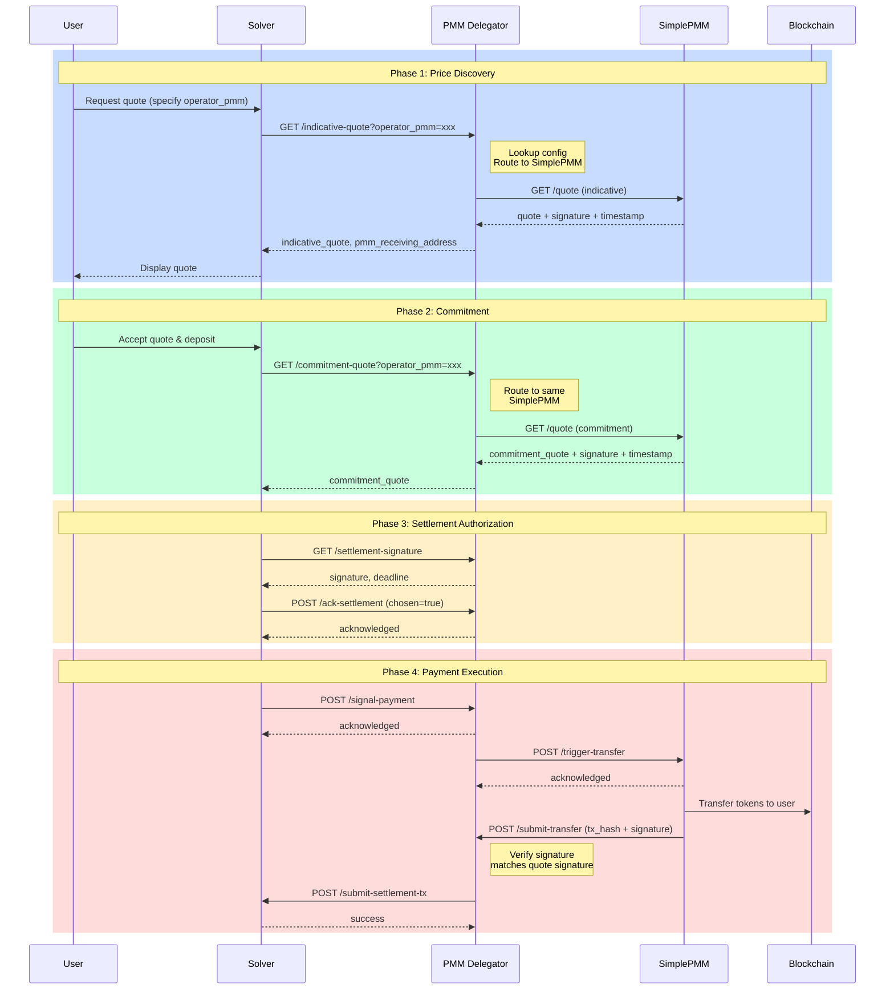

# SimplePMM Delegator Architecture

This document describes the **PMM Delegator** and **SimplePMM** architecture, enabling a simplified integration pattern for market makers who want to provide liquidity without implementing the full PMM protocol complexity.

> **Related:** For SimplePMM endpoint specification, see [SimplePMM API](./simple-pmm-api.md)

## Table of Contents

- [SimplePMM Delegator Architecture](#simplepmm-delegator-architecture)
  - [Table of Contents](#table-of-contents)
  - [1. Overview](#1-overview)
    - [1.1. Architecture Components](#11-architecture-components)
    - [1.2. Key Benefits](#12-key-benefits)
    - [1.3. API Comparison](#13-api-comparison)
    - [1.4. Operator-Based Routing](#14-operator-based-routing)
  - [2. System Architecture](#2-system-architecture)
    - [2.1. Component Roles](#21-component-roles)
    - [2.2. Communication Flow](#22-communication-flow)
  - [3. Complete Trade Flow](#3-complete-trade-flow)
    - [3.1. Flow Diagram](#31-flow-diagram)
    - [3.2. Phase Breakdown](#32-phase-breakdown)
  - [4. SimplePMM API Specification](#4-simplepmm-api-specification)
    - [4.1. Endpoint: `GET /quote` (Unified Quote Endpoint)](#41-endpoint-get-quote-unified-quote-endpoint)
      - [Request Parameters](#request-parameters)
      - [Example Requests](#example-requests)
      - [Expected Response](#expected-response)
      - [Signature Message Format](#signature-message-format)
    - [4.2. Endpoint: `POST /trigger-transfer`](#42-endpoint-post-trigger-transfer)
      - [Request Parameters](#request-parameters-1)
      - [Example Request](#example-request)
      - [Expected Response](#expected-response-1)
      - [SimplePMM Actions After Acknowledgment](#simplepmm-actions-after-acknowledgment)
  - [5. PMM Delegator API Specification](#5-pmm-delegator-api-specification)
    - [5.1. Endpoint: `POST /submit-transfer`](#51-endpoint-post-submit-transfer)
      - [Request Parameters](#request-parameters-2)
      - [Example Request](#example-request-1)
      - [Expected Response](#expected-response-2)
      - [PMM Delegator Processing](#pmm-delegator-processing)
  - [6. Signature Specification](#6-signature-specification)
    - [6.1. Quote Signature](#61-quote-signature)
    - [6.2. Transfer Submission Signature](#62-transfer-submission-signature)
  - [7. Security Considerations](#7-security-considerations)
  - [8. Error Handling](#8-error-handling)
    - [Common Error Responses](#common-error-responses)
    - [Error Response Format](#error-response-format)
    - [Retry Strategy](#retry-strategy)
  - [9. Open Discussion Items](#9-open-discussion-items)
    - [9.1. Critical Issues](#91-critical-issues)
    - [9.2. Unresolved Questions](#92-unresolved-questions)

---

## 1. Overview

The SimplePMM Delegator architecture introduces a two-tier system that abstracts the complexity of the Optimex PMM protocol from liquidity providers.

### 1.1. Architecture Components

| Component         | Role                                       | Implements                    |
| ----------------- | ------------------------------------------ | ----------------------------- |
| **Solver**        | Orchestrates trades between users and PMMs | Optimex Protocol              |
| **PMM Delegator** | Virtual PMM that delegates to SimplePMMs   | Full PMM API (README.md)      |
| **SimplePMM**     | Simplified liquidity provider              | SimplePMM API (this document) |

### 1.2. Key Benefits

- **Simplified Integration**: SimplePMMs only implement 2 endpoints instead of 5
- **Unified Quote Endpoint**: Single `/quote` endpoint handles indicative, commitment, and liquidation quotes
- **Operator-Based Routing**: Solver specifies which SimplePMM handles each trade via `operator_pmm`
- **Abstracted Complexity**: PMM Delegator handles settlement signatures, acknowledgments, and solver communication
- **Flexible Liquidity**: Multiple SimplePMMs can be registered, each serving specific trades
- **Reduced Risk**: SimplePMMs only need to manage token transfers, not protocol complexity

### 1.3. API Comparison

| Full PMM API (5 endpoints)  | SimplePMM API (2 endpoints)   |
| --------------------------- | ----------------------------- |
| `GET /indicative-quote`     | `GET /quote?type=indicative`  |
| `GET /commitment-quote`     | `GET /quote?type=commitment`  |
| `GET /liquidation-quote`    | `GET /quote?type=liquidation` |
| `GET /settlement-signature` | _(handled by Delegator)_      |
| `POST /ack-settlement`      | _(handled by Delegator)_      |
| `POST /signal-payment`      | `POST /trigger-transfer`      |

### 1.4. Operator-Based Routing

When the Solver calls PMM Delegator, it includes an `operator_pmm` parameter specifying which SimplePMM should handle the trade.

```
Solver Request → PMM Delegator
                      │
                      ▼
              ┌───────────────┐
              │ Read config   │
              │ for operator  │
              └───────┬───────┘
                      │
                      ▼
              Route to specific SimplePMM
```

**PMM Delegator Config Example:**

```json
{
  "simple_pmms": {
    "operator_a": {
      "name": "SimplePMM Alpha",
      "base_url": "https://pmm-alpha.example.com",
      "address": "0xAaaa..."
    },
    "operator_b": {
      "name": "SimplePMM Beta",
      "base_url": "https://pmm-beta.example.com",
      "address": "0xBbbb..."
    }
  }
}
```

**Routing Logic:**

- Solver includes `operator_pmm=operator_a` in request
- PMM Delegator looks up config for `operator_a`
- Routes request to `https://pmm-alpha.example.com/quote`

---

## 2. System Architecture

### 2.1. Component Roles

```
┌─────────────────────────────────────────────────────────────────────────┐
│                              SOLVER                                      │
│                    (Optimex Trading Protocol)                           │
└────────────────────────────┬────────────────────────────────────────────┘
                             │
                             │ Full PMM API
                             │ (/indicative-quote, /commitment-quote,
                             │  /settlement-signature, /ack-settlement,
                             │  /signal-payment)
                             ▼
┌─────────────────────────────────────────────────────────────────────────┐
│                          PMM DELEGATOR                                   │
│                      (Virtual PMM Service)                              │
│                                                                         │
│  • Implements full PMM API for Solver                                   │
│  • Aggregates quotes from multiple SimplePMMs                           │
│  • Manages settlement signatures and protocol flow                      │
│  • Delegates token transfers to SimplePMMs                              │
│  • Submits settlement transactions to Solver                            │
└──────────┬──────────────────┬──────────────────┬───────────────────────┘
           │                  │                  │
           │ SimplePMM API    │ SimplePMM API    │ SimplePMM API
           ▼                  ▼                  ▼
    ┌─────────────┐    ┌─────────────┐    ┌─────────────┐
    │  SimplePMM  │    │  SimplePMM  │    │  SimplePMM  │
    │      A      │    │      B      │    │      C      │
    │             │    │             │    │             │
    │ • Quote     │    │ • Quote     │    │ • Quote     │
    │ • Transfer  │    │ • Transfer  │    │ • Transfer  │
    └─────────────┘    └─────────────┘    └─────────────┘
```

### 2.2. Communication Flow

| Direction  | From          | To            | Protocol                         |
| ---------- | ------------- | ------------- | -------------------------------- |
| Downstream | Solver        | PMM Delegator | Full PMM API (5 endpoints)       |
| Downstream | PMM Delegator | SimplePMM     | SimplePMM API (2 endpoints)      |
| Upstream   | SimplePMM     | PMM Delegator | Submit Transfer API (1 endpoint) |
| Upstream   | PMM Delegator | Solver        | Submit Settlement API            |

---

## 3. Complete Trade Flow

### 3.1. Flow Diagram



### 3.2. Phase Breakdown

| #   | Phase          | Solver → Delegator           | Delegator → SimplePMM        | SimplePMM Action              |
| --- | -------------- | ---------------------------- | ---------------------------- | ----------------------------- |
| 1   | Discovery      | `GET /indicative-quote`      | `GET /quote?type=indicative` | Return quote + signature      |
| 2   | Commitment     | `GET /commitment-quote`      | `GET /quote?type=commitment` | Return firm quote + signature |
| 3   | Authorization  | `GET /settlement-signature`  | —                            | Delegator handles internally  |
| 4   | Acknowledgment | `POST /ack-settlement`       | —                            | Delegator handles internally  |
| 5   | Signal         | `POST /signal-payment`       | `POST /trigger-transfer`     | Prepare for transfer          |
| 6   | Execution      | —                            | —                            | Transfer tokens on-chain      |
| 7   | Submission     | —                            | `POST /submit-transfer`      | Submit tx to Delegator        |
| 8   | Settlement     | `POST /submit-settlement-tx` | —                            | Delegator submits to Solver   |

---

## 4. SimplePMM API Specification

SimplePMMs must implement the following endpoints:

| Endpoint            | Method | Purpose                                                                       |
| ------------------- | ------ | ----------------------------------------------------------------------------- |
| `/quote`            | GET    | **Unified endpoint** - handles indicative, commitment, and liquidation quotes |
| `/trigger-transfer` | POST   | Receive transfer instruction from Delegator                                   |

---

### 4.1. Endpoint: `GET /quote` (Unified Quote Endpoint)

**Purpose:** Single unified endpoint that replaces the three separate endpoints in the full PMM API:

| Full PMM API             | SimplePMM API                 |
| ------------------------ | ----------------------------- |
| `GET /indicative-quote`  | `GET /quote?type=indicative`  |
| `GET /commitment-quote`  | `GET /quote?type=commitment`  |
| `GET /liquidation-quote` | `GET /quote?type=liquidation` |

This consolidation simplifies SimplePMM integration by:

- Reducing endpoint count from 5 to 2
- Using consistent request/response format across all quote types
- Always returning signature + timestamp for verification

#### Request Parameters

**Query Parameters:**

| Parameter          | Type   | Required    | Description                                                                |
| ------------------ | ------ | ----------- | -------------------------------------------------------------------------- |
| `type`             | string | Yes         | Quote type: `indicative`, `commitment`, or `liquidation`                   |
| `trade_id`         | string | Conditional | Required for `commitment` and `liquidation` types                          |
| `from_token_id`    | string | Yes         | Source token identifier                                                    |
| `to_token_id`      | string | Yes         | Destination token identifier                                               |
| `amount`           | string | Yes         | Amount to trade (base 10, treat as BigInt)                                 |
| `to_user_address`  | string | Yes         | User's receiving address                                                   |
| `trade_deadline`   | string | Conditional | Payment deadline (UNIX timestamp) - required for commitment/liquidation    |
| `script_deadline`  | string | Conditional | Withdrawal deadline (UNIX timestamp) - required for commitment/liquidation |
| `payment_metadata` | string | Optional    | Hex-encoded metadata for liquidation                                       |

#### Example Requests

**Indicative Quote:**

```
GET /quote?type=indicative&from_token_id=ETH&to_token_id=BTC&amount=1000000000000000000&to_user_address=bc1q...
```

**Commitment Quote:**

```
GET /quote?type=commitment&trade_id=0x3bfe...&from_token_id=ETH&to_token_id=BTC&amount=1000000000000000000&to_user_address=bc1q...&trade_deadline=1696012800&script_deadline=1696016400
```

**Liquidation Quote:**

```
GET /quote?type=liquidation&trade_id=0x3bfe...&from_token_id=ETH&to_token_id=BTC&amount=1000000000000000000&to_user_address=bc1q...&trade_deadline=1696012800&script_deadline=1696016400&payment_metadata=0x...
```

#### Expected Response

**HTTP Status:** `200 OK`

**Response Body:**

```json
{
  "simple_pmm_address": "0x1234567890abcdef1234567890abcdef12345678",
  "quote": "987654321000000000",
  "signature": "0x...",
  "timestamp": 1696000000,
  "quote_timeout": 1696003600,
  "error": ""
}
```

| Field                | Type    | Description                                                                              |
| -------------------- | ------- | ---------------------------------------------------------------------------------------- |
| `simple_pmm_address` | string  | SimplePMM's wallet address (used for signature verification)                             |
| `quote`              | string  | Quoted output amount (treat as BigInt)                                                   |
| `signature`          | string  | EVM signature of the message (see [Signature Specification](#6-signature-specification)) |
| `timestamp`          | integer | UNIX timestamp when quote was signed                                                     |
| `quote_timeout`      | integer | When this quote expires (0 if no timeout)                                                |
| `error`              | string  | Error message if applicable (empty if successful)                                        |

#### Signature Message Format

The SimplePMM signs the following message:

```
#{simple_pmm_address} quote #{quote} for #{trade_id} at #{timestamp}
```

**Example:**

```
0x1234567890abcdef1234567890abcdef12345678 quote 987654321000000000 for 0x3bfe2fc4889a98a39b31b348e7b212ea3f2bea63fd1ea2e0c8ba326433677328 at 1696000000
```

For indicative quotes (no trade_id), use a session identifier:

```
0x1234567890abcdef1234567890abcdef12345678 quote 987654321000000000 for session_abc123 at 1696000000
```

<details>
<summary><strong>Example Implementation</strong></summary>

```typescript
import { ethers } from 'ethers'

interface QuoteRequest {
  type: 'indicative' | 'commitment' | 'liquidation'
  trade_id?: string
  from_token_id: string
  to_token_id: string
  amount: string
  to_user_address: string
  trade_deadline?: string
  script_deadline?: string
  payment_metadata?: string
}

async function getQuote(req: QuoteRequest) {
  const simplePmmAddress = process.env.SIMPLE_PMM_ADDRESS!
  const privateKey = process.env.SIMPLE_PMM_PRIVATE_KEY!

  // Calculate quote based on your pricing logic
  const quote = await calculateQuote({
    fromToken: req.from_token_id,
    toToken: req.to_token_id,
    amount: BigInt(req.amount),
    type: req.type,
  })

  const timestamp = Math.floor(Date.now() / 1000)
  const identifier = req.trade_id || `session_${generateSessionId()}`

  // Create signature message
  const message = `${simplePmmAddress} quote ${quote.toString()} for ${identifier} at ${timestamp}`

  // Sign the message
  const wallet = new ethers.Wallet(privateKey)
  const signature = await wallet.signMessage(message)

  // Calculate quote timeout (e.g., 1 hour for indicative, 30 min for commitment)
  const quoteTimeout = req.type === 'indicative' ? timestamp + 3600 : timestamp + 1800

  return {
    simple_pmm_address: simplePmmAddress,
    quote: quote.toString(),
    signature,
    timestamp,
    quote_timeout: quoteTimeout,
    error: '',
  }
}
```

</details>

---

### 4.2. Endpoint: `POST /trigger-transfer`

**Purpose:** PMM Delegator instructs the SimplePMM to execute a token transfer to the user.

#### Request Parameters

**Request Body (JSON):**

| Parameter                  | Type    | Required | Description                                          |
| -------------------------- | ------- | -------- | ---------------------------------------------------- |
| `trade_id`                 | string  | Yes      | Unique trade identifier                              |
| `from_token_id`            | string  | Yes      | Source token identifier                              |
| `to_token_id`              | string  | Yes      | Destination token identifier                         |
| `amount_in`                | string  | Yes      | Input amount (base 10, treat as BigInt)              |
| `amount_out`               | string  | Yes      | Output amount to transfer (base 10, treat as BigInt) |
| `to_user_address`          | string  | Yes      | User's receiving address                             |
| `trade_deadline`           | string  | Yes      | Payment deadline (UNIX timestamp)                    |
| `total_fee_amount`         | string  | Yes      | Total fee amount (base 10, treat as BigInt)          |
| `original_quote_signature` | string  | Yes      | Original signature from `/quote` response            |
| `original_quote_timestamp` | integer | Yes      | Original timestamp from `/quote` response            |

#### Example Request

```
POST /trigger-transfer
Content-Type: application/json

{
  "trade_id": "0x3bfe2fc4889a98a39b31b348e7b212ea3f2bea63fd1ea2e0c8ba326433677328",
  "from_token_id": "ETH",
  "to_token_id": "BTC",
  "amount_in": "1000000000000000000",
  "amount_out": "4500000",
  "to_user_address": "bc1p68q6hew27ljf4ghvlnwqz0fq32qg7tsgc7jr5levfy8r74p5k52qqphk07",
  "trade_deadline": "1696012800",
  "total_fee_amount": "1000000000000000",
  "original_quote_signature": "0x...",
  "original_quote_timestamp": 1696000000
}
```

#### Expected Response

**HTTP Status:** `200 OK`

**Response Body:**

```json
{
  "trade_id": "0x3bfe2fc4889a98a39b31b348e7b212ea3f2bea63fd1ea2e0c8ba326433677328",
  "status": "acknowledged",
  "error": ""
}
```

| Field      | Type   | Description                                       |
| ---------- | ------ | ------------------------------------------------- |
| `trade_id` | string | Trade identifier from request                     |
| `status`   | string | `acknowledged` if transfer will be executed       |
| `error`    | string | Error message if applicable (empty if successful) |

#### SimplePMM Actions After Acknowledgment

1. **Verify Request**: Validate that the original signature matches
2. **Queue Transfer**: Add transfer to execution queue
3. **Execute Transfer**: Send tokens to `to_user_address` before `trade_deadline`
4. **Submit Result**: Call PMM Delegator's `/submit-transfer` endpoint with transaction details

<details>
<summary><strong>Example Implementation</strong></summary>

```typescript
import { ethers } from 'ethers'

interface TriggerTransferRequest {
  trade_id: string
  from_token_id: string
  to_token_id: string
  amount_in: string
  amount_out: string
  to_user_address: string
  trade_deadline: string
  total_fee_amount: string
  original_quote_signature: string
  original_quote_timestamp: number
}

async function triggerTransfer(req: TriggerTransferRequest) {
  const simplePmmAddress = process.env.SIMPLE_PMM_ADDRESS!

  // Step 1: Verify the original quote signature
  const message = `${simplePmmAddress} quote ${req.amount_out} for ${req.trade_id} at ${req.original_quote_timestamp}`
  const recoveredAddress = ethers.verifyMessage(message, req.original_quote_signature)

  if (recoveredAddress.toLowerCase() !== simplePmmAddress.toLowerCase()) {
    return {
      trade_id: req.trade_id,
      status: 'error',
      error: 'Invalid quote signature',
    }
  }

  // Step 2: Queue the transfer for execution
  await transferQueue.add({
    tradeId: req.trade_id,
    toToken: req.to_token_id,
    amount: req.amount_out,
    recipient: req.to_user_address,
    deadline: parseInt(req.trade_deadline),
    quoteSignature: req.original_quote_signature,
    quoteTimestamp: req.original_quote_timestamp,
  })

  return {
    trade_id: req.trade_id,
    status: 'acknowledged',
    error: '',
  }
}

// Transfer execution worker
async function executeTransfer(job: TransferJob) {
  const { tradeId, toToken, amount, recipient, quoteSignature, quoteTimestamp } = job

  // Execute the actual transfer based on network type
  const txHash = await performTransfer(toToken, amount, recipient)

  // Submit the transfer result to PMM Delegator
  await submitTransferToDelegator({
    trade_id: tradeId,
    tx_hash: txHash,
    signature: quoteSignature,
    timestamp: quoteTimestamp,
  })
}
```

</details>

---

## 5. PMM Delegator API Specification

PMM Delegator exposes the following endpoint for SimplePMMs to submit completed transfers:

### 5.1. Endpoint: `POST /submit-transfer`

**Purpose:** SimplePMM submits the completed transfer transaction to the PMM Delegator for settlement with the Solver.

#### Request Parameters

**Request Body (JSON):**

| Parameter    | Type    | Required | Description                                   |
| ------------ | ------- | -------- | --------------------------------------------- |
| `trade_id`   | string  | Yes      | Unique trade identifier                       |
| `tx_hash`    | string  | Yes      | Transaction hash of the transfer (hex format) |
| `network_id` | string  | Yes      | Network where transfer was executed           |
| `signature`  | string  | Yes      | Original quote signature for verification     |
| `timestamp`  | integer | Yes      | Original quote timestamp for verification     |

#### Example Request

```
POST /submit-transfer
Content-Type: application/json

{
  "trade_id": "0x3bfe2fc4889a98a39b31b348e7b212ea3f2bea63fd1ea2e0c8ba326433677328",
  "tx_hash": "0x7a87d2c423e13533b5ae0ecc5af900a7b697048103f4f6e32d19edde5e707355",
  "network_id": "ethereum",
  "signature": "0x...",
  "timestamp": 1696000000
}
```

#### Expected Response

**HTTP Status:** `200 OK`

**Response Body:**

```json
{
  "trade_id": "0x3bfe2fc4889a98a39b31b348e7b212ea3f2bea63fd1ea2e0c8ba326433677328",
  "status": "submitted",
  "error": ""
}
```

| Field      | Type   | Description                                       |
| ---------- | ------ | ------------------------------------------------- |
| `trade_id` | string | Trade identifier from request                     |
| `status`   | string | `submitted` if successfully forwarded to Solver   |
| `error`    | string | Error message if applicable (empty if successful) |

#### PMM Delegator Processing

1. **Verify Signature**: Confirm signature matches the registered SimplePMM
2. **Verify Trade**: Confirm trade exists and is pending settlement
3. **Format for Solver**: Convert to Solver's `/submit-settlement-tx` format
4. **Submit to Solver**: Forward settlement to complete the trade

<details>
<summary><strong>PMM Delegator Implementation</strong></summary>

```typescript
import { ethers } from 'ethers'

interface SubmitTransferRequest {
  trade_id: string
  tx_hash: string
  network_id: string
  signature: string
  timestamp: number
}

async function handleSubmitTransfer(req: SubmitTransferRequest) {
  // Step 1: Get trade details
  const trade = await tradeRepository.findById(req.trade_id)
  if (!trade) {
    return { trade_id: req.trade_id, status: 'error', error: 'Trade not found' }
  }

  // Step 2: Verify the SimplePMM signature
  const simplePmmAddress = trade.assignedSimplePmm
  const message = `${simplePmmAddress} quote ${trade.commitmentQuote} for ${req.trade_id} at ${req.timestamp}`
  const recoveredAddress = ethers.verifyMessage(message, req.signature)

  if (recoveredAddress.toLowerCase() !== simplePmmAddress.toLowerCase()) {
    return { trade_id: req.trade_id, status: 'error', error: 'Invalid signature' }
  }

  // Step 3: Encode tx_hash for non-EVM chains
  const settlementTx = encodeSettlementTx(req.tx_hash, req.network_id)

  // Step 4: Submit to Solver
  await solverClient.submitSettlementTx({
    trade_ids: [req.trade_id],
    pmm_id: process.env.PMM_DELEGATOR_ID,
    settlement_tx: settlementTx,
    signature: await signSettlement(req.trade_id),
    start_index: 0,
    signed_at: Math.floor(Date.now() / 1000),
  })

  // Step 5: Update trade status
  await tradeRepository.updateStatus(req.trade_id, 'COMPLETED')

  return { trade_id: req.trade_id, status: 'submitted', error: '' }
}

function encodeSettlementTx(txHash: string, networkId: string): string {
  // EVM chains: use tx hash directly
  if (isEvmNetwork(networkId)) {
    return txHash.startsWith('0x') ? txHash : `0x${txHash}`
  }

  // Bitcoin/Solana: encode as hex
  return '0x' + Buffer.from(txHash, 'utf8').toString('hex')
}
```

</details>

---

## 6. Signature Specification

### 6.1. Quote Signature

SimplePMM signs quotes using EVM personal sign (`eth_sign` / `personal_sign`).

**Message Format:**

```
{simple_pmm_address} quote {quote_amount} for {trade_id_or_session} at {timestamp}
```

**Components:**
| Component | Description | Example |
|-----------|-------------|---------|
| `simple_pmm_address` | SimplePMM's Ethereum address | `0x1234...5678` |
| `quote_amount` | Quoted output amount (string) | `987654321000000000` |
| `trade_id_or_session` | Trade ID (commitment) or session ID (indicative) | `0x3bfe...` or `session_abc` |
| `timestamp` | UNIX timestamp when signed | `1696000000` |

**Signing Code:**

```typescript
const message = `${address} quote ${quote} for ${tradeId} at ${timestamp}`
const signature = await wallet.signMessage(message)
```

**Verification Code:**

```typescript
const recoveredAddress = ethers.verifyMessage(message, signature)
const isValid = recoveredAddress.toLowerCase() === expectedAddress.toLowerCase()
```

### 6.2. Transfer Submission Signature

When submitting a completed transfer, SimplePMM reuses the original quote signature to prove:

1. The SimplePMM was the one who provided the quote
2. The transfer amount matches the committed quote
3. The timestamp proves when the commitment was made

**Verification Flow:**

```
Original Quote → signature + timestamp
                      ↓
Transfer Submission → same signature + timestamp
                      ↓
PMM Delegator → verify signature matches SimplePMM address
                      ↓
              → verify trade exists with matching quote
                      ↓
              → submit to Solver
```

---

## 7. Security Considerations

| Aspect                     | Recommendation                                       |
| -------------------------- | ---------------------------------------------------- |
| **Private Key Storage**    | Use HSM or secure vault for SimplePMM private keys   |
| **Signature Verification** | Always verify signatures before processing transfers |
| **Replay Protection**      | Use unique trade_id + timestamp combination          |
| **Rate Limiting**          | Implement rate limits on all endpoints               |
| **TLS/HTTPS**              | Require TLS 1.3 for all API communications           |
| **IP Whitelisting**        | Consider whitelisting PMM Delegator IPs              |
| **Quote Timeout**          | Enforce quote expiration to prevent stale quotes     |
| **Amount Validation**      | Verify transfer amounts match committed quotes       |

---

## 8. Error Handling

### Common Error Responses

| HTTP Status | Error Code              | Description                         |
| ----------- | ----------------------- | ----------------------------------- |
| `400`       | `INVALID_SIGNATURE`     | Quote signature verification failed |
| `400`       | `INVALID_AMOUNT`        | Quote amount doesn't match request  |
| `400`       | `QUOTE_EXPIRED`         | Quote timestamp exceeded timeout    |
| `400`       | `TRADE_NOT_FOUND`       | Trade ID doesn't exist              |
| `400`       | `INSUFFICIENT_BALANCE`  | SimplePMM lacks funds for transfer  |
| `409`       | `TRADE_ALREADY_SETTLED` | Trade was already completed         |
| `500`       | `TRANSFER_FAILED`       | On-chain transfer execution failed  |
| `503`       | `SERVICE_UNAVAILABLE`   | SimplePMM temporarily unavailable   |

### Error Response Format

```json
{
  "trade_id": "0x3bfe...",
  "status": "error",
  "error": "INVALID_SIGNATURE: Quote signature verification failed"
}
```

### Retry Strategy

| Error Type              | Retry | Wait                |
| ----------------------- | ----- | ------------------- |
| Network timeout         | Yes   | Exponential backoff |
| `SERVICE_UNAVAILABLE`   | Yes   | 5 seconds           |
| `INSUFFICIENT_BALANCE`  | No    | —                   |
| `INVALID_SIGNATURE`     | No    | —                   |
| `TRADE_ALREADY_SETTLED` | No    | —                   |

---

## 9. Open Discussion Items

> **Status:** These items need team discussion before production deployment.

### 9.1. Critical Issues

| # | Issue | Description | Impact |
|---|-------|-------------|--------|
| 1 | **Delegator→Solver Settlement** | When Delegator calls Solver's `/submit-settlement-tx`, whose signature and `pmm_id` should be used? Delegator's own credentials or SimplePMM's? | HIGH |
| 2 | **Network Encoding** | Current `encodeSettlementTx` treats Bitcoin/Solana hex tx hash as UTF-8 before encoding. Need to handle already-hex strings correctly. | CRITICAL |
| 3 | **Callback Failure Recovery** | If SimplePMM transfers tokens but `/submit-transfer` callback fails, trade is stuck. Need retry policy or Delegator polling mechanism. | HIGH |
| 4 | **Signature Reuse Security** | Same signature flows through: quote → trigger-transfer → submit-transfer. Need explicit replay protection or context-bound signatures. | HIGH |

### 9.2. Unresolved Questions

1. **Delegator PMM Identity:** Does Delegator register with Solver as single PMM entity? What `pmm_id` is used in settlement?

2. **Multi-SimplePMM Routing:** Can Solver query multiple SimplePMMs for best quote, or must pre-select via `operator_pmm`?

3. **Fee Distribution:** Does SimplePMM keep entire quote spread or share with Delegator? Fee structure not defined.

4. **Configuration Management:** How to register/deregister SimplePMMs? API endpoints? Dynamic reload?

5. **Timeout Relationships:** Expected ordering: `quote_timeout < trade_deadline < script_deadline`?

6. **Failover Strategy:** If selected SimplePMM becomes unreachable after commitment, what happens?
