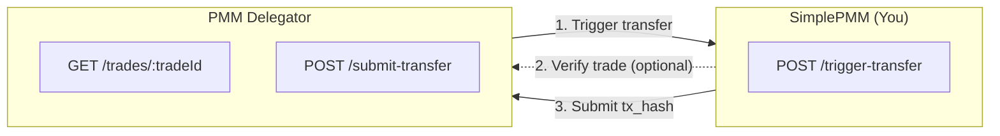
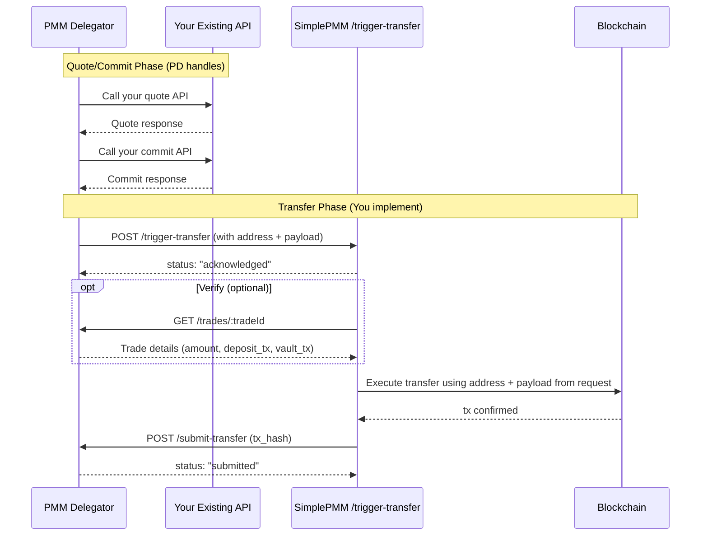

# SimplePMM Integration Guide

This document describes how to integrate as a **SimplePMM** liquidity provider with the PMM Delegator (PD) system.

> **Related:** For full architecture details, see [PMM Delegator Architecture](./pmm-delegator.md)

## Quick Summary



| What You Implement | Endpoints                |
| ------------------ | ------------------------ |
| **SimplePMM**      | `POST /trigger-transfer` |

| What PD Provides | Endpoints                                       |
| ---------------- | ----------------------------------------------- |
| **PD APIs**      | `GET /trades/:tradeId`, `POST /submit-transfer` |

> **Note:** PD handles quote and commit phases by integrating with your existing API (e.g., NEAR Intent Swap API). You only need to implement the transfer execution endpoint.

---

## 1. Overview

As a SimplePMM, you provide liquidity for specific trading pairs. The PMM Delegator handles:

- **Quote/Commit phases** - PD integrates with your existing API documentation
- **Token ID translation** - Maps between Solver and SimplePMM token formats
- **Trade state management** - Tracks trade lifecycle
- **Payload generation** - Builds execution payloads for you

### 1.1. Your Only Responsibility

Implement **1 endpoint**: `POST /trigger-transfer`

- Receive pre-built `address` + `payload` from PD
- Execute on-chain transfer
- Submit transaction hash back to PD

### 1.2. What PD Handles

- Calling your existing quote/commit APIs (per your API docs)
- Protocol integration with Solver
- Building execution payloads
- Trade state management

---

## 2. Endpoint You Must Implement

### 2.1. Endpoint: `POST /trigger-transfer`

**Purpose:** Execute the token transfer. PD calls this with pre-built payload for easy execution.

#### Request Parameters

**Request Body (JSON):**

| Parameter | Type   | Required | Description                                   |
| --------- | ------ | -------- | --------------------------------------------- |
| `tradeId` | string | Yes      | Unique trade identifier                       |
| `address` | string | Yes      | Contract/destination address for execution    |
| `payload` | string | Yes      | Pre-built payload for execution (hex-encoded) |

#### Example Request

```
POST /trigger-transfer
Content-Type: application/json

{
  "tradeId": "0x3bfe2fc4889a98a39b31b348e7b212ea3f2bea63fd1ea2e0c8ba326433677328",
  "address": "0xPaymentContract1234567890abcdef12345678",
  "payload": "0xa9059cbb000000000000000000000000..."
}
```

#### Expected Response

**HTTP Status:** `200 OK`

```json
{
  "trade_id": "0x3bfe2fc4889a98a39b31b348e7b212ea3f2bea63fd1ea2e0c8ba326433677328",
  "status": "acknowledged",
  "error": ""
}
```

| Field      | Type   | Description                                       |
| ---------- | ------ | ------------------------------------------------- |
| `trade_id` | string | Trade identifier from request                     |
| `status`   | string | `acknowledged` if transfer will be executed       |
| `error`    | string | Error message if applicable (empty if successful) |

---

## 3. How to Execute Transfers

Use `address` and `payload` from the request to execute the transfer.

### 3.1. EVM Networks

For EVM networks, call the payment contract with the provided payload:

```typescript
const tx = await signer.sendTransaction({
  to: address,   // Payment contract from response
  data: payload, // Pre-built calldata from PD
})

// After tx confirmed, submit to PD
await submitTransfer(tradeId, tx.hash, networkId)
```

### 3.2. Bitcoin

For Bitcoin, create a transaction with OP_RETURN:

```typescript
// address = user's BTC address
// payload = opReturnData
const tx = createBtcTransaction({
  to: address,
  amount: amountOut,
  opReturn: payload,
})

// After tx confirmed, submit to PD
await submitTransfer(tradeId, tx.txid, 'bitcoin')
```

---

## 4. PD APIs You Can Call

### 4.1. Verify Trade Details (Optional)

Before executing a transfer, you can verify trade details. Include your `operator_address` to get token IDs in your format:

```
GET /trades/:tradeId?operator_address=0xYourOperatorAddress
```

> **Note:** Without `operator_address`, token IDs are returned in Solver format (e.g., `nep141:btc.omft.near`). With your operator address, PD reverse-maps to your token format (e.g., `btc`).

**Response:**

```json
{
  "trade_id": "0x3bfe...",
  "from_token_id": "eth",
  "to_token_id": "btc",
  "amount_in": "100000000",
  "amount_out": "2500000000000000000",
  "to_user_address": "0x1234...",
  "trade_deadline": "1696012800",
  "deposit_tx": "0x1234...",
  "vault_tx": "0xabcd...",
  "status": "pending",
  "error": ""
}
```

### 4.2. Submit Transfer Result

After executing the transfer, submit the transaction hash:

```
POST /submit-transfer
Content-Type: application/json

{
  "trade_id": "0x3bfe...",
  "tx_hash": "0x7a87d2c4...",
  "network_id": "ethereum"
}
```

**Response:**

```json
{
  "trade_id": "0x3bfe...",
  "status": "submitted",
  "error": ""
}
```

---

## 5. Complete Flow



---

## 6. Error Handling

### Common Errors

| HTTP Status | Error Code             | Description                        |
| ----------- | ---------------------- | ---------------------------------- |
| `400`       | `INVALID_PAYLOAD`      | Payload format invalid             |
| `400`       | `TRADE_NOT_FOUND`      | Trade ID doesn't exist             |
| `400`       | `INSUFFICIENT_BALANCE` | Not enough liquidity               |
| `409`       | `ALREADY_EXECUTED`     | Trade already executed             |
| `500`       | `TRANSFER_FAILED`      | On-chain transfer execution failed |

### Error Response Format

```json
{
  "trade_id": "0x3bfe...",
  "status": "error",
  "error": "INSUFFICIENT_BALANCE: Not enough ETH liquidity"
}
```

---

## 7. Best Practices

1. **Validate all inputs** before processing
2. **Check trade details** via `GET /trades/:tradeId` before large transfers
3. **Implement retry logic** for `/submit-transfer` with exponential backoff
4. **Monitor deadlines** - execute before `trade_deadline`
5. **Use secure key storage** (HSM or vault) for signing
6. **Log all requests** for debugging and auditing
