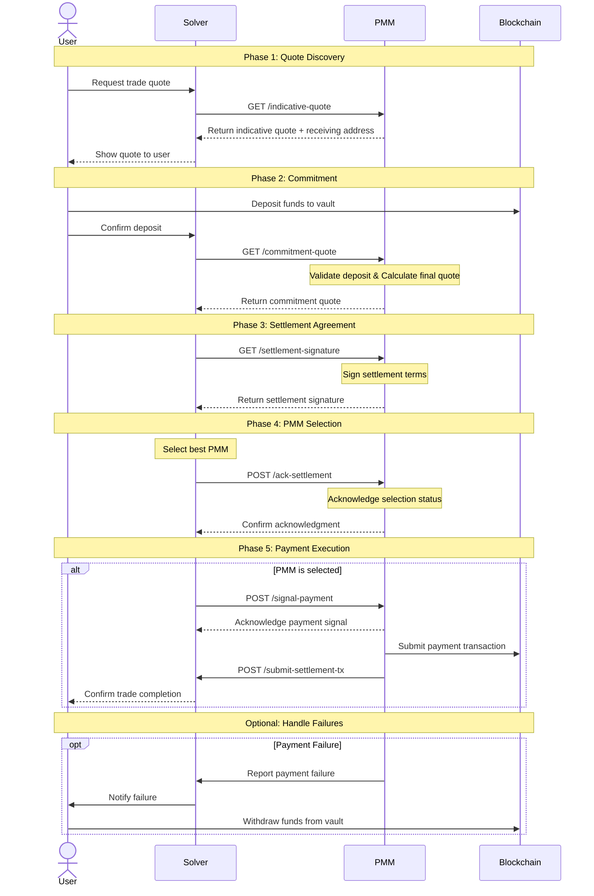

# PetaFiMockPmm

```mermaid
sequenceDiagram
    actor User
    participant Solver
    participant PMM
    participant Blockchain

    Note over User,Blockchain: Phase 1: Quote Discovery
    User->>Solver: Request trade quote
    Solver->>PMM: GET /indicative-quote
    PMM-->>Solver: Return indicative quote + receiving address
    Solver-->>User: Show quote to user

    Note over User,Blockchain: Phase 2: Commitment
    User->>Blockchain: Deposit funds to vault
    User->>Solver: Confirm deposit
    Solver->>PMM: GET /commitment-quote
    Note over PMM: Validate deposit & Calculate final quote
    PMM-->>Solver: Return commitment quote

    Note over User,Blockchain: Phase 3: Settlement Agreement
    Solver->>PMM: GET /settlement-signature
    Note over PMM: Sign settlement terms
    PMM-->>Solver: Return settlement signature

    Note over User,Blockchain: Phase 4: PMM Selection
    Note over Solver: Select best PMM
    Solver->>PMM: POST /ack-settlement
    Note over PMM: Acknowledge selection status
    PMM-->>Solver: Confirm acknowledgment

    Note over User,Blockchain: Phase 5: Payment Execution
    alt PMM is selected
        Solver->>PMM: POST /signal-payment
        PMM-->>Solver: Acknowledge payment signal
        PMM->>Blockchain: Submit payment transaction
        PMM->>Solver: POST /submit-settlement-tx
        Solver-->>User: Confirm trade completion
    end

    Note over User,Blockchain: Optional: Handle Failures
    opt Payment Failure
        PMM->>Solver: Report payment failure
        Solver->>User: Notify failure
        User->>Blockchain: Withdraw funds from vault
    end
```
