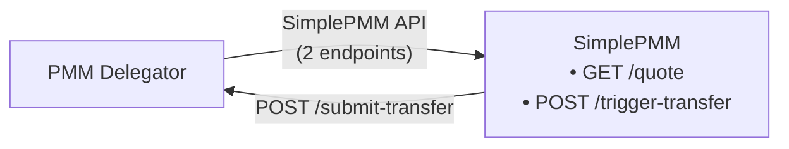

# SimplePMM API Specification

API specification for SimplePMM services that integrate with the PMM Delegator. SimplePMMs provide liquidity through a simplified 2-endpoint interface.

## Table of Contents

- [SimplePMM API Specification](#simplepmm-api-specification)
  - [Table of Contents](#table-of-contents)
  - [1. Overview](#1-overview)
    - [1.1. Integration Architecture](#11-integration-architecture)
    - [1.2. API Summary](#12-api-summary)
  - [2. Endpoints](#2-endpoints)
    - [2.1. `GET /quote` - Unified Quote Endpoint](#21-get-quote---unified-quote-endpoint)
      - [Request Parameters](#request-parameters)
      - [Example Requests](#example-requests)
      - [Response](#response)
    - [2.2. `POST /trigger-transfer` - Transfer Execution](#22-post-trigger-transfer---transfer-execution)
      - [Request Body](#request-body)
      - [Response](#response-1)
      - [SimplePMM Actions](#simplepmm-actions)
  - [3. Callback to PMM Delegator](#3-callback-to-pmm-delegator)
    - [3.1. `POST /submit-transfer`](#31-post-submit-transfer)
      - [Request Body](#request-body-1)
      - [Response](#response-2)
  - [4. Signature Specification](#4-signature-specification)
    - [Message Format](#message-format)
    - [Examples](#examples)
    - [Signing Code](#signing-code)
    - [Verification Code](#verification-code)
  - [5. Error Handling](#5-error-handling)
    - [Error Codes](#error-codes)
    - [Error Response Format](#error-response-format)
    - [Retry Strategy](#retry-strategy)
  - [6. Design Decisions](#6-design-decisions)
    - [6.1. Callback Failure Recovery](#61-callback-failure-recovery)
    - [6.2. Quote Timeout Enforcement](#62-quote-timeout-enforcement)
    - [6.3. Signature Uniqueness](#63-signature-uniqueness)
    - [6.4. Operator Routing](#64-operator-routing)
    - [6.5. Concurrent Trade Handling](#65-concurrent-trade-handling)
    - [6.6. Partial Execution Policy](#66-partial-execution-policy)
    - [6.7. Quote Slippage Protection](#67-quote-slippage-protection)
    - [6.8. Cross-Network Signing](#68-cross-network-signing)

---

## 1. Overview

### 1.1. Integration Architecture



### 1.2. API Summary

| Endpoint            | Method | Direction             | Purpose                                       |
| ------------------- | ------ | --------------------- | --------------------------------------------- |
| `/quote`            | GET    | Delegator → SimplePMM | Get quote (indicative/commitment/liquidation) |
| `/trigger-transfer` | POST   | Delegator → SimplePMM | Trigger token transfer to user                |
| `/submit-transfer`  | POST   | SimplePMM → Delegator | Submit completed transfer tx                  |

---

## 2. Endpoints

### 2.1. `GET /quote` - Unified Quote Endpoint

Returns a quote with cryptographic signature for any quote type.

#### Request Parameters

| Parameter          | Type   | Required    | Description                                        |
| ------------------ | ------ | ----------- | -------------------------------------------------- |
| `type`             | string | Yes         | `indicative`, `commitment`, or `liquidation`       |
| `trade_id`         | string | Conditional | Required for commitment/liquidation                |
| `from_token_id`    | string | Yes         | Source token identifier                            |
| `to_token_id`      | string | Yes         | Destination token identifier                       |
| `amount`           | string | Yes         | Input amount (base 10, BigInt)                     |
| `to_user_address`  | string | Optional    | User's receiving address ( blank when indicative ) |
| `trade_deadline`   | string | Conditional | Payment deadline (UNIX timestamp)                  |
| `script_deadline`  | string | Conditional | Withdrawal deadline (UNIX timestamp)               |
| `payment_metadata` | string | Optional    | Hex-encoded metadata (liquidation only)            |

#### Example Requests

**Indicative:**

```
GET /quote?type=indicative&from_token_id=ETH&to_token_id=BTC&amount=1000000000000000000&to_user_address=bc1q...
```

**Commitment:**

```
GET /quote?type=commitment&trade_id=0x3bfe...&from_token_id=ETH&to_token_id=BTC&amount=1000000000000000000&to_user_address=bc1q...&trade_deadline=1696012800&script_deadline=1696016400
```

**Liquidation:**

```
GET /quote?type=liquidation&trade_id=0x3bfe...&from_token_id=ETH&to_token_id=BTC&amount=1000000000000000000&to_user_address=bc1q...&trade_deadline=1696012800&script_deadline=1696016400&payment_metadata=0x...
```

#### Response

```json
{
  "address": "0x1234567890abcdef1234567890abcdef12345678",
  "quote": "987654321000000000",
  "signature": "0x...",
  "timestamp": 1696000000,
  "error": ""
}
```

| Field       | Type    | Description                                                 |
| ----------- | ------- | ----------------------------------------------------------- |
| `address`   | string  | SimplePMM's wallet address                                  |
| `quote`     | string  | Output amount (BigInt string)                               |
| `signature` | string  | EVM signature (see [Section 4](#4-signature-specification)) |
| `timestamp` | integer | UNIX timestamp when signed                                  |
| `error`     | string  | Error message (empty if success)                            |

---

### 2.2. `POST /trigger-transfer` - Transfer Execution

PMM Delegator instructs SimplePMM to execute token transfer.

#### Request Body

```json
{
  "trade_id": "0x3bfe2fc4889a98a39b31b348e7b212ea3f2bea63fd1ea2e0c8ba326433677328",
  "to_user_address": "bc1p68q6hew27ljf4ghvlnwqz0fq32qg7tsgc7jr5levfy8r74p5k52qqphk07",
  "trade_deadline": "1696012800",
  "script_deadline": "1696012800"
}
```

| Field             | Type   | Description                       |
| ----------------- | ------ | --------------------------------- |
| `trade_id`        | string | Unique trade identifier           |
| `to_user_address` | string | User's receiving address          |
| `trade_deadline`  | string | Payment deadline (UNIX timestamp) |
| `script_deadline` | string | Payment deadline (UNIX timestamp) |

#### Response

```json
{
  "trade_id": "0x3bfe...",
  "status": "acknowledged",
  "error": ""
}
```

#### SimplePMM Actions

1. Verify `original_quote_signature` matches own signature
2. Queue transfer for execution
3. Execute on-chain transfer before `trade_deadline`
4. Call Delegator's `/submit-transfer` with tx hash

---

## 3. Callback to PMM Delegator

### 3.1. `POST /submit-transfer`

SimplePMM submits completed transfer to PMM Delegator.

#### Request Body

```json
{
  "trade_id": "0x3bfe2fc4889a98a39b31b348e7b212ea3f2bea63fd1ea2e0c8ba326433677328",
  "tx_hash": "0x7a87d2c423e13533b5ae0ecc5af900a7b697048103f4f6e32d19edde5e707355",
  "signature": "0x...",
  "timestamp": 1696000000
}
```

| Field       | Type    | Description               |
| ----------- | ------- | ------------------------- |
| `trade_id`  | string  | Trade identifier          |
| `tx_hash`   | string  | On-chain transaction hash |
| `signature` | string  | Original quote signature  |
| `timestamp` | integer | Original quote timestamp  |

#### Response

```json
{
  "status": "submitted",
  "error": ""
}
```

---

## 4. Signature Specification

SimplePMM signs quotes using EVM personal sign (`eth_sign`).

### Message Format

```
{address} sign at {timestamp}
```

### Examples

**Commitment/Liquidation (with trade_id):**

```
0x1234567890abcdef1234567890abcdef12345678 sign at 1696000000
```

### Signing Code

```typescript
import { ethers } from 'ethers'

const message = `${operatorAddress} sign at ${timestamp}`
const signature = await wallet.signMessage(message)
```

### Verification Code

```typescript
const recoveredAddress = ethers.verifyMessage(message, signature)
const isValid = recoveredAddress.toLowerCase() === expectedAddress.toLowerCase()
```

---

## 5. Error Handling

### Error Codes

| HTTP | Code                    | Description                   |
| ---- | ----------------------- | ----------------------------- |
| 400  | `INVALID_SIGNATURE`     | Signature verification failed |
| 400  | `INVALID_AMOUNT`        | Amount mismatch               |
| 400  | `TRADE_NOT_FOUND`       | Unknown trade_id              |
| 400  | `INSUFFICIENT_BALANCE`  | Not enough funds              |
| 409  | `TRADE_ALREADY_SETTLED` | Trade completed               |
| 500  | `TRANSFER_FAILED`       | On-chain failure              |
| 503  | `SERVICE_UNAVAILABLE`   | Temporarily unavailable       |

### Error Response Format

```json
{
  "trade_id": "0x3bfe...",
  "status": "error",
  "error": "INVALID_SIGNATURE: Quote signature verification failed"
}
```

### Retry Strategy

| Error                  | Retry | Strategy            |
| ---------------------- | ----- | ------------------- |
| Network timeout        | Yes   | Exponential backoff |
| `SERVICE_UNAVAILABLE`  | Yes   | Wait 5s             |
| `INSUFFICIENT_BALANCE` | No    | —                   |
| `INVALID_SIGNATURE`    | No    | —                   |

---

## 6. Design Decisions

This section documents resolved design decisions for SimplePMM integration.

### 6.1. Callback Failure Recovery

**Decision:** Implement retry policy with exponential backoff.

When SimplePMM transfers tokens but `/submit-transfer` callback fails:

1. SimplePMM MUST implement retry logic with exponential backoff
2. Retry intervals: 1s → 2s → 4s → 8s → 16s (max 5 retries)
3. After max retries, log error and alert for manual intervention
4. PMM Delegator MAY implement polling as secondary recovery mechanism

### 6.2. Quote Timeout Enforcement

**Decision:** SimplePMM business logic responsibility.

- SimplePMM enforces `quote_timeout` in its own business logic
- If `/trigger-transfer` arrives after timeout, SimplePMM SHOULD reject with `QUOTE_EXPIRED` error
- SimplePMM has discretion to honor expired quotes if beneficial

### 6.3. Signature Uniqueness

**Decision:** Different timestamps produce different signatures.

- Each quote request generates a new `timestamp`
- Message format: `{address} quote {amount} for {trade_id} at {timestamp}`
- Different timestamps = different signatures = natural replay protection
- SimplePMM MUST verify signature matches the specific timestamp provided

### 6.4. Operator Routing

**Decision:** Delegator routes based on `operator_pmm` parameter.

| Scenario               | Behavior                          |
| ---------------------- | --------------------------------- |
| Valid `operator_pmm`   | Route to SimplePMM matching alias |
| Invalid `operator_pmm` | Return 400 error                  |

### 6.5. Concurrent Trade Handling

**Decision:** SimplePMM supports parallel trade execution.

- Single SimplePMM CAN handle multiple trades simultaneously
- No global resource locking required
- SimplePMM manages its own internal concurrency (connection pools, rate limits)
- Each trade operates independently with its own `trade_id`

### 6.6. Partial Execution Policy

**Decision:** All-or-nothing execution per trade.

- SimplePMM MUST execute full `amount_out` or reject entirely
- No partial fills allowed for a single trade
- If insufficient liquidity, return `INSUFFICIENT_BALANCE` error before acknowledging

### 6.7. Quote Slippage Protection

**Decision:** Slippage enforced at commitment/liquidation stage.

| Quote Type  | Slippage Handling                                    |
| ----------- | ---------------------------------------------------- |
| Indicative  | Non-binding, can differ significantly from final     |
| Commitment  | `minAmountOut` calculated with slippage (e.g., 0.5%) |
| Liquidation | Same slippage rules as commitment                    |

**Example:** Indicative quote = $1000, slippage = 0.5% → `minAmountOut` = $995. SimplePMM selected if quote ≥ $995.

### 6.8. Cross-Network Signing

**Decision:** All SimplePMMs sign with EVM wallet only.

- Each SimplePMM has an `operatorAddress` (EVM address)
- ALL signatures use this EVM wallet regardless of output network
- For BTC/Solana outputs: SimplePMM signs with EVM wallet, executes transfer on target chain
- After transfer, submit `tx_hash` (target chain format) to PMM Delegator
