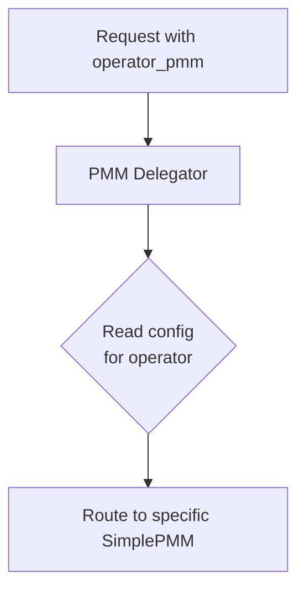
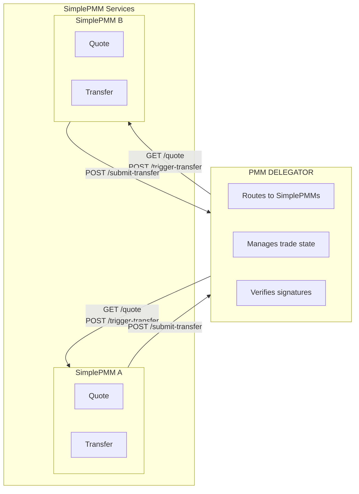
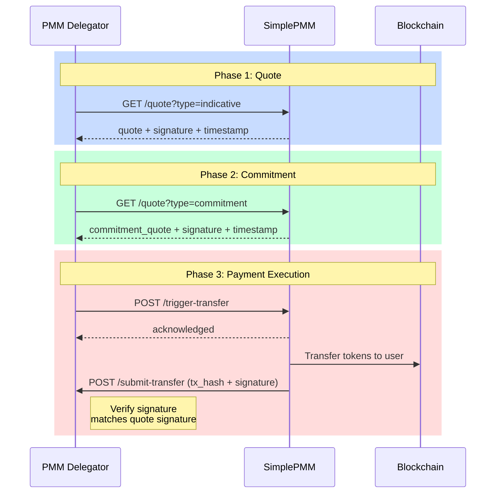

# SimplePMM Delegator Architecture

This document describes the **PMM Delegator** and **SimplePMM** architecture, enabling a simplified integration pattern for market makers who want to provide liquidity without implementing the full PMM protocol complexity.

> **Related:** For SimplePMM endpoint specification, see [SimplePMM API](./simple-pmm-api.md)

## Table of Contents

- [SimplePMM Delegator Architecture](#simplepmm-delegator-architecture)
  - [Table of Contents](#table-of-contents)
  - [1. Overview](#1-overview)
    - [1.1. Architecture Components](#11-architecture-components)
    - [1.2. Key Benefits](#12-key-benefits)
    - [1.3. Operator-Based Routing](#13-operator-based-routing)
  - [2. System Architecture](#2-system-architecture)
    - [2.1. Component Diagram](#21-component-diagram)
    - [2.2. Communication Flow](#22-communication-flow)
  - [3. Trade Flow](#3-trade-flow)
    - [3.1. Flow Diagram](#31-flow-diagram)
    - [3.2. Phase Breakdown](#32-phase-breakdown)
  - [4. SimplePMM API Specification](#4-simplepmm-api-specification)
    - [4.1. Endpoint: `GET /quote`](#41-endpoint-get-quote)
      - [Request Parameters](#request-parameters)
      - [Example Requests](#example-requests)
      - [Expected Response](#expected-response)
      - [Signature Message Format](#signature-message-format)
    - [4.2. Endpoint: `POST /trigger-transfer`](#42-endpoint-post-trigger-transfer)
      - [Request Parameters](#request-parameters-1)
      - [Example Request](#example-request)
      - [Expected Response](#expected-response-1)
      - [SimplePMM Actions After Acknowledgment](#simplepmm-actions-after-acknowledgment)
  - [5. PMM Delegator API Specification](#5-pmm-delegator-api-specification)
    - [5.1. Endpoint: `POST /submit-transfer`](#51-endpoint-post-submit-transfer)
      - [Request Parameters](#request-parameters-2)
      - [Example Request](#example-request-1)
      - [Expected Response](#expected-response-2)
      - [PMM Delegator Processing](#pmm-delegator-processing)
  - [6. Signature Specification](#6-signature-specification)
    - [6.1. Quote Signature](#61-quote-signature)
    - [6.2. Transfer Submission Signature](#62-transfer-submission-signature)
  - [7. Security Considerations](#7-security-considerations)
  - [8. Error Handling](#8-error-handling)
    - [Common Error Responses](#common-error-responses)
    - [Error Response Format](#error-response-format)
    - [Retry Strategy](#retry-strategy)
  - [9. Design Decisions](#9-design-decisions)
    - [9.1. Transaction Hash Format](#91-transaction-hash-format)
    - [9.2. Callback Failure Recovery](#92-callback-failure-recovery)
    - [9.3. Signature Uniqueness \& Replay Protection](#93-signature-uniqueness--replay-protection)
    - [9.4. Operator Routing Rules](#94-operator-routing-rules)
    - [9.5. Fee Distribution](#95-fee-distribution)
    - [9.6. Configuration Management](#96-configuration-management)
    - [9.7. Timeout Ordering](#97-timeout-ordering)
    - [9.8. Failover Strategy](#98-failover-strategy)
    - [9.9. Cross-Network Signing](#99-cross-network-signing)

---

## 1. Overview

The SimplePMM Delegator architecture introduces a two-tier system that abstracts the complexity of the Optimex PMM protocol from liquidity providers.

### 1.1. Architecture Components

| Component         | Role                                     |
| ----------------- | ---------------------------------------- |
| **PMM Delegator** | Virtual PMM that delegates to SimplePMMs |
| **SimplePMM**     | Simplified liquidity provider            |

### 1.2. Key Benefits

- **Simplified Integration**: SimplePMMs only implement 2 endpoints
- **Unified Quote Endpoint**: Single `/quote` endpoint handles indicative, commitment, and liquidation quotes
- **Operator-Based Routing**: Delegator routes to specific SimplePMM via `operator_pmm`
- **Flexible Liquidity**: Multiple SimplePMMs can be registered, each serving specific trades
- **Reduced Risk**: SimplePMMs only need to manage token transfers, not protocol complexity

### 1.3. Operator-Based Routing

PMM Delegator routes requests to specific SimplePMM based on `operator_pmm` parameter.



**PMM Delegator Config Example:**

```yaml
simple_pmms:
  - id: "optimex-pmm-testnet"
    http_endpoint: "https://pmm-dev.bitdex.xyz"
    operator_address: "0x78Bdc100555672a193359bd3e9CD68F23015A051"
  - id: "optimex-pmm-mainnet"
    http_endpoint: "https://pmm.bitdex.xyz"
    operator_address: "0xAaaa1234567890abcdef1234567890abcdef1234"
```

**Routing Logic:**

- Request includes `operator_pmm=optimex-pmm-testnet`
- PMM Delegator looks up config for `optimex-pmm-testnet`
- Routes request to `https://pmm-dev.bitdex.xyz/quote`

---

## 2. System Architecture

### 2.1. Component Diagram



### 2.2. Communication Flow

| Direction  | From          | To            | Protocol                         |
| ---------- | ------------- | ------------- | -------------------------------- |
| Downstream | PMM Delegator | SimplePMM     | SimplePMM API (2 endpoints)      |
| Upstream   | SimplePMM     | PMM Delegator | Submit Transfer API (1 endpoint) |

---

## 3. Trade Flow

### 3.1. Flow Diagram



### 3.2. Phase Breakdown

| #   | Phase      | Delegator → SimplePMM        | SimplePMM Action              |
| --- | ---------- | ---------------------------- | ----------------------------- |
| 1   | Discovery  | `GET /quote?type=indicative` | Return quote + signature      |
| 2   | Commitment | `GET /quote?type=commitment` | Return firm quote + signature |
| 3   | Signal     | `POST /trigger-transfer`     | Prepare for transfer          |
| 4   | Execution  | —                            | Transfer tokens on-chain      |
| 5   | Submission | `POST /submit-transfer`      | Submit tx to Delegator        |

---

## 4. SimplePMM API Specification

SimplePMMs must implement the following endpoints:

| Endpoint            | Method | Purpose                                                                       |
| ------------------- | ------ | ----------------------------------------------------------------------------- |
| `/quote`            | GET    | **Unified endpoint** - handles indicative, commitment, and liquidation quotes |
| `/trigger-transfer` | POST   | Receive transfer instruction from Delegator                                   |

---

### 4.1. Endpoint: `GET /quote`

**Purpose:** Single unified endpoint for all quote types.

#### Request Parameters

**Query Parameters:**

| Parameter          | Type   | Required    | Description                                                                |
| ------------------ | ------ | ----------- | -------------------------------------------------------------------------- |
| `type`             | string | Yes         | Quote type: `indicative`, `commitment`, or `liquidation`                   |
| `trade_id`         | string | Conditional | Required for `commitment` and `liquidation` types                          |
| `from_token_id`    | string | Yes         | Source token identifier                                                    |
| `to_token_id`      | string | Yes         | Destination token identifier                                               |
| `amount`           | string | Yes         | Amount to trade (base 10, treat as BigInt)                                 |
| `to_user_address`  | string | Yes         | User's receiving address                                                   |
| `trade_deadline`   | string | Conditional | Payment deadline (UNIX timestamp) - required for commitment/liquidation    |
| `script_deadline`  | string | Conditional | Withdrawal deadline (UNIX timestamp) - required for commitment/liquidation |
| `payment_metadata` | string | Optional    | Hex-encoded metadata for liquidation                                       |

#### Example Requests

**Indicative Quote:**

```
GET /quote?type=indicative&from_token_id=ETH&to_token_id=BTC&amount=1000000000000000000&to_user_address=bc1q...
```

**Commitment Quote:**

```
GET /quote?type=commitment&trade_id=0x3bfe...&from_token_id=ETH&to_token_id=BTC&amount=1000000000000000000&to_user_address=bc1q...&trade_deadline=1696012800&script_deadline=1696016400
```

**Liquidation Quote:**

```
GET /quote?type=liquidation&trade_id=0x3bfe...&from_token_id=ETH&to_token_id=BTC&amount=1000000000000000000&to_user_address=bc1q...&trade_deadline=1696012800&script_deadline=1696016400&payment_metadata=0x...
```

#### Expected Response

**HTTP Status:** `200 OK`

**Response Body:**

```json
{
  "simple_pmm_address": "0x1234567890abcdef1234567890abcdef12345678",
  "quote": "987654321000000000",
  "signature": "0x...",
  "timestamp": 1696000000,
  "quote_timeout": 1696003600,
  "error": ""
}
```

| Field                | Type    | Description                                                                              |
| -------------------- | ------- | ---------------------------------------------------------------------------------------- |
| `simple_pmm_address` | string  | SimplePMM's wallet address (used for signature verification)                             |
| `quote`              | string  | Quoted output amount (treat as BigInt)                                                   |
| `signature`          | string  | EVM signature of the message (see [Signature Specification](#6-signature-specification)) |
| `timestamp`          | integer | UNIX timestamp when quote was signed                                                     |
| `quote_timeout`      | integer | When this quote expires (0 if no timeout)                                                |
| `error`              | string  | Error message if applicable (empty if successful)                                        |

#### Signature Message Format

The SimplePMM signs the following message:

```
{simple_pmm_address} quote {quote} for {trade_id} at {timestamp}
```

**Example:**

```
0x1234567890abcdef1234567890abcdef12345678 quote 987654321000000000 for 0x3bfe2fc4889a98a39b31b348e7b212ea3f2bea63fd1ea2e0c8ba326433677328 at 1696000000
```

For indicative quotes (no trade_id), use a session identifier:

```
0x1234567890abcdef1234567890abcdef12345678 quote 987654321000000000 for session_abc123 at 1696000000
```

---

### 4.2. Endpoint: `POST /trigger-transfer`

**Purpose:** PMM Delegator instructs the SimplePMM to execute a token transfer to the user.

#### Request Parameters

**Request Body (JSON):**

| Parameter                  | Type    | Required | Description                                          |
| -------------------------- | ------- | -------- | ---------------------------------------------------- |
| `trade_id`                 | string  | Yes      | Unique trade identifier                              |
| `from_token_id`            | string  | Yes      | Source token identifier                              |
| `to_token_id`              | string  | Yes      | Destination token identifier                         |
| `amount_in`                | string  | Yes      | Input amount (base 10, treat as BigInt)              |
| `amount_out`               | string  | Yes      | Output amount to transfer (base 10, treat as BigInt) |
| `to_user_address`          | string  | Yes      | User's receiving address                             |
| `trade_deadline`           | string  | Yes      | Payment deadline (UNIX timestamp)                    |
| `total_fee_amount`         | string  | Yes      | Total fee amount (base 10, treat as BigInt)          |
| `original_quote_signature` | string  | Yes      | Original signature from `/quote` response            |
| `original_quote_timestamp` | integer | Yes      | Original timestamp from `/quote` response            |

#### Example Request

```
POST /trigger-transfer
Content-Type: application/json

{
  "trade_id": "0x3bfe2fc4889a98a39b31b348e7b212ea3f2bea63fd1ea2e0c8ba326433677328",
  "from_token_id": "ETH",
  "to_token_id": "BTC",
  "amount_in": "1000000000000000000",
  "amount_out": "4500000",
  "to_user_address": "bc1p68q6hew27ljf4ghvlnwqz0fq32qg7tsgc7jr5levfy8r74p5k52qqphk07",
  "trade_deadline": "1696012800",
  "total_fee_amount": "1000000000000000",
  "original_quote_signature": "0x...",
  "original_quote_timestamp": 1696000000
}
```

#### Expected Response

**HTTP Status:** `200 OK`

**Response Body:**

```json
{
  "trade_id": "0x3bfe2fc4889a98a39b31b348e7b212ea3f2bea63fd1ea2e0c8ba326433677328",
  "status": "acknowledged",
  "error": ""
}
```

| Field      | Type   | Description                                       |
| ---------- | ------ | ------------------------------------------------- |
| `trade_id` | string | Trade identifier from request                     |
| `status`   | string | `acknowledged` if transfer will be executed       |
| `error`    | string | Error message if applicable (empty if successful) |

#### SimplePMM Actions After Acknowledgment

1. **Verify Request**: Validate that the original signature matches
2. **Queue Transfer**: Add transfer to execution queue
3. **Execute Transfer**: Send tokens to `to_user_address` before `trade_deadline`
4. **Submit Result**: Call PMM Delegator's `/submit-transfer` endpoint with transaction details

---

## 5. PMM Delegator API Specification

PMM Delegator exposes the following endpoint for SimplePMMs to submit completed transfers:

### 5.1. Endpoint: `POST /submit-transfer`

**Purpose:** SimplePMM submits the completed transfer transaction to the PMM Delegator.

#### Request Parameters

**Request Body (JSON):**

| Parameter    | Type    | Required | Description                                   |
| ------------ | ------- | -------- | --------------------------------------------- |
| `trade_id`   | string  | Yes      | Unique trade identifier                       |
| `tx_hash`    | string  | Yes      | Transaction hash of the transfer              |
| `network_id` | string  | Yes      | Network where transfer was executed           |
| `signature`  | string  | Yes      | Original quote signature for verification     |
| `timestamp`  | integer | Yes      | Original quote timestamp for verification     |

#### Example Request

```
POST /submit-transfer
Content-Type: application/json

{
  "trade_id": "0x3bfe2fc4889a98a39b31b348e7b212ea3f2bea63fd1ea2e0c8ba326433677328",
  "tx_hash": "0x7a87d2c423e13533b5ae0ecc5af900a7b697048103f4f6e32d19edde5e707355",
  "network_id": "ethereum",
  "signature": "0x...",
  "timestamp": 1696000000
}
```

#### Expected Response

**HTTP Status:** `200 OK`

**Response Body:**

```json
{
  "trade_id": "0x3bfe2fc4889a98a39b31b348e7b212ea3f2bea63fd1ea2e0c8ba326433677328",
  "status": "submitted",
  "error": ""
}
```

| Field      | Type   | Description                                       |
| ---------- | ------ | ------------------------------------------------- |
| `trade_id` | string | Trade identifier from request                     |
| `status`   | string | `submitted` if successfully processed             |
| `error`    | string | Error message if applicable (empty if successful) |

#### PMM Delegator Processing

1. **Verify Signature**: Confirm signature matches the registered SimplePMM
2. **Verify Trade**: Confirm trade exists and is pending settlement
3. **Update State**: Mark trade as completed

---

## 6. Signature Specification

### 6.1. Quote Signature

SimplePMM signs quotes using EVM personal sign (`eth_sign` / `personal_sign`).

**Message Format:**

```
{simple_pmm_address} quote {quote_amount} for {trade_id_or_session} at {timestamp}
```

**Components:**
| Component | Description | Example |
|-----------|-------------|---------|
| `simple_pmm_address` | SimplePMM's Ethereum address | `0x1234...5678` |
| `quote_amount` | Quoted output amount (string) | `987654321000000000` |
| `trade_id_or_session` | Trade ID (commitment) or session ID (indicative) | `0x3bfe...` or `session_abc` |
| `timestamp` | UNIX timestamp when signed | `1696000000` |

**Signing Code:**

```typescript
const message = `${address} quote ${quote} for ${tradeId} at ${timestamp}`
const signature = await wallet.signMessage(message)
```

**Verification Code:**

```typescript
const recoveredAddress = ethers.verifyMessage(message, signature)
const isValid = recoveredAddress.toLowerCase() === expectedAddress.toLowerCase()
```

### 6.2. Transfer Submission Signature

When submitting a completed transfer, SimplePMM reuses the original quote signature to prove:

1. The SimplePMM was the one who provided the quote
2. The transfer amount matches the committed quote
3. The timestamp proves when the commitment was made

**Verification Flow:**

```
Original Quote → signature + timestamp
                      ↓
Transfer Submission → same signature + timestamp
                      ↓
PMM Delegator → verify signature matches SimplePMM address
                      ↓
              → verify trade exists with matching quote
```

---

## 7. Security Considerations

| Aspect                     | Recommendation                                       |
| -------------------------- | ---------------------------------------------------- |
| **Private Key Storage**    | Use HSM or secure vault for SimplePMM private keys   |
| **Signature Verification** | Always verify signatures before processing transfers |
| **Replay Protection**      | Use unique trade_id + timestamp combination          |
| **Rate Limiting**          | Implement rate limits on all endpoints               |
| **TLS/HTTPS**              | Require TLS 1.3 for all API communications           |
| **IP Whitelisting**        | Consider whitelisting PMM Delegator IPs              |
| **Quote Timeout**          | Enforce quote expiration to prevent stale quotes     |
| **Amount Validation**      | Verify transfer amounts match committed quotes       |

---

## 8. Error Handling

### Common Error Responses

| HTTP Status | Error Code              | Description                         |
| ----------- | ----------------------- | ----------------------------------- |
| `400`       | `INVALID_SIGNATURE`     | Quote signature verification failed |
| `400`       | `INVALID_AMOUNT`        | Quote amount doesn't match request  |
| `400`       | `QUOTE_EXPIRED`         | Quote timestamp exceeded timeout    |
| `400`       | `TRADE_NOT_FOUND`       | Trade ID doesn't exist              |
| `400`       | `INSUFFICIENT_BALANCE`  | SimplePMM lacks funds for transfer  |
| `409`       | `TRADE_ALREADY_SETTLED` | Trade was already completed         |
| `500`       | `TRANSFER_FAILED`       | On-chain transfer execution failed  |
| `503`       | `SERVICE_UNAVAILABLE`   | SimplePMM temporarily unavailable   |

### Error Response Format

```json
{
  "trade_id": "0x3bfe...",
  "status": "error",
  "error": "INVALID_SIGNATURE: Quote signature verification failed"
}
```

### Retry Strategy

| Error Type              | Retry | Wait                |
| ----------------------- | ----- | ------------------- |
| Network timeout         | Yes   | Exponential backoff |
| `SERVICE_UNAVAILABLE`   | Yes   | 5 seconds           |
| `INSUFFICIENT_BALANCE`  | No    | —                   |
| `INVALID_SIGNATURE`     | No    | —                   |
| `TRADE_ALREADY_SETTLED` | No    | —                   |

---

## 9. Design Decisions

This section documents resolved design decisions for PMM Delegator architecture.

### 9.1. Transaction Hash Format

**Decision:** Pass tx hash as-is without encoding.

- SimplePMM submits `tx_hash` in native chain format
- Delegator stores and processes unchanged

| Network  | Format                          | Example                              |
| -------- | ------------------------------- | ------------------------------------ |
| EVM      | `0x`-prefixed hex (66 chars)    | `0x7a87d2c4...707355`                |
| Bitcoin  | Hex string (64 chars)           | `a1b2c3d4e5f6...`                    |
| Solana   | Base58 signature                | `5UfDuX...`                          |

### 9.2. Callback Failure Recovery

**Decision:** SimplePMM implements retry with exponential backoff.

1. SimplePMM MUST retry `/submit-transfer` on failure
2. Retry intervals: 1s → 2s → 4s → 8s → 16s (max 5 retries)
3. After max retries, log and alert for manual intervention
4. Delegator MAY implement polling as secondary recovery

### 9.3. Signature Uniqueness & Replay Protection

**Decision:** Timestamps provide natural replay protection.

- Each quote has unique `timestamp` → unique signature
- Message: `{address} quote {amount} for {trade_id} at {timestamp}`
- Verification MUST match exact timestamp from original quote
- No additional replay protection needed

### 9.4. Operator Routing Rules

**Decision:** Delegator routes based on `operator_pmm` parameter.

| Scenario               | Behavior                          |
| ---------------------- | --------------------------------- |
| Valid `operator_pmm`   | Route to matching SimplePMM       |
| Invalid `operator_pmm` | Return 400 error                  |

### 9.5. Fee Distribution

**Decision:** Fee structure is external to protocol.

- SimplePMM keeps quote spread as profit
- Fee sharing between SimplePMM and Delegator is off-chain business agreement
- Protocol does not enforce fee distribution

### 9.6. Configuration Management

**Decision:** Static YAML configuration with reload support.

```yaml
simple_pmms:
  - id: "optimex-pmm-testnet"
    http_endpoint: "https://pmm-dev.bitdex.xyz"
    operator_address: "0x78Bdc100555672a193359bd3e9CD68F23015A051"
```

- Configuration loaded at startup
- Support SIGHUP for config reload without restart
- No dynamic registration API in v1

### 9.7. Timeout Ordering

**Decision:** Enforce strict timeout hierarchy.

```
quote_timeout < trade_deadline < script_deadline
```

- `quote_timeout`: When quote expires (SimplePMM enforced)
- `trade_deadline`: When payment must complete
- `script_deadline`: When withdrawal is allowed

### 9.8. Failover Strategy

**Decision:** No automatic failover after commitment.

- Once SimplePMM is committed via `operator_pmm`, trade is bound to that operator
- If SimplePMM unreachable after commitment → trade fails
- Future: Consider multi-operator redundancy

### 9.9. Cross-Network Signing

**Decision:** All SimplePMMs use EVM wallet for signing.

- Each SimplePMM has `operatorAddress` (EVM address)
- ALL signatures use EVM wallet, regardless of output chain
- For BTC/Solana outputs: sign with EVM, execute on target chain
- Submit target chain `tx_hash` to Delegator after transfer
